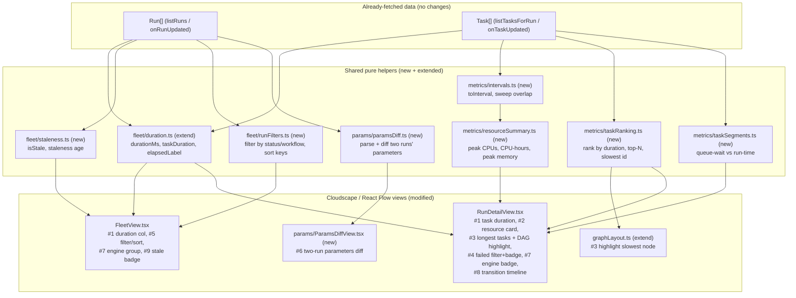
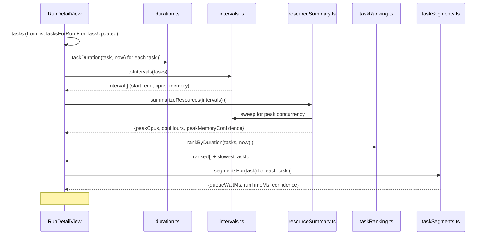
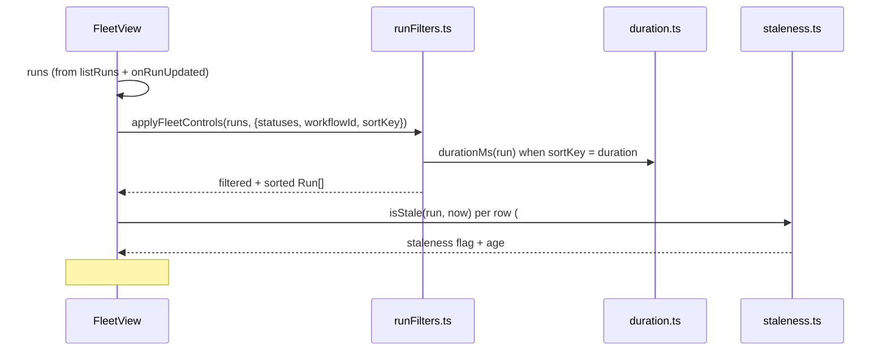

# Design Document: Dashboard Quality-of-Life Enhancements

## Overview

This feature adds nine quality-of-life enhancements to the AWS HealthOmics Workflow Dashboard. Each enhancement makes an existing dataset more legible to bioinformaticians without changing how data is collected: every value surfaced here is **derived client-side from data already persisted in DynamoDB and already fetched by the existing GraphQL queries** (`listRuns`, `getRun`, `listTasksForRun`). No new ingestion path, no new GraphQL field, and — per the project's strict standing rule — no fabricated or placeholder data is introduced. Where a value cannot be derived from present fields, the UI shows an explicit "unknown" affordance rather than inventing one.

The nine enhancements are:

1. **Duration columns** — run and per-task wall-clock durations, with elapsed-so-far for still-running items.
2. **Resource summary per run** — peak concurrent CPUs, total CPU-hours, and peak memory, computed from task intervals.
3. **Longest-running / critical-path tasks** — rank a run's tasks by duration, surface the top N, and highlight the slowest on the DAG.
4. **Failed-task quick filter + count badge** — filter to failed/cancelled tasks and jump to them.
5. **Run-list filtering and sorting** — filter by status and workflow, sort by recency or duration, using Cloudscape table features.
6. **Parameters diff** — compare the `parameters` JSON of two runs of the same workflow.
7. **Engine version badge + grouping** — show a run's `engineVersion` on the header and group the fleet by engine version.
8. **Task state-transition timeline** — per-task breakdown of queue-wait (`createdAt`→`startedAt`) vs run-time (`startedAt`→`stoppedAt`).
9. **Stale-run indicator** — flag non-terminal runs whose `updatedAt` is far in the past as possibly stuck.

The design is intentionally cohesive: a small set of shared, pure timing/aggregation utilities underpins several features (durations feed enhancements 1, 2, 3, 8; interval overlap feeds enhancement 2 and reuses the same algorithm already proven in `inferredDag.ts`). This follows the codebase's established pattern of pure, unit- and property-testable helpers (`fleet/duration.ts`, `fleet/ordering.ts`, `taskview/timeline.ts`, `rundetail/progress.ts`) that React views consume.

This design maps to requirements that will be derived in `requirements.md` and reuses the correctness-property / property-based-testing (PBT) methodology of the existing `healthomics-workflow-dashboard` spec.

### Scope and non-goals

- **Frontend-only.** All nine enhancements are computed in `frontend/src`. No changes to `ingest/`, the GraphQL schema, resolvers, IAM, or CDK are required or made.
- **No new data.** The design adds no new stored attributes. Enhancement 8's timeline and enhancement 2's memory aggregation depend on fields whose *semantics* are not yet confirmed (see the risk section); the design guards these rather than adding data to work around them.
- **No fabricated values.** Missing/unparseable timestamps, absent `cpus`/`memory`, and empty task sets all resolve to explicit "unknown" states.

---

## Architecture

### Where the enhancements live

Every enhancement is a derivation over data the frontend already holds in React state (`Run` objects from `listRuns`/`getRun`, `Task[]` from `listTasksForRun`, live-updated via the existing subscriptions). The architecture is a thin layer of pure helper modules plus targeted view changes.



### Module placement

| Concern | Location | New/extended |
|---|---|---|
| Duration primitives (run + task) | `frontend/src/fleet/duration.ts` | Extended |
| Interval + overlap sweep | `frontend/src/metrics/intervals.ts` | New |
| Resource summary (CPUs, CPU-hours, memory) | `frontend/src/metrics/resourceSummary.ts` | New |
| Task ranking / critical path | `frontend/src/metrics/taskRanking.ts` | New |
| Task state-transition segments | `frontend/src/metrics/taskSegments.ts` | New |
| Parameters diff | `frontend/src/params/paramsDiff.ts` | New |
| Run filtering/sorting keys | `frontend/src/fleet/runFilters.ts` | New |
| Stale-run detection | `frontend/src/fleet/staleness.ts` | New |
| Fleet view integration | `frontend/src/fleet/FleetView.tsx` | Extended |
| Run detail integration | `frontend/src/rundetail/RunDetailView.tsx` | Extended |
| DAG slowest-node highlight | `frontend/src/rundetail/graphLayout.ts` | Extended |
| Parameters diff view | `frontend/src/params/ParamsDiffView.tsx` | New |

Rationale for a new `metrics/` directory: enhancements 2, 3, and 8 are run-analytics that are conceptually distinct from both the fleet list (`fleet/`) and the DAG layering (`taskview/`), and are shared between views. Keeping them in one place mirrors the existing separation of concerns and keeps each helper independently testable. `duration.ts` stays in `fleet/` because it already lives there and is already reused by `rundetail/progress.ts`.

---

## Sequence Diagrams

### Run detail: computing the analytics panels (enhancements 1, 2, 3, 4, 8)



### Fleet: filtering, sorting, grouping, staleness (enhancements 1, 5, 7, 9)



---

## Components and Interfaces

Each helper is a pure module (no React, no I/O, injectable `now`) so it can be unit- and property-tested exactly like the existing `duration.ts` / `ordering.ts` / `timeline.ts`. TypeScript is used throughout (the codebase is React + TypeScript).

### Shared timing primitives — `fleet/duration.ts` (extended, enhancement 1)

The existing module already exports `formatDuration`, `runDuration`, and `formatStartTime`. It is extended with numeric duration primitives (so callers that need to *compute* — sort, aggregate, rank — get milliseconds, while callers that need to *display* keep the formatted string) and a task-aware wrapper.

```typescript
/**
 * Numeric elapsed milliseconds between start and stop, or `null` when the
 * duration is unknown (no/invalid start). A started-but-not-stopped item is
 * measured against `now` (elapsed-so-far). Negative results (stop before start)
 * clamp to 0. Distinct from `runDuration`, which returns a formatted string.
 */
export function durationMs(
  startedAt: string | null | undefined,
  stoppedAt: string | null | undefined,
  now?: number,
): number | null;

/** True when the item is started but not yet stopped (elapsed-so-far applies). */
export function isRunning(
  startedAt: string | null | undefined,
  stoppedAt: string | null | undefined,
): boolean;

/**
 * Task duration as a formatted `HH:MM:SS` string (reuses `runDuration`), keyed
 * off a Task's startedAt/stoppedAt. Convenience wrapper so the run-detail task
 * table has a one-call cell (#1).
 */
export function taskDuration(
  task: Pick<Task, 'startedAt' | 'stoppedAt'>,
  now?: number,
): string;
```

**Responsibilities**: single source of truth for "how long did this take" as both a number (for sort/aggregate/rank) and a string (for display). `runDuration`/`formatDuration` are unchanged so existing callers and tests are unaffected.

### Interval model + overlap sweep — `metrics/intervals.ts` (new, enhancement 2)

```typescript
/** A task's execution interval with its resource request. Milliseconds epoch. */
export interface TaskInterval {
  readonly taskId: string;
  readonly start: number;         // epoch ms
  readonly end: number;           // epoch ms; open (running) tasks use `now`
  readonly cpus: number | null;   // null when the task carries no cpus
  readonly memory: number | null; // null when the task carries no memory
  readonly open: boolean;         // true when derived from a still-running task
}

/**
 * Build execution intervals from tasks. A task with no usable `startedAt` is
 * dropped (it has not run, so it contributes nothing measurable — never a
 * fabricated interval). A running task (started, not stopped) is closed at
 * `now` and flagged `open`. Inverted intervals (stop < start) clamp end=start.
 */
export function toIntervals(tasks: readonly Task[], now?: number): TaskInterval[];

/**
 * Compute the maximum number of simultaneously-active intervals (peak
 * concurrency) and the value of a per-interval numeric weight at that peak,
 * via a boundary sweep. `weight` selects the quantity summed across concurrent
 * intervals (e.g. cpus). Returns 0 for an empty input.
 */
export function peakConcurrent(
  intervals: readonly TaskInterval[],
  weight: (i: TaskInterval) => number,
): { peakCount: number; peakWeight: number };
```

**Responsibilities**: turn tasks into a clean interval set once, then answer overlap questions. The overlap semantics deliberately match the already-proven approach in `taskview/inferredDag.ts` (half-open intervals, running tasks extend to `now`/`+∞`), keeping behavior consistent across the app.

### Resource summary — `metrics/resourceSummary.ts` (new, enhancement 2)

```typescript
/**
 * A resource metric that may be unavailable. `confidence` distinguishes a real
 * computed value from "not derivable from present data" so the UI never shows a
 * fabricated 0. `note` carries the units caveat for memory (see risks).
 */
export interface ResourceMetric {
  readonly value: number | null;
  readonly available: boolean;
  readonly note?: string;
}

export interface ResourceSummary {
  /** Peak count of concurrently-running tasks. */
  readonly peakConcurrentTasks: number;
  /** Peak sum of `cpus` across concurrently-running tasks. */
  readonly peakConcurrentCpus: ResourceMetric;
  /** Total CPU-hours = Σ (task duration hours × task cpus) over closed+open. */
  readonly cpuHours: ResourceMetric;
  /** Peak sum of `memory` across concurrently-running tasks (units unconfirmed). */
  readonly peakConcurrentMemory: ResourceMetric;
  /** True when any interval is still open (values are lower bounds / in-flux). */
  readonly partial: boolean;
}

export function summarizeResources(
  tasks: readonly Task[],
  now?: number,
): ResourceSummary;
```

**Responsibilities**: the enhancement-2 aggregation. Each metric independently reports `available: false` when the inputs it needs (`cpus` for CPU metrics, `memory` for the memory metric) are absent on all tasks, so a run whose tasks never carried `cpus` shows "CPU data unavailable" rather than `0`. `peakConcurrentMemory.note` always carries the units caveat (see risks).

### Task ranking / critical path — `metrics/taskRanking.ts` (new, enhancement 3)

```typescript
export interface RankedTask {
  readonly task: Task;
  readonly durationMs: number | null; // null => unknown duration, sorts last
  readonly rank: number;              // 1-based; ties share ascending order
  readonly running: boolean;
}

/**
 * Rank a run's tasks by descending duration (longest first). Tasks with unknown
 * duration sort last, preserving input order among themselves (stable). Running
 * tasks are ranked by elapsed-so-far and flagged `running`.
 */
export function rankByDuration(tasks: readonly Task[], now?: number): RankedTask[];

/** The top-N longest tasks (N defaults to 5). Never returns unknown-duration tasks. */
export function topLongest(tasks: readonly Task[], n?: number, now?: number): RankedTask[];

/**
 * The taskId of the single longest-duration task, or `null` when no task has a
 * known duration. Used to highlight the slowest node on the DAG (#3). Ties
 * resolve to the earliest-started task deterministically.
 */
export function slowestTaskId(tasks: readonly Task[], now?: number): string | null;
```

**Responsibilities**: "critical path" here is an approximation — the longest-running task(s) by wall-clock, which is what is derivable without a dependency graph for every run. When a True_DAG exists this is still a useful "slowest step" highlight; the design does not claim a true graph-critical-path (that would require the static graph, which is not available for most runs per `RunDetailView`'s known limitation).

### Task state-transition segments — `metrics/taskSegments.ts` (new, enhancement 8)

```typescript
/**
 * A task's time broken into queue-wait and run-time.
 *   queueWaitMs: createdAt -> startedAt   (time before the task started)
 *   runTimeMs:   startedAt -> stoppedAt   (or -> now while running)
 * Each segment is null when its bounding timestamps are absent/unparseable.
 * `confidence` is 'unconfirmed' whenever queueWaitMs is derived, because the
 * createdAt semantics (creation vs first-scheduled) are not yet confirmed
 * against AWS docs (see risks).
 */
export interface TaskSegments {
  readonly taskId: string;
  readonly queueWaitMs: number | null;
  readonly runTimeMs: number | null;
  readonly running: boolean;
  readonly confidence: 'confirmed' | 'unconfirmed';
}

export function segmentsFor(task: Task, now?: number): TaskSegments;
export function segmentsForAll(tasks: readonly Task[], now?: number): TaskSegments[];
```

**Responsibilities**: the enhancement-8 breakdown. `runTimeMs` reuses `durationMs`. `queueWaitMs` is explicitly labeled unconfirmed at the data level, so the view can render it under a caveat (e.g. a tooltip) rather than as ground truth.

### Parameters diff — `params/paramsDiff.ts` (new, enhancement 6)

```typescript
export type DiffKind = 'added' | 'removed' | 'changed' | 'unchanged';

export interface ParamDiffEntry {
  readonly key: string;               // dotted path for nested keys, e.g. "ref.fasta"
  readonly kind: DiffKind;
  readonly left: unknown;             // value in run A (undefined when added)
  readonly right: unknown;            // value in run B (undefined when removed)
}

export interface ParamsDiffResult {
  readonly entries: ParamDiffEntry[]; // sorted by key
  readonly leftParseError: boolean;   // run A parameters unparseable
  readonly rightParseError: boolean;  // run B parameters unparseable
  readonly sameWorkflow: boolean;     // both runs share workflowId
}

/** Parse a run's `parameters` JSON string into an object, or null on failure. */
export function parseParameters(parameters: string | null | undefined):
  Record<string, unknown> | null;

/**
 * Diff two runs' parameters. Nested objects are flattened to dotted paths so
 * the diff is a flat, sortable key list. Runs of different workflows are still
 * diffed but flagged `sameWorkflow: false` so the view can warn.
 */
export function diffRunParameters(left: Run, right: Run): ParamsDiffResult;
```

**Responsibilities**: enhancement 6. Reuses the same JSON-parse-with-fallback pattern already present inline in `RunDetailView`'s `RunInputsOutputs`; that inline logic can later be refactored onto `parseParameters` for a single source of truth (not required for this feature but noted).

### Run filtering / sorting — `fleet/runFilters.ts` (new, enhancement 5, 7)

```typescript
export type FleetSortKey = 'recency' | 'duration';
export type SortDirection = 'asc' | 'desc';

export interface FleetControls {
  readonly statuses: ReadonlySet<RunStatus> | null; // null => all
  readonly workflowId: string | null;               // null => all
  readonly sortKey: FleetSortKey;
  readonly direction: SortDirection;
}

/**
 * Apply status + workflow filters then sort. `recency` sorts by updatedAt (the
 * existing default via compareRuns); `duration` sorts by numeric durationMs
 * with unknown durations last. Input is not mutated. Filtering preserves the
 * existing `filterRunsByStatus` single-status behavior as a special case.
 */
export function applyFleetControls(
  runs: readonly Run[],
  controls: FleetControls,
  now?: number,
): Run[];

/** Distinct, sorted workflow options present in the runs (for the filter UI). */
export function workflowOptions(runs: readonly Run[]): Array<{ id: string; label: string }>;

/** Group runs by engineVersion (absent => "unknown"), each group order-preserved (#7). */
export function groupByEngineVersion(
  runs: readonly Run[],
): Array<{ engineVersion: string | null; runs: Run[] }>;
```

**Responsibilities**: enhancement 5 (multi-status + workflow filter, recency/duration sort) and enhancement 7's grouping. This composes with the existing `orderRuns`/`filterRunsByStatus` rather than replacing them: `recency` sort delegates to the existing `compareRuns`.

### Stale-run detection — `fleet/staleness.ts` (new, enhancement 9)

```typescript
/** Non-terminal run statuses: a run in one of these should keep progressing. */
export const NON_TERMINAL_STATUSES: ReadonlySet<RunStatus>;

export interface Staleness {
  readonly stale: boolean;
  readonly ageMs: number | null;   // now - updatedAt, or null when unparseable
  readonly reason: 'active-no-progress' | 'terminal' | 'unknown';
}

/**
 * A run is stale when its status is non-terminal AND (now - updatedAt) exceeds
 * `thresholdMs` (default 1 hour). Terminal runs are never stale. A run with an
 * unparseable updatedAt is not flagged stale (we do not guess).
 */
export function evaluateStaleness(run: Run, thresholdMs?: number, now?: number): Staleness;
```

**Responsibilities**: enhancement 9. Threshold is a parameter (default 1h) so it is tunable and testable. Because `updatedAt` is bumped by every ingest write, a genuinely progressing run stays fresh; only a run that has gone quiet while non-terminal is flagged.

---

## Data Models

No stored data model changes. The enhancements consume the existing `Run` and `Task` shapes (`frontend/src/api/types.ts`), reproduced here for reference with the fields each enhancement reads:

```typescript
interface Run {
  runId: string; status?: RunStatus | null; name?: string | null;
  createdAt?: string | null; startedAt?: string | null; stoppedAt?: string | null;
  updatedAt: string; workflowId?: string | null; workflowName?: string | null;
  outputUri?: string | null; parameters?: string | null; engineVersion?: string | null;
}
interface Task {
  runId: string; taskId: string; status?: TaskStatus | null; name?: string | null;
  createdAt?: string | null; startedAt?: string | null; stoppedAt?: string | null;
  updatedAt: string; cpus?: number | null; memory?: number | null;
}
```

| Enhancement | Run fields read | Task fields read |
|---|---|---|
| 1 Durations | `startedAt`, `stoppedAt` | `startedAt`, `stoppedAt` |
| 2 Resource summary | — | `startedAt`, `stoppedAt`, `cpus`, `memory` |
| 3 Longest/critical | — | `startedAt`, `stoppedAt`, `taskId`, `name`, `status` |
| 4 Failed filter | — | `status` |
| 5 Filter/sort | `status`, `workflowId`, `workflowName`, `updatedAt`, `startedAt`, `stoppedAt` | — |
| 6 Params diff | `parameters`, `workflowId` | — |
| 7 Engine badge/group | `engineVersion` | — |
| 8 Transition timeline | — | `createdAt`, `startedAt`, `stoppedAt`, `status` |
| 9 Stale indicator | `status`, `updatedAt` | — |

### Derived view-model shapes

The derived shapes (`TaskInterval`, `ResourceSummary`, `RankedTask`, `TaskSegments`, `ParamsDiffResult`, `Staleness`, `FleetControls`) are defined in the Components section above. They are all in-memory only; none is persisted or sent over the wire.

---

## Algorithmic Pseudocode

The two non-trivial algorithms are the peak-concurrency sweep (enhancement 2) and the fleet control pipeline (enhancement 5). Both are given with pre/postconditions and, where looping, a loop invariant. Remaining helpers are straightforward maps/filters/reductions and are specified by their signatures and the correctness properties below.

### Peak concurrency by boundary sweep (`peakConcurrent`)

```pascal
ALGORITHM peakConcurrent(intervals, weight)
INPUT:  intervals - list of {start, end, ...}, start <= end
        weight    - function mapping an interval to a non-negative number
OUTPUT: {peakCount, peakWeight} - max simultaneous count and the summed weight at that peak

BEGIN
  IF intervals is empty THEN
    RETURN {peakCount: 0, peakWeight: 0}
  END IF

  // Build boundary events: +weight at start, -weight at end.
  // Ends are processed before starts at an equal timestamp so a task ending
  // exactly when another starts is NOT counted as concurrent (half-open [start,end)).
  events <- empty list
  FOR each i IN intervals DO
    events.add({t: i.start, delta: +1, w: weight(i), isEnd: false})
    events.add({t: i.end,   delta: -1, w: weight(i), isEnd: true})
  END FOR

  SORT events BY (t ascending, isEnd descending)   // ends (isEnd=true) before starts at equal t

  curCount <- 0 ; curWeight <- 0
  peakCount <- 0 ; peakWeight <- 0

  FOR each e IN events DO
    // INVARIANT: curCount = number of intervals active in [prev event t, e.t),
    //            curWeight = sum of weight over those active intervals,
    //            peakCount/peakWeight = max seen over all processed prefixes.
    IF e.isEnd THEN
      curCount  <- curCount - 1
      curWeight <- curWeight - e.w
    ELSE
      curCount  <- curCount + 1
      curWeight <- curWeight + e.w
      IF curCount > peakCount THEN
        peakCount <- curCount
      END IF
      IF curWeight > peakWeight THEN
        peakWeight <- curWeight
      END IF
    END IF
  END FOR

  RETURN {peakCount, peakWeight}
END
```

**Preconditions**: every interval satisfies `start <= end` (guaranteed by `toIntervals`, which clamps inverted intervals); `weight(i) >= 0`.
**Postconditions**: `peakCount` equals the maximum number of intervals whose half-open ranges `[start, end)` share a common instant; `peakWeight` equals the maximum sum of `weight` over any set of mutually-overlapping intervals. For empty input, both are 0 (never fabricated).
**Loop invariant**: stated inline — after processing each prefix of sorted events, `curCount`/`curWeight` reflect the active set on the half-open segment just closed, and `peakCount`/`peakWeight` are the running maxima.

### Fleet control pipeline (`applyFleetControls`)

```pascal
ALGORITHM applyFleetControls(runs, controls, now)
INPUT:  runs     - list of Run (not mutated)
        controls - {statuses, workflowId, sortKey, direction}
        now      - current epoch ms
OUTPUT: a new ordered, filtered list of Run

BEGIN
  result <- copy of runs                       // never mutate input (Property style of ordering.ts)

  IF controls.statuses is not null THEN
    result <- FILTER result WHERE run.status IN controls.statuses
  END IF

  IF controls.workflowId is not null THEN
    result <- FILTER result WHERE run.workflowId = controls.workflowId
  END IF

  IF controls.sortKey = 'recency' THEN
    result <- SORT result BY compareRuns          // reuse existing recency comparator
  ELSE  // 'duration'
    result <- SORT result BY durationMs(run, now) with unknown (null) durations last,
                            ties broken by compareRuns (stable, deterministic)
  END IF

  IF controls.direction = 'asc' THEN
    result <- reverse-of-the-descending-order equivalently by inverting the comparator
  END IF

  RETURN result
END
```

**Preconditions**: `controls.statuses`, when present, is a set of valid `RunStatus`; `sortKey ∈ {recency, duration}`.
**Postconditions**: the result contains exactly the runs matching every active filter; ordering is total and deterministic (ties resolved by `compareRuns`); the input array is unchanged. An empty filter set (`statuses = null`, `workflowId = null`) returns all runs in the chosen sort order — equivalent to the current fleet behavior when `sortKey = recency`.

---

## Key Functions with Formal Specifications

### `durationMs(startedAt, stoppedAt, now)`
- **Pre**: timestamps are ISO-8601 strings, `null`, or `undefined`; `now` is a finite epoch ms.
- **Post**: returns `null` iff `startedAt` is absent/unparseable; otherwise returns `max(0, resolvedEnd - start)` where `resolvedEnd = stoppedAt` when present/parseable else `now`. Deterministic for fixed `now`.

### `toIntervals(tasks, now)`
- **Pre**: `tasks` is any array of `Task`.
- **Post**: output length ≤ input length; contains exactly those tasks with a parseable `startedAt`; each output has `start <= end`; a task without `stoppedAt` yields `open = true, end = now`; no task without a usable start ever produces an interval (no fabrication).

### `summarizeResources(tasks, now)`
- **Pre**: any `Task[]`.
- **Post**: `peakConcurrentCpus.available` is `false` iff no task in the derived intervals has a non-null `cpus`; likewise for memory; `cpuHours.available` false iff no interval has non-null `cpus`. When available, `peakConcurrentCpus.value = peakConcurrent(intervals, cpus).peakWeight` and `cpuHours.value = Σ (durationHours(i) × i.cpus)` over intervals with non-null cpus. `partial` is `true` iff any interval is `open`. Empty input ⇒ all metrics `available:false`, `peakConcurrentTasks = 0`.

### `rankByDuration(tasks, now)` / `slowestTaskId(tasks, now)`
- **Pre**: any `Task[]`.
- **Post**: `rankByDuration` returns one entry per task; entries with known duration precede entries with unknown duration; among known, sorted by descending `durationMs`; ranks are 1-based and non-decreasing down the list. `slowestTaskId` returns the `taskId` of rank-1 among known-duration tasks, or `null` when none exist; ties resolve to earliest `startedAt` deterministically.

### `segmentsFor(task, now)`
- **Pre**: any `Task`.
- **Post**: `runTimeMs = durationMs(startedAt, stoppedAt, now)`; `queueWaitMs = durationMs(createdAt, startedAt)` (no `now` fallback — an unstarted task has unknown wait, returns `null`); `running = isRunning(startedAt, stoppedAt)`; `confidence = 'unconfirmed'` whenever `queueWaitMs != null`.

### `diffRunParameters(left, right)`
- **Pre**: two `Run` objects.
- **Post**: `entries` covers the union of flattened keys from both parsed parameter objects, each classified `added`/`removed`/`changed`/`unchanged` by deep-equality of values; sorted by key; `leftParseError`/`rightParseError` set when the respective `parameters` string is present but unparseable; `sameWorkflow = (left.workflowId === right.workflowId && both non-null)`.

### `evaluateStaleness(run, thresholdMs, now)`
- **Pre**: a `Run`; `thresholdMs > 0`.
- **Post**: `stale = true` iff `run.status ∈ NON_TERMINAL_STATUSES` and `updatedAt` is parseable and `now - updatedAt > thresholdMs`; terminal statuses ⇒ `stale = false, reason = 'terminal'`; unparseable `updatedAt` ⇒ `stale = false, reason = 'unknown'`.

---

## Example Usage

```typescript
// #1 Task duration column cell (RunDetailView task table)
const cell = taskDuration(task); // "00:12:47" or "—"

// #2 Resource summary card
const summary = summarizeResources(tasks);
if (summary.peakConcurrentCpus.available) {
  render(`Peak vCPUs: ${summary.peakConcurrentCpus.value}`);
} else {
  render('CPU data unavailable for this run');
}

// #3 Highlight the slowest task on the DAG
const slowest = slowestTaskId(tasks);           // taskId | null
const top5 = topLongest(tasks, 5);              // RankedTask[]

// #4 Failed-task quick filter + badge
const failed = tasks.filter((t) => t.status === 'FAILED' || t.status === 'CANCELLED');
render(<Badge color="red">{failed.length}</Badge>);

// #5 Fleet controls
const shown = applyFleetControls(runs, {
  statuses: new Set<RunStatus>(['RUNNING', 'FAILED']),
  workflowId: null,
  sortKey: 'duration',
  direction: 'desc',
});

// #6 Parameters diff
const diff = diffRunParameters(runA, runB);
if (!diff.sameWorkflow) render(<Alert>Comparing runs of different workflows.</Alert>);

// #7 Engine version grouping
const groups = groupByEngineVersion(runs);      // [{engineVersion, runs}, ...]

// #8 Task transition timeline
const seg = segmentsFor(task);                  // {queueWaitMs, runTimeMs, confidence}

// #9 Stale-run indicator
const s = evaluateStaleness(run);
if (s.stale) render(<StatusIndicator type="warning">Possibly stuck</StatusIndicator>);
```

---

## Error Handling

The enhancements are pure derivations, so "errors" are missing or malformed inputs rather than exceptions. The uniform policy is: **never throw, never fabricate — degrade to an explicit unknown/unavailable state.**

| Scenario | Handling |
|---|---|
| Absent / unparseable timestamp | Duration/segment returns `null`; UI renders the existing `—` placeholder. |
| Task with no `startedAt` | Excluded from intervals, ranking, and resource sums (it did not run). |
| Run/tasks with no `cpus` | CPU metrics report `available: false`; UI shows "CPU data unavailable". |
| Run/tasks with no `memory` | Memory metric reports `available: false` (also always caveated on units). |
| Unparseable `parameters` JSON | `parseParameters` returns `null`; diff sets `leftParseError`/`rightParseError` and the view shows a parse-error notice for that side. |
| Empty task set | All run-detail analytics render explicit empty/unavailable states (consistent with existing zero-task empty state in `RunDetailView`). |
| Diff of different-workflow runs | Computed but flagged `sameWorkflow: false`; view warns the comparison may be meaningless. |
| Unparseable `updatedAt` | Staleness returns `stale: false, reason: 'unknown'` — not flagged as stuck. |
| Still-running items | Measured against injected `now`; results flagged (`partial`, `running`) so the UI can indicate the value is in-flux, not final. |

---

## Testing Strategy

### Unit testing approach

Each pure helper gets a `*.test.ts` beside it (matching the existing convention: `duration.test.ts`, `ordering.test.ts`, `timeline.test.ts`). Unit tests cover: known-good inputs, boundary timestamps (equal start/stop, stop-before-start, running items), all-absent-field inputs (unavailable metrics), and empty inputs. `now` is always injected for determinism, exactly as the existing helpers do.

View integration is tested with the existing React Testing Library + vitest setup (`vitest.setup.ts`), reusing the injectable-data-function pattern already in `FleetView`/`RunDetailView` (props default to the real client, tests pass stubs). Cloudscape table filter/sort behavior (enhancement 5) is validated at the view level; the sort/filter *logic* is validated as properties on `runFilters.ts`. Test factories follow `taskview/testFactories.ts`.

### Property-based testing approach

Following the existing spec's methodology, the correctness properties below are the executable properties. **Property test library: fast-check** — already a dev dependency of the frontend (`fast-check` 4.9.0 in `frontend/package.json`), consistent with the existing spec's use of property tests for the pure helpers. Generators produce arbitrary `Run`/`Task` objects with a mix of present/absent/malformed timestamps, arbitrary `cpus`/`memory` (including `null`), and arbitrary `parameters` JSON (valid objects, nested objects, and unparseable strings).

### Integration testing approach

View-level tests assert that: the fleet duration column and stale badge render for representative runs; the run-detail resource card shows "unavailable" when tasks lack `cpus`; the failed-task badge count matches the number of failed/cancelled tasks; the slowest node is highlighted on the DAG; and the params diff view warns on cross-workflow comparison. These are example-based (specific UI states), not properties.

---

## Correctness Properties

*A property is a characteristic or behavior that should hold true across all valid executions of a system — a formal statement about what the system should do, serving as the bridge between human-readable specifications and machine-verifiable guarantees.*

Each property is stated with universal quantification over its inputs and mapped to the enhancement it validates. Specific UI states, exact colors/badges, and library-specific Cloudscape rendering are validated by example-based view tests rather than properties.

### Property 1: Duration is non-negative, monotone, and honest about the unknown
*For any* pair of `startedAt`/`stoppedAt` values and *any* `now`, `durationMs` returns `null` iff `startedAt` is absent or unparseable; otherwise it returns a value `>= 0` that equals `stoppedAt − startedAt` when both are present and parseable, and `now − startedAt` (clamped at 0) when `stoppedAt` is absent. **Validates: Requirements 1.1, 1.2, 1.3, 1.4, 1.5, 10.1, 10.3.**

### Property 2: Intervals never fabricate execution
*For any* `Task[]`, every interval produced by `toIntervals` corresponds to a distinct input task with a parseable `startedAt`, has `start <= end`, and is flagged `open` iff its task had no parseable `stoppedAt`; no task lacking a usable start produces an interval. **Validates: Requirements 2.1, 10.1, 10.3, 10.4.**

### Property 3: Peak concurrency equals the true overlap maximum
*For any* set of intervals, `peakConcurrent(intervals, weight).peakCount` equals the maximum, over all instants `t`, of the number of intervals whose half-open range `[start, end)` contains `t`; and `peakWeight` equals the maximum over all instants of the summed `weight` of intervals containing `t`. Empty input yields 0. **Validates: Requirements 2.2, 2.3, 11.3.**

### Property 4: Resource metrics are available exactly when their inputs exist
*For any* `Task[]`, `summarizeResources` reports `peakConcurrentCpus.available` (and `cpuHours.available`) as `true` iff at least one task with a parseable start carries a non-null `cpus`, and `peakConcurrentMemory.available` as `true` iff at least one such task carries a non-null `memory`; when unavailable the corresponding `value` is `null` (never 0-as-data). **Validates: Requirements 2.5, 2.6, 2.7, 10.1, 10.4.**

### Property 5: CPU-hours equals the summed area
*For any* `Task[]` where at least one interval has non-null `cpus`, `cpuHours.value` equals `Σ over intervals with non-null cpus of (durationMs(i)/3_600_000) × i.cpus`, computed against a fixed `now`. **Validates: Requirements 2.4.**

### Property 6: Ranking is a stable total order with unknowns last
*For any* `Task[]`, `rankByDuration` returns one entry per input task; every task with a known duration precedes every task with unknown duration; among known-duration tasks the sequence is non-increasing in `durationMs`; and ranks are 1-based and non-decreasing. **Validates: Requirements 3.1, 3.2, 3.3.**

### Property 7: Slowest id is the argmax of duration
*For any* `Task[]`, `slowestTaskId` returns `null` iff no task has a known duration; otherwise it returns the `taskId` of a task whose duration is `>=` every other task's duration, resolving ties to the earliest `startedAt`. The returned id always identifies a task present in the input. **Validates: Requirements 3.4, 3.5.**

### Property 8: Failed filter selects exactly the failed/cancelled tasks
*For any* `Task[]`, the failed-task predicate selects exactly the tasks whose `status` is `FAILED` or `CANCELLED`, and the badge count equals the size of that selection. **Validates: Requirements 4.1, 4.2.**

### Property 9: Fleet filtering selects exactly the matching runs and preserves the input
*For any* `Run[]` and *any* `FleetControls`, `applyFleetControls` returns exactly the runs whose `status` is in `controls.statuses` (when non-null) and whose `workflowId` equals `controls.workflowId` (when non-null); the input array is not mutated; and passing `statuses = null, workflowId = null, sortKey = recency` yields the same ordering as the existing `orderRuns`. **Validates: Requirements 5.1, 5.2, 5.3, 5.4.**

### Property 10: Fleet sorting is a deterministic total order
*For any* `Run[]`, sorting by `duration` places every known-duration run before every unknown-duration run, orders known-duration runs by `durationMs` in the requested direction, breaks ties by `compareRuns`, and is a permutation of the filtered input (no run added or dropped). **Validates: Requirements 5.5, 5.6.**

### Property 11: Engine grouping partitions the runs
*For any* `Run[]`, `groupByEngineVersion` produces groups whose concatenation is a permutation of the input (every run appears in exactly one group), all runs in a group share the same `engineVersion` (with absent `engineVersion` collected under a single `null` group), and within each group input order is preserved. **Validates: Requirements 7.3, 7.4.**

### Property 12: Parameters diff is complete, sound, and symmetric in structure
*For any* two runs, `diffRunParameters` produces one entry per key in the union of the two flattened parameter objects; an entry is `added` iff the key exists only on the right, `removed` iff only on the left, `unchanged` iff present on both with deep-equal values, and `changed` otherwise; swapping the two runs swaps every entry's `added`⇄`removed` and `left`⇄`right` while `changed`/`unchanged` classification is preserved. **Validates: Requirements 6.1, 6.2, 6.3, 6.4.**

### Property 13: Parse errors are surfaced, not swallowed
*For any* run whose `parameters` is a non-empty, non-JSON string, `parseParameters` returns `null` and `diffRunParameters` sets the corresponding `leftParseError`/`rightParseError` flag; a run with `null`/empty `parameters` is treated as an empty object (no error). **Validates: Requirements 6.5, 6.6, 10.1, 10.3.**

### Property 14: Segments partition a task's timeline without fabrication
*For any* `Task` and *any* `now`, `segmentsFor` sets `runTimeMs = durationMs(startedAt, stoppedAt, now)` and `queueWaitMs = durationMs(createdAt, startedAt)` (no `now` fallback), each `null` when its bounding timestamps are absent/unparseable; `confidence` is `'unconfirmed'` whenever `queueWaitMs` is non-null. **Validates: Requirements 8.1, 8.2, 8.3, 8.4, 12.1, 12.2.**

### Property 15: Staleness flags only quiet non-terminal runs
*For any* `Run`, *any* `thresholdMs > 0`, and *any* `now`, `evaluateStaleness` returns `stale = true` iff the run's status is non-terminal, its `updatedAt` is parseable, and `now − updatedAt > thresholdMs`; terminal statuses yield `stale = false, reason = 'terminal'`; unparseable `updatedAt` yields `stale = false, reason = 'unknown'`. **Validates: Requirements 9.1, 9.2, 9.3, 9.4, 10.1, 10.3.**

---

## Risks and Assumptions (CONFIRM AGAINST AWS DOCS)

Two enhancements depend on field semantics that are explicitly marked unconfirmed in `ingest/src/enrichment/tasks.ts` (the designated "confirm against AWS docs" location). The design surfaces these as first-class caveats rather than silently trusting them.

### Risk 1 — Task `memory` units (affects Enhancement 2, peak memory)

`mapTaskFields` in `ingest/src/enrichment/tasks.ts` maps `memory <- TaskListItem.memory` with the inline note *"CONFIRM: units — API doc says gigabytes"*. The peak-memory metric therefore cannot claim a unit.

**Guard**: `ResourceSummary.peakConcurrentMemory` is a `ResourceMetric` carrying a `note` that always states the unit is unconfirmed (assumed GiB, pending doc confirmation). The view renders the value with the unit shown as "GiB (unconfirmed)" or similar, and never converts it into another unit. If confirmation shows different units, only the display label changes — the aggregation (a sum over concurrent intervals) is unit-agnostic and correct regardless.
**Verification**: confirm against the [AWS HealthOmics API reference](https://docs.aws.amazon.com/omics/latest/api/) `GetRunTask` / `ListRunTasks` `memory` field; if the unit differs from GiB, update only the display label (and the ingest mapping comment). *Content was rephrased for compliance with licensing restrictions.*

### Risk 2 — Task `createdAt` semantics: creation vs first-scheduled (affects Enhancement 8, queue-wait)

The same file maps `createdAt <- creationTime` with the note *"CONFIRM: creation vs start"*. Enhancement 8's queue-wait segment (`createdAt → startedAt`) is only meaningful if `createdAt` marks when the task was created/enqueued rather than, say, when the record was written.

**Guard**: `TaskSegments.confidence` is `'unconfirmed'` whenever `queueWaitMs` is derived. The view renders queue-wait under an explicit caveat (tooltip/footnote: "queue-wait derived from createdAt→startedAt; createdAt semantics unconfirmed"). Run-time (`startedAt → stoppedAt`) is unaffected and remains the confident portion of the breakdown.
**Verification**: confirm the meaning of `creationTime` on the HealthOmics task read APIs. If `createdAt` does not represent enqueue/creation time, the queue-wait segment should be hidden (not fabricated) — a one-line view guard keyed off `confidence`.

### Risk 3 — "Critical path" is a wall-clock approximation (affects Enhancement 3)

Without a task dependency graph for every run (the static graph is unavailable for most runs, per `RunDetailView`'s documented known limitation), a true graph-critical-path cannot be computed. Enhancement 3 therefore ranks by wall-clock duration and highlights the slowest step(s).

**Guard**: the feature is named and labeled "longest-running tasks" (with "slowest step" highlighting) rather than "critical path" in user-facing copy, so no dependency-path claim is implied. When a True_DAG is present the slowest-node highlight still adds value; when it is not, the ranked list stands on its own.

### Assumption — running-item values are lower bounds

For still-running tasks/runs, all durations/aggregates are measured against `now` and are inherently in-flux. Every derived shape that can include an open interval exposes a flag (`open`, `partial`, `running`) so the UI can mark such values as provisional. This is an intended behavior, not a defect, and is covered by the properties (which inject `now`).

---

## Dependencies

- **Existing, already in the frontend**: React, TypeScript, Vite, Cloudscape (`@cloudscape-design/components`), React Flow (`reactflow`) + `dagre`, vitest + React Testing Library.
- **Testing**: `fast-check` for property-based tests — already present as a dev dependency (`fast-check` 4.9.0 in `frontend/package.json`), matching the existing spec's property methodology. No new test dependency is required.
- **No runtime dependencies added.** No new AWS SDK, GraphQL, or backend dependency is required — the feature reads data already in the client.
