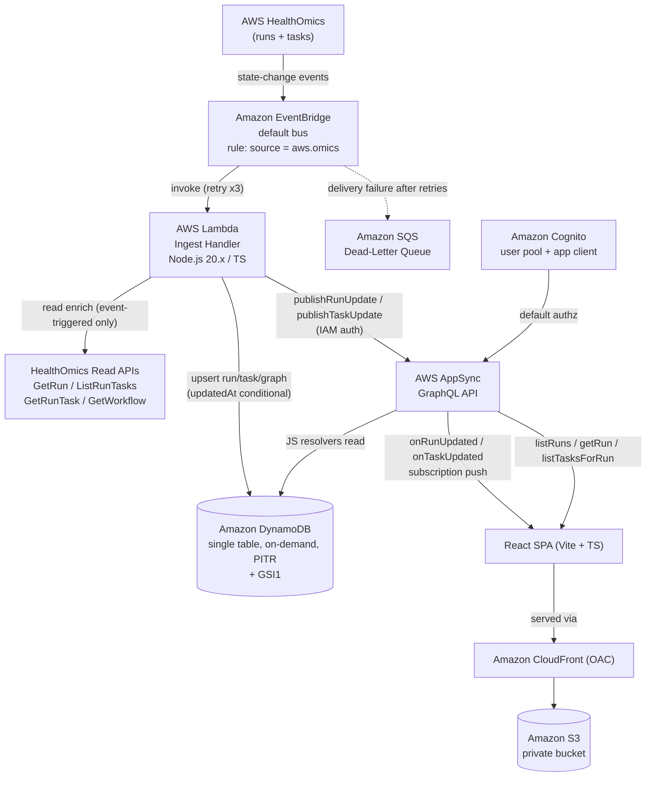

# Design Document

## Overview

The HealthOmics Workflow Dashboard is a serverless, event-driven web application that monitors AWS HealthOmics workflow runs in near real time. It has two user-facing surfaces: a fleet view listing every run with live status, and a run detail view that renders a run's task graph (DAG) with per-task progress. All state changes are pushed to the browser through AppSync GraphQL subscriptions; the browser never polls.

The design optimizes for the lowest possible operating cost and the least infrastructure to maintain. Every backend component is fully managed and scales to zero at idle: no servers, containers, or provisioned capacity. HealthOmics emits state-change events to Amazon EventBridge, which triggers an ingest Lambda that normalizes the event, enriches missing fields via HealthOmics read APIs, upserts state into a single DynamoDB table, and publishes the change through an AppSync mutation. AppSync serves queries for the initial page load and pushes live updates through subscriptions to a React SPA hosted on Amazon S3 behind CloudFront.

Because the HealthOmics run APIs do not expose task dependency edges, the task DAG is derived from the workflow definition (WDL, Nextflow, or CWL). The system renders three task-view layers with graceful degradation: a true dependency DAG derived from the definition, an inferred DAG estimated from task names and timing when the definition is unavailable, and an always-available timeline view.

This design maps directly to the requirements in `requirements.md` and follows the architecture and tech stack fixed in `HealthOmics Dashboard - Coding Agent Prompt.md`. Design decisions are annotated with the requirements they satisfy.

### Key design decisions

- **AppSync GraphQL subscriptions** rather than API Gateway WebSockets. AppSync manages WebSocket connections, subscription fan-out, and authorization. No connection table or `$connect`/`$disconnect` plumbing is built. (Satisfies Req 4, Req 5.)
- **DynamoDB on-demand single table** with a GSI for the recency-ordered fleet list. Scales to zero cost at idle. (Satisfies Req 3, Req 12.)
- **EventBridge default bus, `source: ["aws.omics"]`** — event-driven ingest, no status polling. (Satisfies Req 1, Req 2.)
- **S3 + CloudFront (OAC)** static hosting for the SPA. (Satisfies Req 11.)
- **AWS CDK v2 (TypeScript)** for all infrastructure with least-privilege IAM. (Satisfies Req 11, Req 12.)
- **APPSYNC_JS resolvers** reading DynamoDB directly for queries, avoiding Lambda cost; a Lambda data source is used only where a JS resolver is insufficient. (Satisfies Req 5.11, Req 12.)

## Architecture

### Event flow



### Data and control flow summary

1. HealthOmics publishes a run or task status-change event to the default EventBridge bus.
2. The EventBridge rule matching `source = aws.omics` invokes the ingest Lambda (Req 1.1, 1.2). On repeated failure the event is routed to the DLQ (Req 1.7, 11.3).
3. The ingest Lambda defensively parses the event `detail`, extracting run/task identifiers and status (Req 1.3–1.6). When fields needed to render a Run or Task are absent, it enriches state through HealthOmics read APIs, event-triggered only (Req 2.1, 2.2).
4. On first sighting of a `workflowId`, the Lambda fetches and parses the workflow definition into a cached static graph (Req 6.1–6.9).
5. The Lambda upserts run/task/graph items into DynamoDB with a stale-write guard (Req 3.1–3.10), then calls `publishRunUpdate` / `publishTaskUpdate` (Req 4.1–4.9).
6. AppSync fans the mutation out to subscribed clients (Req 4.5, 4.6, 5.9, 5.10) and serves queries for initial load (Req 5.2–5.8).
7. The React SPA renders the fleet view and run detail view, subscribing for live updates and reconnecting on drop (Req 8, 9, 10).

## CDK Stack Structure

The infrastructure is a single CDK v2 (TypeScript) app organized into four stacks by lifecycle and blast radius. Cross-stack references pass ARNs, names, and endpoints as stack properties; all are also emitted as stack outputs and injected into the frontend build (Req 11.7).

| Stack | Responsibilities | Requirements |
|-------|------------------|--------------|
| `DataStack` | DynamoDB single table (on-demand, PITR, GSI1). | 3.6, 3.7, 12.3 |
| `ApiStack` | AppSync GraphQL API, schema, JS resolvers, optional Lambda data source, Cognito user pool + app client, default Cognito authz + IAM authz for ingest. | 5.*, 11.6, 11.10 |
| `IngestStack` | Ingest Lambda (`NodejsFunction`, esbuild), EventBridge rule, SQS DLQ, retry policy, least-privilege IAM (DynamoDB write, `appsync:GraphQL` on specific mutations, HealthOmics read). | 1.*, 2.3, 4.4, 11.2, 11.3 |
| `FrontendStack` | Private S3 bucket, CloudFront distribution with OAC, SPA routing (403/404 → index.html), build-config injection. | 11.4, 11.5, 11.7 |

Stack ordering enforces dependencies so the Cognito user pool exists before API authorization is configured (Req 11.10), and a failure in any stack fails the whole deployment (Req 11.11 — CloudFormation rolls back the failed stack; deploy is treated as all-or-nothing). A project identifier tag is applied at the app level so every taggable resource inherits it (Req 11.8). Teardown is `cdk destroy` across all stacks; `RemovalPolicy` and auto-delete settings ensure no orphaned resources, and any resource that cannot be removed is reported by CloudFormation (Req 11.9).

Rationale for four stacks over one: it isolates the stateful `DataStack` (retain-on-delete candidate) from frequently-changing frontend and ingest code, and keeps IAM grants scoped per stack. A single well-organized stack is an acceptable alternative; four stacks are chosen for clearer least-privilege boundaries.

## Components and Interfaces

### Component inventory

- **Event_Source** — EventBridge rule on the default bus, pattern `{"source": ["aws.omics"]}`, target = ingest Lambda, DLQ + retry configured.
- **Ingest_Lambda** — Node.js 20.x TypeScript function: event normalization, enrichment, persistence, publish.
- **Definition_Parser** — isolated module with one parser per language (WDL/Nextflow/CWL) behind a common interface.
- **Data_Store** — DynamoDB single table + GSI1.
- **API** — AppSync GraphQL: queries, mutations, subscriptions.
- **Auth_Provider** — Cognito user pool + app client.
- **Frontend** — React SPA (fleet view, run detail view, subscription manager).

### Ingest Lambda internal interfaces

```typescript
// Normalized domain records produced from an EventBridge event or API enrichment.
interface RunRecord {
  runId: string;
  status?: RunStatus;
  name?: string;
  createdAt?: string;   // ISO 8601
  startedAt?: string;
  stoppedAt?: string;
  updatedAt: string;    // ISO 8601 UTC, ms precision (Req 3.3)
  workflowId?: string;
  workflowName?: string;
}

interface TaskRecord {
  runId: string;
  taskId: string;
  status?: TaskStatus;
  name?: string;
  createdAt?: string;
  startedAt?: string;
  stoppedAt?: string;
  updatedAt: string;
  cpus?: number;
  memory?: number;
}

// The isolated, clearly-commented mapping surface. Everything about the real
// HealthOmics event shape is confined here (see "Confirm against AWS docs").
interface EventMapper {
  detectKind(event: EventBridgeEvent): 'RUN' | 'TASK' | 'UNKNOWN';
  mapRunEvent(event: EventBridgeEvent): Partial<RunRecord>;
  mapTaskEvent(event: EventBridgeEvent): Partial<TaskRecord>;
}

interface Enricher {
  enrichRun(runId: string): Promise<Partial<RunRecord>>;      // GetRun
  enrichTasks(runId: string): Promise<Partial<TaskRecord>[]>; // ListRunTasks / GetRunTask
  getWorkflowDefinition(workflowId: string): Promise<WorkflowDefinition>; // GetWorkflow
}

interface Repository {
  upsertRun(run: RunRecord): Promise<UpsertResult>;   // conditional on updatedAt (Req 3.8)
  upsertTask(task: TaskRecord): Promise<UpsertResult>;
  putStaticGraph(workflowId: string, graph: StaticGraph): Promise<void>;
  getStaticGraph(workflowId: string): Promise<StaticGraph | null>;
  recordGraphFailure(workflowId: string, reason: string): Promise<void>;
}

interface Publisher {
  publishRunUpdate(run: RunRecord): Promise<void>;   // AppSync mutation, IAM auth
  publishTaskUpdate(task: TaskRecord): Promise<void>;
}
```

### Definition parser interface

```typescript
type Language = 'WDL' | 'NEXTFLOW' | 'CWL';

interface GraphNode { id: string; name: string; }
interface GraphEdge { from: string; to: string; } // producer -> consumer
interface StaticGraph { workflowId: string; nodes: GraphNode[]; edges: GraphEdge[]; }

interface DefinitionParser {
  language: Language;
  canParse(def: WorkflowDefinition): boolean;
  parse(def: WorkflowDefinition): StaticGraph; // throws ParseError on cycle/unsupported (Req 6.4)
}
```

## Data Models

### DynamoDB single-table design

One table, on-demand (PAY_PER_REQUEST) capacity, point-in-time recovery enabled (Req 3.6, 12.3). One global secondary index `GSI1` supports the recency-ordered fleet list (Req 3.7).

**Primary key:** `PK` (partition), `SK` (sort).
**GSI1:** `GSI1PK` (partition), `GSI1SK` (sort).

#### Item types

| Item | PK | SK | GSI1PK | GSI1SK |
|------|----|----|--------|--------|
| Run | `RUN#<runId>` | `RUN#<runId>` | `RUNS` | `<updatedAt ISO8601>` |
| Task | `RUN#<runId>` | `TASK#<taskId>` | — | — |
| Static graph | `WF#<workflowId>` | `WF#<workflowId>` | — | — |

**Run item attributes** (Req 3.1, 3.3, 3.4): `PK`, `SK`, `GSI1PK`, `GSI1SK`, `runId`, `status`, `name`, `createdAt`, `startedAt`, `stoppedAt`, `updatedAt`, `workflowId`, `workflowName`, `entityType = "RUN"`. `GSI1PK` = `RUNS` and `GSI1SK` = `updatedAt` normalized to ISO 8601 UTC with millisecond precision, set only when `updatedAt` is a valid ISO 8601 timestamp (Req 3.3).

**Task item attributes** (Req 3.2, 3.5): `PK`, `SK`, `runId`, `taskId`, `status`, `name`, `createdAt`, `startedAt`, `stoppedAt`, `updatedAt`, `cpus`, `memory`, `entityType = "TASK"`.

**Static graph item attributes** (Req 6.8): `PK`, `SK`, `workflowId`, `nodes` (list of `{id, name}`), `edges` (list of `{from, to}`), `language`, `updatedAt`, `entityType = "GRAPH"`. On parse/fetch failure a `failureReason` attribute is recorded and existing data is preserved (Req 6.2, 7.1).

#### Access patterns

| Pattern | Requirement | Implementation |
|---------|-------------|----------------|
| List all runs ordered by recency | 3.7, 5.2, 8.4 | Query `GSI1` where `GSI1PK = RUNS`, `ScanIndexForward = false`, paginated by `limit`/`nextToken`. |
| Get one run | 5.6 | GetItem `PK = RUN#<runId>`, `SK = RUN#<runId>`. |
| List tasks for a run | 5.8 | Query `PK = RUN#<runId>` with `SK begins_with "TASK#"`. |
| Get static graph for a workflow | 6.9 | GetItem `PK = WF#<workflowId>`, `SK = WF#<workflowId>`. |

#### Stale-write guard (monotonic upsert)

Every run/task upsert uses a DynamoDB conditional expression: write only when the item does not exist, or when the incoming `updatedAt` is strictly greater than the stored `updatedAt`. If the condition fails (incoming `updatedAt <=` stored), the existing item is preserved unchanged and no attribute is overwritten (Req 3.8). Upserts are rejected before the write when `runId` (run) or `runId`/`taskId` (task) is absent or empty, leaving the store unchanged and emitting an error identifying the missing attribute (Req 3.9). A write failing after 3 attempts leaves the item unchanged and emits an error identifying the failed `runId`/`taskId` (Req 3.10).

## GraphQL API

### Schema

```graphql
enum RunStatus { PENDING STARTING RUNNING STOPPING COMPLETED DELETED CANCELLED FAILED }
enum TaskStatus { PENDING STARTING RUNNING STOPPING COMPLETED CANCELLED FAILED }

type Run {
  runId: ID!
  status: RunStatus
  name: String
  createdAt: String
  startedAt: String
  stoppedAt: String
  updatedAt: String!
  workflowId: String
  workflowName: String
}

type Task {
  runId: ID!
  taskId: ID!
  status: TaskStatus
  name: String
  createdAt: String
  startedAt: String
  stoppedAt: String
  updatedAt: String!
  cpus: Int
  memory: Int
}

type RunConnection { items: [Run!]! nextToken: String }

type Query {
  listRuns(limit: Int, nextToken: String): RunConnection!
    @aws_cognito_user_pools
  getRun(runId: ID!): Run @aws_cognito_user_pools
  listTasksForRun(runId: ID!): [Task!]! @aws_cognito_user_pools
}

type Mutation {
  # Ingest-only, IAM authorized. Not exposed to interactive users.
  publishRunUpdate(input: RunInput!): Run @aws_iam
  publishTaskUpdate(input: TaskInput!): Task @aws_iam
}

type Subscription {
  onRunUpdated: Run
    @aws_subscribe(mutations: ["publishRunUpdate"]) @aws_cognito_user_pools
  onTaskUpdated(runId: ID!): Task
    @aws_subscribe(mutations: ["publishTaskUpdate"]) @aws_cognito_user_pools
}

input RunInput {
  runId: ID! status: RunStatus name: String
  createdAt: String startedAt: String stoppedAt: String
  updatedAt: String! workflowId: String workflowName: String
}
input TaskInput {
  runId: ID! taskId: ID! status: TaskStatus name: String
  createdAt: String startedAt: String stoppedAt: String
  updatedAt: String! cpus: Int memory: Int
}
```

The `Run` and `Task` types map one-to-one to the stored attributes, with every non-nullable stored attribute (`runId`, `taskId`, `updatedAt`) exposed as non-nullable (Req 5.1).

### Resolver strategy

- `listRuns`, `getRun`, `listTasksForRun` use **APPSYNC_JS resolvers directly on the DynamoDB data source** (Req 5.11, 12). `listRuns` queries GSI1 descending with server-side validation that `limit` is 1–100, defaulting to 25 when omitted (Req 5.2); out-of-range `limit` and malformed/expired `nextToken` are rejected with descriptive errors (Req 5.3, 5.5). `getRun` returns null (no error) when no run matches (Req 5.7). `listTasksForRun` returns an empty list when a run has no tasks (Req 5.8).
- `publishRunUpdate` / `publishTaskUpdate` are **pass-through resolvers** whose sole purpose is to trigger subscription fan-out; the ingest Lambda has already written to DynamoDB before calling them (write-then-publish ordering, documented per the prompt). The mutation returns its input payload so `@aws_subscribe` delivers it.
- A Lambda data source is available as a fallback where a JS resolver is insufficient (Req 5.11), but the baseline design needs none.

### Subscription scoping

`onRunUpdated` delivers every published run to all fleet subscribers (Req 5.9, 4.5). `onTaskUpdated(runId)` uses the subscription argument as an enhanced filter so a subscriber receives only task updates whose `runId` equals its argument (Req 5.10, 4.6).

### Authorization

The API default authorization mode is the Cognito user pool; interactive queries and subscriptions require a valid token (Req 5.12, 11.6). Requests without valid credentials are rejected without returning data (Req 5.13). The publish mutations are IAM-authorized and callable only by the ingest Lambda's execution role (Req 4.3, 4.4).

## Ingest Lambda Design

### Processing pipeline

1. **Classify and map.** The isolated `EventMapper` inspects the event and defensively extracts fields from `detail`. All assumptions about the real event shape live here behind clearly commented functions (see "Confirm against AWS docs"). Missing fields cause the full event to be logged while processing continues on remaining fields (Req 1.5). Status values outside the enum are logged and skipped, without failing the whole event (Req 1.6).
2. **Enrich on demand.** When the mapped record lacks fields needed to render a Run/Task, the `Enricher` calls only `GetRun`, `ListRunTasks`, `GetRunTask`, `GetWorkflow` (Req 2.1). Enrichment is strictly event-triggered — never on a timer or schedule (Req 2.2). Each API call has a 10s timeout and is retried up to 3 times; on persistent failure the Lambda logs the failed operation and affected identifier, persists state from event fields only, and leaves unretrievable fields unset (Req 2.5, 2.6). Successful calls merge event and retrieved fields before persistence (Req 2.4).
3. **Resolve the static graph.** On first sighting of a run's `workflowId` with no cached graph, the Lambda calls `GetWorkflow` (30s budget) and parses the definition (Req 6.1). A cached graph is reused and never re-fetched (Req 6.9, 6.13). Fetch/parse failure aborts graph creation, preserves prior state, and records the failure reason on the workflow item (Req 6.2, 6.4, 7.1).
4. **Persist.** Upsert run/task/graph items with the monotonic `updatedAt` conditional-write guard and identifier validation described in the data model (Req 3.1–3.10).
5. **Publish.** After a successful persist, call `publishRunUpdate` / `publishTaskUpdate` within 2s (Req 4.1, 4.2, 4.7), authenticated via IAM (Req 4.3). A missing/empty identifier is rejected before the mutation call (Req 4.9). Failed mutations retry up to 3 times; if all fail, an error is recorded while the persisted data is retained (Req 4.8).

### Failure isolation

The DLQ captures events that fail after 3 EventBridge retries (Req 1.7). Enrichment, persistence, and publish failures are handled independently so a downstream failure never discards already-persisted state.

## Workflow Definition Parser Module

The parser is an isolated module exposing exactly one `DefinitionParser` implementation per supported language behind the common interface (Req 6.12). A dispatcher selects the parser by definition language.

- **WDL** — parse `call` statements as nodes; create a directed edge from each call producing an output reference to every call consuming that reference as input (Req 6.5).
- **Nextflow** — parse `process` declarations as nodes; create a directed edge for each process-to-process channel connection, producer → consumer (Req 6.6).
- **CWL** — parse `steps` as nodes; create a directed edge for each connection derived from `in`/`out`/`source` references, producing step → consuming step (Req 6.7).

Each parser produces a `StaticGraph` with one node per task and one directed edge per producer-to-consumer relationship (Req 6.3). If a definition cannot be parsed, uses an unsupported language, or yields a cycle, the parser rejects it, produces no graph, and returns an error identifying the `workflowId` and reason (Req 6.4). Produced graphs are cached in DynamoDB keyed by `workflowId` (Req 6.8) and reused across runs (Req 6.9).

## Task DAG Rendering (Three Layers)

The frontend selects the highest-fidelity available layer and always displays which layer is shown (Req 7.5).

1. **True_DAG (primary).** When a `StaticGraph` exists for the run's workflow, render nodes and edges with automatic DAG layout (React Flow + dagre/elkjs). Match each static node to a run task by exact, case-sensitive `name` equality and overlay the task's live `Task_Status` (Req 6.10). A node with no matching task is rendered with an unmatched-status indication and no status overlay (Req 6.11).
2. **Inferred_DAG (fallback).** When no static graph is available, order tasks by start time (earlier start placed before later) and show tasks with overlapping start/stop intervals as concurrent (Req 7.2). The view carries a visible "inferred" label (Req 7.3).
3. **Timeline_View (always-available floor).** Gantt-style grouping by `Task_Status`, ordered by start time (Req 7.4). When neither a static graph nor timing data is available, the timeline is shown grouped by status with an "ordering data unavailable" indication (Req 7.6).

Layer selection: True_DAG if a static graph exists → else Inferred_DAG if timing data exists → else Timeline_View. Runs with zero tasks show an empty-state message rather than an empty graph (Req 9.4).

## Frontend Design

### Views

- **Fleet view.** On mount, query `listRuns` once and render each run's status badge, workflow name, start time, and duration within 3s of the response (Req 8.1). Query failure/timeout shows an error message with a retry action (Req 8.2); an empty result shows an empty state (Req 8.3). Runs are ordered by `updatedAt` descending, ties broken by start time descending (Req 8.4). Status filtering shows only matching runs; clearing restores full ordered list (Req 8.8, 8.9).
- **Run detail view.** On open, query `getRun` and `listTasksForRun` (Req 9.1); failure/timeout (10s) shows an error with retry (Req 9.2). Render the task graph with automatic DAG layout for True/Inferred layers (Req 9.3) and a progress indicator showing completed/total tasks and elapsed time in HH:MM:SS (Req 9.6). Subscribe to `onTaskUpdated(runId)` (Req 9.7).

### GraphQL client and subscription management

The client (Amplify GraphQL client / `aws-appsync` / `graphql-ws`) fetches initial data through queries exactly once per view mount and thereafter applies all changes only through active subscriptions (Req 10.4). Fleet subscribers receive `onRunUpdated`: a displayed run is updated in place within 2s (Req 8.5), an undisplayed run is inserted in ordered position within 2s (Req 8.6), and any update source is applied subject to the fleet ordering (Req 8.10). If an update cannot be applied within 2s, a per-run loading indicator is shown without a full page reload (Req 8.11). Task updates update the affected node's color/status within 2s (Req 9.8).

On subscription drop, the client reconnects automatically with exponential backoff starting at 1s and capped at 30s, continuing until re-established (Req 10.5). While down, a disconnected indicator is shown and no refetch is attempted; on reconnect the indicator is removed and current data is refetched through queries (Req 10.6).

### State handling and colors

While a query is in flight, a loading indicator replaces the queried content (Req 10.1). A query error replaces the loading indicator with a human-readable error state while retaining previously loaded content (Req 10.2). An empty successful result shows an empty state (Req 10.3). Each `Run_Status` and each `Task_Status` maps to a distinct color so no two values share a color (Req 8.7, 9.5).

### Build-time configuration

CDK stack outputs (AppSync endpoint, Cognito user pool ID and app client ID, region) are injected into the Vite build config at build time (Req 11.7), so the SPA has no hardcoded environment values.

## Infrastructure and IAM

### Least-privilege grants

- **Ingest Lambda role:** DynamoDB write (PutItem/UpdateItem/Query/GetItem) scoped to the table and GSI1 ARNs; `appsync:GraphQL` scoped to the `publishRunUpdate` and `publishTaskUpdate` field ARNs only (Req 4.4); HealthOmics read scoped to `GetRun`, `ListRunTasks`, `GetRunTask`, `GetWorkflow` with no create/update/delete (Req 2.3). No wildcard action or resource grants (Req 11.2).
- **AppSync DynamoDB data source role:** read on the table/GSI for query resolvers.

### EventBridge, DLQ, retry

Rule on the default bus with pattern `{"source": ["aws.omics"]}` targeting the ingest Lambda; target retry policy of maximum 3 attempts with the SQS DLQ as failure destination (Req 1.7, 11.3).

### S3 + CloudFront

Private S3 bucket with all public access blocked, served only through CloudFront using Origin Access Control (Req 11.4). CloudFront maps 403/404 responses to `index.html` with HTTP 200 for SPA routing (Req 11.5).

### Cognito

User pool + app client provisioned before API authorization is configured; AppSync default authorization requires a valid pool-issued token (Req 11.6, 11.10).

### Outputs, tagging, teardown

All resource names, ARNs, and endpoints are stack outputs injected into the frontend build (Req 11.7). A project identifier tag is applied to every taggable resource (Req 11.8). `cdk destroy` removes all resources and reports any that cannot be removed (Req 11.9). Any single-component provisioning failure fails the whole deployment with no partially-provisioned stack left in service (Req 11.11).

## Cost and Operations

Every component scales to zero at idle: Lambda (per-invocation), DynamoDB on-demand, AppSync (per request/subscription minute), S3/CloudFront (per usage). No EC2/ECS/Fargate and no NAT gateways are provisioned, so there are zero recurring hourly charges when idle (Req 12.1, 12.2). DynamoDB uses on-demand capacity only (Req 12.3). The README documents each cost driver — AppSync requests and subscription minutes, Lambda invocations, DynamoDB on-demand read/write units, and CloudFront usage — with its billing unit and metering service (Req 12.4). Any resource with a fixed recurring charge independent of usage is flagged in the cost documentation as violating the idle-cost constraint (Req 12.5).

## Correctness Properties

*A property is a characteristic or behavior that should hold true across all valid executions of a system — essentially, a formal statement about what the system should do. Properties serve as the bridge between human-readable specifications and machine-verifiable correctness guarantees.*

The following properties were derived by classifying every acceptance criterion (see the prework analysis) and consolidating redundant criteria. Infrastructure configuration (Req 11, 12), fixed retry counts (2.6, 3.10, 4.8), timing bounds (1.2, 4.7, 8.x/9.x "within N seconds"), AppSync fan-out/auth behavior (4.5, 5.9, 5.12, 5.13), and specific UI states are validated by CDK assertions, integration tests, and example-based unit tests rather than properties (see Testing Strategy).

### Property 1: Event mapping robustness and extraction

*For any* HealthOmics run or task event, and *for any* subset of its `detail` fields removed, the event mapper SHALL not throw and SHALL return exactly the fields still present; when a valid enum status is present it is extracted, and when the status value is not a member of its enum it is left unset rather than surfaced.

**Validates: Requirements 1.3, 1.4, 1.5, 1.6**

### Property 2: Enrichment merge preserves both sources

*For any* pair of an event-derived field set and an enrichment-derived field set, the persisted record SHALL equal the merge of both, and *for any* event whose enrichment fails, the persisted record SHALL be derived solely from the event fields with unretrieved fields left unset.

**Validates: Requirements 2.4, 2.5**

### Property 3: Enrichment uses only allowed read operations

*For any* enrichment execution, the set of HealthOmics operations invoked SHALL be a subset of `{GetRun, ListRunTasks, GetRunTask, GetWorkflow}`.

**Validates: Requirements 2.1**

### Property 4: Key derivation

*For any* run record, the persisted item's keys SHALL be `PK = SK = RUN#<runId>`, and *for any* task record, `PK = RUN#<runId>` and `SK = TASK#<taskId>`.

**Validates: Requirements 3.1, 3.2**

### Property 5: GSI recency key normalization

*For any* run whose `updatedAt` is a valid ISO 8601 timestamp, the persisted item's `GSI1PK` SHALL equal `RUNS` and `GSI1SK` SHALL be that timestamp normalized to UTC with millisecond precision, such that parsing `GSI1SK` recovers the same instant as `updatedAt`.

**Validates: Requirements 3.3**

### Property 6: Stored attribute completeness

*For any* run record, the persisted item SHALL contain all of `status`, `name`, `createdAt`, `startedAt`, `stoppedAt`, `updatedAt`, `workflowId`, `workflowName` that are present on the record, and *for any* task record it SHALL contain all of `status`, `name`, `createdAt`, `startedAt`, `stoppedAt`, `updatedAt`, `cpus`, `memory` that are present.

**Validates: Requirements 3.4, 3.5**

### Property 7: Monotonic (idempotent) upsert

*For any* set of upserts targeting the same run or task key applied in any order, the final stored item SHALL equal the upsert with the greatest `updatedAt`; any upsert whose `updatedAt` is less than or equal to the currently stored value SHALL leave every stored attribute unchanged. Consequently, re-applying an already-stored upsert is a no-op (idempotent).

**Validates: Requirements 3.8**

### Property 8: Invalid identifier rejects the write

*For any* run record with an absent or empty `runId`, or task record with an absent or empty `runId` or `taskId`, the upsert SHALL be rejected, the store SHALL remain unchanged, and an error identifying the missing attribute SHALL be emitted.

**Validates: Requirements 3.9**

### Property 9: Publish dispatch correctness

*For any* persisted run change, exactly `publishRunUpdate` SHALL be called with that run's data, and *for any* persisted task change, exactly `publishTaskUpdate` SHALL be called with that task's data; *for any* change whose run or task identifier is absent or empty, no mutation SHALL be called and an error SHALL be recorded.

**Validates: Requirements 4.1, 4.2, 4.9**

### Property 10: Task subscription scoping

*For any* set of `onTaskUpdated` subscribers each bound to a `runId`, and *for any* published task update, the set of subscribers that receive the update SHALL equal exactly the subscribers whose bound `runId` equals the update's `runId`.

**Validates: Requirements 4.6, 5.10**

### Property 11: listRuns ordering and limit bounds

*For any* set of stored runs and *for any* omitted or in-range `limit`, `listRuns` SHALL return a prefix of the runs ordered by descending `updatedAt` whose length is at most `limit` (25 when omitted); *for any* `limit` less than 1 or greater than 100, `listRuns` SHALL return no run data and an out-of-range error.

**Validates: Requirements 5.2, 5.3**

### Property 12: Pagination completeness

*For any* set of stored runs paged through `listRuns` using successive `nextToken` values, the concatenation of pages SHALL contain each run exactly once in descending `updatedAt` order and terminate with a null `nextToken`; *for any* malformed or expired token, `listRuns` SHALL return no run data and an invalid-token error.

**Validates: Requirements 5.4, 5.5**

### Property 13: Run and task lookup completeness

*For any* stored run, `getRun(runId)` SHALL return that run, and *for any* run with a stored set of tasks, `listTasksForRun(runId)` SHALL return exactly that set (an empty list when the run has no tasks).

**Validates: Requirements 5.6, 5.8**

### Property 14: Parser produces an acyclic graph with correct node/edge counts

*For any* parseable, supported workflow definition, the produced Static_Graph SHALL contain exactly one node per workflow task and SHALL be acyclic; *for any* definition that is unparseable, of an unsupported language, or that would produce a cycle, the parser SHALL produce no graph and return an error identifying the `workflowId` and reason.

**Validates: Requirements 6.3, 6.4**

### Property 15: Definition-to-graph round trip per language

*For any* language in `{WDL, Nextflow, CWL}` and *for any* directed acyclic dependency graph rendered as a definition in that language, parsing that definition SHALL recover a graph whose nodes and producer-to-consumer edges are equivalent to the original.

**Validates: Requirements 6.5, 6.6, 6.7**

### Property 16: Name-based status overlay

*For any* Static_Graph and *for any* set of run tasks, each graph node whose `name` exactly (case-sensitively) equals a task `name` SHALL be overlaid with that task's Task_Status, and each node with no exact match SHALL carry an unmatched-status indication with no status overlaid.

**Validates: Requirements 6.10, 6.11**

### Property 17: Static graph cache reuse

*For any* `workflowId` for which a Static_Graph is already cached, resolving that workflow's graph SHALL return the cached graph and SHALL perform zero definition fetches.

**Validates: Requirements 6.9, 6.13**

### Property 18: Inferred DAG ordering

*For any* set of tasks with start/stop times, in the Inferred_DAG ordering a task with an earlier start time SHALL be placed no later than a task with a later start time, and tasks whose start/stop intervals overlap SHALL be marked concurrent.

**Validates: Requirements 7.2**

### Property 19: Timeline grouping

*For any* set of tasks, the Timeline_View SHALL partition tasks by Task_Status and order the tasks within each group by ascending start time.

**Validates: Requirements 7.4**

### Property 20: Fleet ordering with tie-break

*For any* set of runs, the fleet view ordering SHALL be by descending `updatedAt`, with ties between equal `updatedAt` values broken by descending start time.

**Validates: Requirements 8.4**

### Property 21: Fleet update merge is idempotent and order-preserving

*For any* ordered fleet list and *for any* incoming run update (from a subscription, query, or direct call), applying the update SHALL yield a list that contains the run exactly once with the updated fields and remains ordered per Property 20; applying the same update twice SHALL yield the same list.

**Validates: Requirements 8.5, 8.6, 8.10**

### Property 22: Status color injectivity

*For any* two distinct Run_Status values the assigned colors SHALL differ, and *for any* two distinct Task_Status values the assigned colors SHALL differ (the status-to-color map is injective).

**Validates: Requirements 8.7, 9.5**

### Property 23: Status filtering

*For any* set of runs and *for any* selected status, the filtered fleet SHALL contain exactly the runs whose Run_Status equals the selected status; clearing the filter SHALL restore the full set ordered per Property 20.

**Validates: Requirements 8.8, 8.9**

### Property 24: Progress counting and elapsed formatting

*For any* set of a run's tasks, the progress indicator SHALL display the count of tasks with status `COMPLETED` as the completed count and the total task count as the total, and SHALL format elapsed time as `HH:MM:SS`.

**Validates: Requirements 9.6**

### Property 25: Query view state machine

*For any* query lifecycle, while the query is in flight the view SHALL show a loading indicator; on error it SHALL show an error state while retaining previously loaded content; on an empty successful result it SHALL show an empty state.

**Validates: Requirements 10.1, 10.2, 10.3**

### Property 26: Reconnect backoff schedule

*For any* reconnect attempt number `n` (starting at 0), the backoff delay SHALL equal `min(base * 2^n, 30s)` with `base = 1s`, such that the first delay is 1s, the sequence is non-decreasing, and no delay exceeds 30s.

**Validates: Requirements 10.5**

## Error Handling

| Failure | Handling | Requirements |
|---------|----------|--------------|
| Missing event field | Log full event; continue with present fields; no processing failure. | 1.5 |
| Status outside enum | Log full event; skip that status; continue other fields. | 1.6 |
| Event fails after 3 EventBridge retries | Route to SQS DLQ. | 1.7, 11.3 |
| HealthOmics API error/timeout (10s) | Retry up to 3x; then log operation + identifier, persist from event fields only, leave missing fields unset. | 2.5, 2.6 |
| GetWorkflow fetch/parse failure | Abort graph creation, preserve prior state, record failure reason on workflow item. | 6.2, 6.4, 7.1 |
| Upsert with invalid/empty identifier | Reject write, leave store unchanged, emit error naming the attribute. | 3.9 |
| DynamoDB write fails after 3 attempts | Leave item unchanged, emit error identifying runId/taskId. | 3.10 |
| Publish mutation failure | Retry up to 3x; if all fail, record error, retain persisted data. | 4.8 |
| Publish with invalid identifier | Reject before mutation call, record error. | 4.9 |
| listRuns invalid limit / token | Reject with out-of-range / invalid-token error, no data returned. | 5.3, 5.5 |
| Query fails or unauthorized | AppSync returns error; frontend shows error state with retry and retains prior content. | 5.13, 8.2, 9.2, 10.2 |
| Subscription drop | Exponential backoff reconnect (1s→30s); show disconnected indicator; refetch on reconnect; no refetch while down. | 10.5, 10.6 |
| Deployment component failure | Fail the whole deployment; no partially provisioned stack in service. | 11.11 |

## Testing Strategy

### Property-based testing

The pure logic layers of this system — event mapping, upsert semantics, key/timestamp derivation, query ordering/pagination, the definition parsers, DAG/timeline construction, fleet merge/order/filter, color mapping, progress computation, and backoff scheduling — are well suited to property-based testing. Property tests use an established PBT library for the target language (`fast-check` for the TypeScript ingest Lambda and frontend logic); parsers and pure logic are not implemented from scratch for testing. Each correctness property is implemented as a **single** property-based test running a **minimum of 100 iterations**, tagged with a comment referencing the design property in the format:

`Feature: healthomics-workflow-dashboard, Property {number}: {property_text}`

Properties 1–26 above map one-to-one to property tests. Parser round-trip tests (Property 15) generate a random DAG, render it into each language's source form, parse it back, and assert graph equivalence — the recommended approach for parser correctness. The monotonic-upsert test (Property 7) applies randomly ordered upserts against an in-memory DynamoDB double and asserts the max-`updatedAt` invariant.

### Unit and integration tests

Example-based unit tests cover specific scenarios and fixed-count behaviors that are not universal properties:

- Ingest Lambda: valid run event, valid task event, and malformed event; retry-count behavior for enrichment (3x), DynamoDB write (3x), and publish (3x); GetWorkflow failure recording; `getRun` of a nonexistent run returns null (Req 1.1, 2.6, 3.10, 4.8, 5.7, 6.1, 7.1). All ingest unit tests must pass on execution (Req 13.1).
- Definition_Parser: unit tests for WDL, Nextflow, and CWL with at least one sample definition fixture per format, all passing (Req 13.3).
- Frontend: fleet error/empty states, run-detail error/empty/zero-task states, inferred and layer-indicator labels, fetch-once-on-mount, disconnect/reconnect indicator toggling, and node-edge rendering (Req 7.3, 7.5, 7.6, 8.2, 8.3, 9.2, 9.3, 9.4, 10.4, 10.6).
- Integration/timing: EventBridge→Lambda invocation and latency, DLQ delivery, AppSync subscription fan-out and 2s propagation, Cognito authorization rejection, and end-to-end synthetic-event propagation within 5s (Req 1.2, 1.7, 4.5, 4.7, 5.12, 5.13, 8.5, 9.8, 13.5).
- CDK assertions (snapshot/template): DynamoDB on-demand + PITR + GSI1 (3.6, 3.7); IAM least-privilege statements for the ingest role (2.3, 4.4, 11.2); EventBridge rule pattern, retry=3, DLQ destination (1.7, 11.3); S3 public-access block + CloudFront OAC + 403/404→index.html (11.4, 11.5); Cognito ordering and default authz (11.6, 11.10); outputs and project tag (11.7, 11.8); absence of EC2/ECS/Fargate/NAT (12.1, 12.2).

### Fixtures and local verification

- A `fixtures/` directory contains at least one sample `aws.omics` EventBridge event for a run status change and one for a task status change (Req 13.2), plus one workflow definition fixture per language (Req 13.3).
- An executable script publishes a synthetic `aws.omics` event to EventBridge **or** invokes the ingest Lambda directly with a fixture, selectable by the operator (Req 13.4). Synthetic events failing schema validation are rejected, leave data unchanged, and return a validation error (Req 13.6).

## Confirm Against AWS Docs

The real HealthOmics event JSON shape is not hardcoded from memory. Every assumption about it is isolated behind the `EventMapper` module so it can be corrected in one place once verified against AWS documentation. The README's "Confirm against AWS docs" section enumerates each location; the design fixes these as the code elements to update:

| What to confirm | Code file | Code element |
|-----------------|-----------|--------------|
| Run status-change `detail` field names (run id, status, timestamps, workflow id/name) | `ingest/src/eventMapper.ts` | `mapRunEvent()` field-extraction constants |
| Task status-change `detail` field names (run id, task id, status, cpus, memory, timestamps) | `ingest/src/eventMapper.ts` | `mapTaskEvent()` field-extraction constants |
| Event `detail-type` values used to classify run vs task events | `ingest/src/eventMapper.ts` | `detectKind()` detail-type matcher |
| Run_Status / Task_Status enum member spellings as emitted by HealthOmics | `ingest/src/domain/status.ts` | `RunStatus` / `TaskStatus` enums |
| `GetWorkflow` response field holding the definition (inline vs URI/S3 location) and export mechanics | `ingest/src/enrichment/workflow.ts` | `getWorkflowDefinition()` definition-source resolver |
| `ListRunTasks` / `GetRunTask` field names used for enrichment | `ingest/src/enrichment/tasks.ts` | `enrichTasks()` field mapping |

The mapping functions are clearly commented as the confirmation points, and the parser fixtures and ingest event fixtures are the artifacts to update alongside them (Req 14.3).
