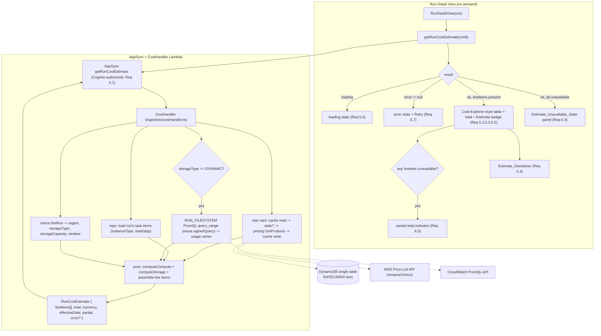

# Design Document

## Overview

This feature adds an **estimated per-run cost breakdown** to the Run Detail page, styled after
AWS Cost Explorer's "usage type + quantity + cost" table, plus two smaller related
enhancements (resource type on task selection; storage/network in the measured-usage section).
The estimate is a **list-price ESTIMATE** — measured task runtime × the published AWS price
list — **not** the actual billed amount, so it is computed immediately from data already
flowing through the pipeline (plus one newly captured task field, `instanceType`), with no
dependence on Cost Explorer's 24–48-hour billing lag and no polling (Req 1–9).

It reads on demand from a new AppSync **Lambda-backed query** `getRunCostEstimate(runId)`,
mirroring the existing `getRunMetrics`/`getRunLogs` read path
(`ingest/src/metricsHandler.ts` + `addMetricsResolver()` in `infra/lib/api-stack.ts` +
`RunMetricsPanel.tsx` + `getRunMetrics` in `frontend/src/api/client.ts`), with two structural
differences from the metrics Lambda:

1. It sources **rates** from the AWS **Price List Query API** (`pricing:GetProducts`), cached
   per region in the DynamoDB single table using the same keyed-item, lazily-refreshed pattern
   as the existing static-graph cache (`getStaticGraph`/`putStaticGraph`/`recordGraphFailure`
   in `ingest/src/repository.ts`) (Req 4).
2. It sources **dynamic-storage GB-hours** by re-issuing the existing measured-metrics PromQL
   path (the `RUN_FILESYSTEM` family, already implemented in `ingest/src/metrics/`) scoped to
   the run window, then trapezoidally integrating the sampled usage series (Req 3.3).

The single most important behavioral theme — inherited directly from the sibling
`run-utilization-metrics` design and Req 6 — is **honesty about availability**. Every value
shown is real / measured / priced, or explicitly **unavailable** ("—"). The cost Lambda
**never fabricates a value and never zero-fills**: it returns a typed `RunCostEstimate` with
per-line-item availability flags, a `partial` flag when some line items are unavailable, and a
typed `error` field (never a thrown exception to AppSync), exactly following
`metricsHandler.ts`'s error-as-typed-result convention (Req 5.6, 5.7, 6.1–6.5).

### Estimate, not actual (the load-bearing distinction)

The estimate prices raw measured task start→stop runtime at On-Demand list price. AWS bills
provisioning/rounding overhead **beyond** that raw runtime, so the estimate runs **lower** than
the eventual actual bill (verified on real run 3388513: compute estimate ≈ $0.0611 from
`omics.m.large` 0.137 hr + `omics.r.large` 0.189 hr + `omics.r.2xlarge` 0.0165 hr; Cost
Explorer showed 0.353 `m.large`-hrs vs 0.137 measured). The UI therefore carries a prominent
**Estimate_Disclaimer** and an "Estimate" badge visually distinct from the "Measured" badge
(Req 5.4, 5.5). Actual / Cost-Explorer cost is a **documented non-goal** for this spec.

### Two decoupled data planes (unchanged from the sibling)

Like the metrics plane, the cost plane is a **pull-query, never persisted** read path that does
not touch the existing state plane (EventBridge → ingest → DynamoDB → subscriptions). The one
new persisted artifact is the **rate-card cache item** — a small, region-keyed item that is a
derived cache of public pricing, not run state, and is written by the cost Lambda's own
least-privilege grant (Req 4, 7). Task `instanceType` is the only new field that joins the
state plane: it is captured in enrichment and persisted like `cpus`/`memory` (Req 1).

### Grounding facts (verified live against AWS during investigation; treated as constraints, not assumptions)

- **Price List parsing model.** `pricing:GetProducts` with `ServiceCode` `AmazonOmics`,
  paginated, filtered by `regionCode` = the run's region and `workflowType=Private`. Each
  `PriceList` item is a **JSON string** that must be parsed. The rate lives at
  `terms.OnDemand.<termKey>.priceDimensions.<dimKey>` = `{ unit, pricePerUnit.USD, description }`.
- **One rate map keyed by `attributes.resourceType` captures both compute and storage.** BOTH
  compute and run-storage products have `product.productFamily === "Compute"` and carry
  `product.attributes.resourceType`. For COMPUTE, `resourceType` is the instance type (e.g.
  `omics.r.2xlarge`), unit `Instance-hrs`. For STORAGE, `resourceType` is the family label —
  exactly `"Dynamic Run Storage"` or `"Run Storage"` — unit `GB-Hours`. So a single rate-card
  build keyed by `attributes.resourceType` captures both; the run's `storageType`
  (`DYNAMIC`→`"Dynamic Run Storage"`, `STATIC`→`"Run Storage"`) selects the storage rate.
- **Products to ignore.** `"Ephemeral Storage"`, sequence/annotation/variant-store, and
  Ready2Run per-run products exist but are out of scope: only Private compute-instance
  `resourceType`s + the two run-storage `resourceType`s are needed.
- **Verified us-east-1 Private rates:** `omics.m.large` = $0.1296, `omics.r.large` = $0.1701,
  `omics.r.2xlarge` = $0.6804 per Instance-hr; `"Dynamic Run Storage"` = $0.000411,
  `"Run Storage"` = $0.0001918 per GB-Hour. 60 instance-type compute rates for us-east-1.
- **Estimate math (verified on run 3388513 → ~$0.0611 compute):**
  - Compute: per task, `Instance_Hours = (stopTime - startTime)` in hours; summed by
    `instanceType`; × the instance type's rate.
  - Storage STATIC: `storageCapacity` (GiB) × run wall-clock hours × `"Run Storage"` rate.
  - Storage DYNAMIC: GB-hours = the trapezoidal time-integral of the `RUN_FILESYSTEM`
    `aws.omics.run.filesystem.usage` measured series (bytes → GB) across the run window; ×
    `"Dynamic Run Storage"` rate. If that series is unavailable → `Estimate_Unavailable_State`
    for storage (never fabricate/zero).
- **Rate-card cache** mirrors the static-graph cache: a region-keyed DynamoDB single-table item
  (`PK = SK = RATECARD#<region>`), storing the region's rate map (`resourceType` →
  `{ pricePerUnit, unit }`), currency, `effectiveDate` (retrieval date), and `updatedAt`. Lazy
  refresh when older than a `STALENESS_THRESHOLD` (~7 days). On Price List API failure: serve
  stale cache if present, else typed unavailable. No polling.
- **Price List IAM grant** follows the existing documented wildcard-**resource** exception: the
  cost Lambda needs read-only `pricing:GetProducts` + `pricing:DescribeServices`; the Price List
  API does not support resource-level scoping, so the resource is `*` — an intentional exception
  exactly like the existing CloudWatch metrics grant (`cloudwatch:GetMetricData`,
  `cloudwatch:ListMetrics` on `resources: ['*']`) — but it is NOT a wildcard action (Req 7).

### End-to-end flow



The state plane and the cost plane share **no events**; the cost plane's only persisted item is
the derived rate-card cache. The only contract with the frontend is the `getRunCostEstimate`
GraphQL shape.

---

## Architecture

### Components changed or added

| Component | File | Change |
|---|---|---|
| Task enrichment | `ingest/src/enrichment/tasks.ts` | Capture `instanceType` in `mapTaskFields` (Req 1.1, 1.4) |
| Task record | `ingest/src/domain/records.ts` | Add `instanceType?: string` to `TaskRecord` (Req 1.2) |
| Task item | `ingest/src/repository.ts` | Persist `instanceType` on `TaskItem` via `buildTaskItem` (Req 1.2) |
| Task input | `ingest/src/publisher.ts` | Add `instanceType` to `TaskInput` + `toTaskInput` + `TASK_MUTATION` selection set (Req 1.5) |
| Rate-card cache | `ingest/src/repository.ts` | New `RateCardItem` shape + `getRateCard`/`putRateCard`/`recordRateCardFailure` methods (Req 4) |
| Price List client | `ingest/src/cost/priceList.ts` (new) | `pricing:GetProducts` pagination + `parsePriceListItem` pure parser → rate map (Req 4.2) |
| Rate-card service | `ingest/src/cost/rateCard.ts` (new) | `isStale` + `loadRateCard` (cache-first, lazy-refresh, stale-on-failure) (Req 4.1–4.5) |
| Cost math | `ingest/src/cost/estimate.ts` (new) | Pure `computeComputeCost`, `computeStorageCost`, `trapezoidalGbHours`, `bytesToGb`, line-item assembly (Req 2, 3) |
| CostHandler | `ingest/src/costHandler.ts` (new) | AppSync resolver: GetRun + tasks + rate card + (dynamic) RUN_FILESYSTEM → typed `RunCostEstimate` (Req 2,3,4,5,6) |
| Filesystem usage source | `ingest/src/cost/filesystemUsage.ts` (new) | Reuse `promql.ts`/`signedQuery.ts`/`parse.ts` to fetch the run's `RUN_FILESYSTEM` usage series (Req 3.3) |
| GraphQL schema | `infra/graphql/schema.graphql` | `getRunCostEstimate` query + `RunCostEstimate`/`CostLineItem` types; `instanceType` on `Task` + `TaskInput` (Req 1.3, 5.1) |
| API stack | `infra/lib/api-stack.ts` | `addCostResolver()` mirroring `addMetricsResolver()`; least-privilege IAM incl. pricing wildcard-resource exception (Req 4, 7) |
| Frontend client | `frontend/src/api/client.ts`, `api/types.ts` | `getRunCostEstimate` one-shot query + typed payload (Req 5.1); `instanceType` on `Task` (Req 8) |
| Cost panel | `frontend/src/rundetail/RunCostPanel.tsx` (new) | Cost-Explorer-style table; Estimate badge; four-state handling; partial/total; disclaimer (Req 5, 6) |
| Cost presentation | `frontend/src/cost/costPresentation.ts` (new) | Pure four-state derivation + partial-total detection from `RunCostEstimate` (Req 5.6, 6.2–6.5) |
| Run detail wiring | `frontend/src/rundetail/RunDetailView.tsx` | Fetch cost on open; render `RunCostPanel` below measured-usage; show task `instanceType`; request the full metric family set (CORE + storage + network) on the initial metrics load (Req 5.2, 8, 9) |

### Design principle: isolate the AWS-shape assumptions

All Price List request/response assumptions (service code, filter names, the
`terms.OnDemand.*.priceDimensions.*` path, the `attributes.resourceType` key, storage family
labels) live behind clearly-marked constants and a single pure `parsePriceListItem` in
`ingest/src/cost/priceList.ts`, mirroring how `logsHandler.ts`/`metricsHandler.ts` isolate
their AWS-shape assumptions. That module is a designated **"confirm against AWS docs"** location
(see the note at the end of Testing Strategy), so if the Price List attribute shape differs,
only that one parser changes.

---

## Components and Interfaces

### 1. Task `instanceType` capture (Req 1)

`instanceType` flows through the pipeline exactly like `cpus`/`memory`, which are already mapped
in `mapTaskFields`:

- **Enrichment** (`tasks.ts`): extend the `EnrichableTask` `Pick<...>` with `'instanceType'` and
  add, alongside the existing `cpus`/`memory` mapping, a guarded copy that persists the value
  only for a non-empty string — leaving it unset otherwise (Req 1.1, 1.4). This is added inside
  the `mapTaskFields` "CONFIRM AGAINST AWS DOCS" block, since `instanceType` is a `GetRunTask`
  response field.
- **Record** (`records.ts`): add `instanceType?: string` to `TaskRecord`.
- **Repository** (`repository.ts`): add `instanceType?: string` to `TaskItem` and a
  `setIfDefined(item, 'instanceType', task.instanceType)` in `buildTaskItem` (absent → omitted,
  never stored as `undefined`) (Req 1.2).
- **Publisher** (`publisher.ts`): add `instanceType?: string` to `TaskInput`, a `setIfDefined`
  in `toTaskInput`, and `instanceType` to the `TASK_MUTATION` response selection set so it fans
  out to `onTaskUpdated` subscribers (Req 1.5).
- **Schema** (`schema.graphql`): add `instanceType: String` to both `type Task` and
  `input TaskInput` (Req 1.3).
- **Frontend types** (`types.ts`): add `readonly instanceType?: string | null` to `Task`; add
  `instanceType` to the `GET_RUN`/`LIST_TASKS_FOR_RUN`/`ON_TASK_UPDATED` task selection sets in
  `client.ts` so the run detail view can read it (Req 8).

### 2. CostHandler (`ingest/src/costHandler.ts`) — Req 2, 3, 4, 5, 6

Mirrors `metricsHandler.ts`: an AppSync Lambda-resolver whose event is the resolver payload
`{ arguments: { runId } }`, returning a typed result matching the `RunCostEstimate` GraphQL
type. Only `runId` validation throws (matching `logsHandler`/`metricsHandler`); every other
failure flows into the typed `error`/unavailable fields.

```ts
/** The AppSync Lambda-resolver event shape for `getRunCostEstimate`. */
interface GetRunCostEstimateEvent {
  arguments: { runId: string };
}

/** Category of a cost line item. */
type CostCategory = 'COMPUTE' | 'STORAGE';

/** One row of the estimate breakdown (mirrors GraphQL `CostLineItem`). */
interface CostLineItem {
  category: CostCategory;
  /** Human usage type, e.g. "Compute (omics.r.2xlarge)" or "Dynamic Run Storage". */
  usageType: string;
  /** Instance type (compute) or storage-family label (storage); null when not applicable. */
  resourceType: string | null;
  /** Quantity in `unit` (Instance-hrs or GB-Hours); null when unavailable. */
  quantity: number | null;
  /** "Instance-hrs" | "GB-Hours". */
  unit: string;
  /** Published On-Demand rate per unit; null when unavailable. */
  ratePerUnit: number | null;
  /** quantity * ratePerUnit; null when unavailable. */
  estimatedCost: number | null;
  /** false => this line item is in the Estimate_Unavailable_State (Req 6.2). */
  available: boolean;
  /** Why unavailable (e.g. "No rate for omics.x"), null when available. */
  unavailableReason: string | null;
}

/** The resolver result (mirrors GraphQL `RunCostEstimate`). */
interface RunCostEstimate {
  runId: string;
  lineItems: CostLineItem[];
  /** Sum of available line items' estimatedCost; null when none are available (Req 6.4). */
  total: number | null;
  currency: string | null;         // "USD"
  effectiveDate: string | null;    // rate card retrieval date
  /** true => at least one line item unavailable, so `total` is partial (Req 6.3). */
  partial: boolean;
  /** non-null => the whole query failed (distinct from unavailable) (Req 5.7). */
  error: string | null;
}
```

Control flow:

1. Validate `runId` (non-empty), else `throw` (surfaces as a GraphQL error → frontend error
   state, Req 5.7).
2. **`omics:GetRun`** for the run's `region`-relevant fields, `storageType`, `storageCapacity`,
   and wall-clock window (`startTime`..`stopTime ?? now`). A failed GetRun → typed
   `{ error }` result (Req 5.7). (Region for the rate card is the Lambda's own region via
   `COST_REGION`/`AWS_REGION`, since the run is queried in-region; see IAM design.)
3. **Load tasks**: read the run's task items from the repository (a `Query` on
   `PK = RUN#<runId>`, `SK begins_with TASK#`) to get each task's `instanceType`, `startedAt`,
   `stoppedAt`.
4. **Load the rate card** via `loadRateCard(region)` (§4): cache-first, lazy-refresh when stale,
   serve-stale-on-failure, typed-unavailable when neither cache nor API yields rates (Req 4).
5. **Compute compute cost** via the pure `computeComputeCost(tasks, rateMap)` (§5): group
   `Instance_Hours` by `instanceType`, price each group, and emit one `CostLineItem` per
   instance type — with `available: false` where a task lacks `instanceType` (Req 2.4), where a
   task lacks start→stop runtime (excluded from the total, indicated; Req 2.5), or where the
   rate card has no rate for an instance type (Req 2.6).
6. **Compute storage cost** via the pure `computeStorageCost(...)` (§5):
   - STATIC → `storageCapacity` × run wall-clock hours × `"Run Storage"` rate (Req 3.2).
   - DYNAMIC → fetch the `RUN_FILESYSTEM` usage series (§3), integrate it to GB-hours, × the
     `"Dynamic Run Storage"` rate (Req 3.3); series unavailable → line item `available: false`
     (Req 3.4). Missing storage-family rate → `available: false` (Req 3.6).
7. **Assemble** the `RunCostEstimate`: `total` = sum of available line items' `estimatedCost`
   (`null` when none available, Req 6.4); `partial` = true when any line item is unavailable
   (Req 6.3); `currency`/`effectiveDate` from the rate card; `error: null` on success.

Env vars (no hardcoding): `COST_REGION` (defaults to `AWS_REGION`), `COST_TABLE_NAME` (the
single table), `MONITORING_HOST`/`SIGNING_SERVICE` (for the DYNAMIC RUN_FILESYSTEM PromQL query,
same defaults as `metricsHandler.ts`). Timeout: **30s** (matches the sibling Lambdas).

### 3. Filesystem usage source (`ingest/src/cost/filesystemUsage.ts`) — Req 3.3

For DYNAMIC storage the Lambda reuses the **existing** measured-metrics query path rather than
re-implementing anything: `buildSelector('aws.omics.run.filesystem.usage', runId)`
(`promql.ts`) → `buildRangeBody` + `signAndPost('/api/v1/query_range', ...)` (`signedQuery.ts`)
→ `parseMatrix(..., 'RUN_FILESYSTEM', 'usage')` (`parse.ts`). The result is the run-level
usage-over-time `MetricSeries` (run-level series carry only the run id, `taskId === null` — a
grounding fact from the sibling design). The function returns the parsed usage `points`
(`{ timestamp, value }`, value in bytes), or `null` when the series is absent or the query
failed — which the caller maps to the storage `Estimate_Unavailable_State` (Req 3.4). This
signing/host path is identical to `metricsHandler.ts` (service `monitoring`), so the same
esbuild ESM `createRequire` banner shim is required for the bundled `@smithy/signature-v4` /
`@aws-crypto/sha256-js` CJS-in-ESM deps (see IAM/bundling design).

### 4. Rate-card cache + service (`ingest/src/repository.ts`, `ingest/src/cost/rateCard.ts`, `ingest/src/cost/priceList.ts`) — Req 4

**Cache item (mirrors `GraphItem`).** A new keyed single-table item, one per region, so distinct
regions never share an entry (Req 4.6):

```ts
/** Per-region cached rate card (mirrors the GraphItem cache pattern). */
export interface RateCardItem {
  PK: string;   // `RATECARD#<region>`
  SK: string;   // `RATECARD#<region>`
  region: string;
  /** resourceType -> published rate. Keys are instance types + the two storage family labels. */
  rates: Record<string, { pricePerUnit: number; unit: string }>;
  currency: string;        // "USD"
  effectiveDate: string;   // ISO date the card was retrieved from the Price List API
  updatedAt: string;       // ISO 8601; the staleness basis (like GraphItem.updatedAt)
  entityType: 'RATECARD';
  /** Set on a fetch/parse failure while preserving prior rates (mirrors recordGraphFailure). */
  failureReason?: string;
}
```

Repository methods mirror `getStaticGraph`/`putStaticGraph`/`recordGraphFailure`:
`getRateCard(region)` (GetItem, returns the item or `null`), `putRateCard(region, rates,
currency, effectiveDate)` (unconditional `PutCommand`), and `recordRateCardFailure(region,
reason)` (`UpdateCommand` that sets only `failureReason`/`updatedAt` without clobbering existing
`rates`, Req 4.4 stale-serve). Keys via `rateCardPk(region)` = `rateCardSk(region)` =
`RATECARD#${region}`.

**Price List client (`priceList.ts`).** `fetchRateMap(region)` paginates
`GetProductsCommand({ ServiceCode: 'AmazonOmics', Filters: [{ Type: 'TERM_MATCH', Field:
'regionCode', Value: region }, { Type: 'TERM_MATCH', Field: 'workflowType', Value: 'Private' }]
})` (following `NextToken`), and maps each `PriceList` JSON string through the pure
`parsePriceListItem`. Confirmed AWS-shape (isolated here):

```ts
/** Pure parse of one PriceList JSON string into a single keyed rate, or null to skip. */
export function parsePriceListItem(
  raw: string,
): { resourceType: string; pricePerUnit: number; unit: string } | null {
  // JSON.parse(raw); read product.attributes.resourceType and product.productFamily.
  // Keep only: productFamily === "Compute" AND resourceType is either an omics
  // instance type (unit "Instance-hrs") OR exactly "Dynamic Run Storage" /
  // "Run Storage" (unit "GB-Hours"). Ignore "Ephemeral Storage", stores, Ready2Run.
  // Rate = terms.OnDemand.<firstTermKey>.priceDimensions.<firstDimKey>:
  //   { unit, pricePerUnit.USD }. Return null when any needed field is absent
  //   (never fabricate a rate).
}
```

`fetchRateMap` reduces the parsed items into `{ rates, currency: 'USD' }`; a malformed item
parses to `null` and is skipped, never zero-filled.

**Rate-card service (`rateCard.ts`).** Pure `isStale(updatedAt, now, thresholdMs)` and the
orchestrating `loadRateCard(repo, priceList, region, now)`:

1. `getRateCard(region)`. If present and **not** stale → reuse without calling the API (Req 4.1).
2. If absent, or present-but-stale → call `fetchRateMap(region)`; on success `putRateCard(...)`
   with `effectiveDate = today` and return it (Req 4.2, 4.3, lazy refresh — no polling).
3. On Price List API failure **with** a cached card present → `recordRateCardFailure` and return
   the **stale** cached card (Req 4.4).
4. On Price List API failure **with no** cached card → return a typed "unavailable" sentinel so
   the handler emits the `Estimate_Unavailable_State` rather than fabricating rates (Req 4.5).

`STALENESS_THRESHOLD` is a named constant `RATE_CARD_STALENESS_MS = 7 * 24 * 60 * 60 * 1000`
(~7 days), so a cached card older than that is eligible for lazy refresh on the next request.

### 5. Cost math (`ingest/src/cost/estimate.ts`) — Req 2, 3 (pure helpers)

The estimate arithmetic is decomposed into small, pure, individually-testable helpers so the
handler orchestration stays I/O-only:

```ts
/** Wall-clock hours from ISO start/stop; null when either is missing/unparseable or stop < start. */
export function instanceHours(startedAt?: string | null, stoppedAt?: string | null): number | null;

/** Group tasks by instanceType, summing Instance_Hours; tasks with no runtime are excluded
 *  (and surfaced separately); tasks with no instanceType are grouped under an
 *  "unavailable" bucket rather than priced (Req 2.4, 2.5). */
export function aggregateComputeHours(tasks: readonly TaskLike[]): {
  byInstanceType: Map<string, number>;
  missingInstanceTypeCount: number;
  excludedNoRuntimeCount: number;
};

/** Bytes -> GB (decimal GB, 1e9), pure and total for any finite input. */
export function bytesToGb(bytes: number): number;

/** Trapezoidal integral of a sampled usage series to GB-hours over its own timespan.
 *  Points are {timestamp ms, value bytes}; each value is converted via bytesToGb; the
 *  integral is Σ over consecutive pairs of (avg GB) * (Δt in hours). Returns 0 for a single
 *  point's zero-width interval; null for an empty series (=> unavailable, never fabricated). */
export function trapezoidalGbHours(points: readonly { timestamp: number; value: number }[]): number | null;

/** Assemble compute line items from aggregated hours + the rate map (Req 2.2, 2.3, 2.6). */
export function computeComputeLineItems(agg, rateMap): CostLineItem[];

/** Assemble the single storage line item from storageType + inputs + the rate map
 *  (Req 3.1, 3.2, 3.3, 3.5, 3.6). */
export function computeStorageLineItem(args): CostLineItem;
```

- **Compute** (Req 2): `aggregateComputeHours` sums each `instanceType`'s `Instance_Hours`
  (`instanceHours` per task). `computeComputeLineItems` emits one `CostLineItem` per instance
  type with `quantity` = summed hours, `ratePerUnit` = the rate-map rate, `estimatedCost` =
  their product, `unit: "Instance-hrs"`. A group whose instance type is absent from the rate map
  is emitted `available: false` (Req 2.6). Tasks lacking `instanceType` produce a single
  `available: false` "unpriced compute" line item carrying `missingInstanceTypeCount` (Req 2.4);
  tasks lacking runtime are excluded and their `excludedNoRuntimeCount` is indicated on the
  compute line items rather than fabricated (Req 2.5).
- **Storage** (Req 3): `computeStorageLineItem` selects the family from `storageType`
  (`STATIC`→`"Run Storage"`, `DYNAMIC`→`"Dynamic Run Storage"`, Req 3.1). STATIC quantity =
  `storageCapacity` × run wall-clock hours (Req 3.2); DYNAMIC quantity =
  `trapezoidalGbHours(fsPoints)` (Req 3.3). `estimatedCost` = quantity × the family rate.
  Missing series (DYNAMIC) → `available: false` (Req 3.4); missing family rate →
  `available: false` (Req 3.6).

### 6. GraphQL surface (`infra/graphql/schema.graphql`) — Req 1.3, 5.1

Follows the schema's conventions (Cognito default; the sibling `RunMetrics` precedent). New
types and query carry only `@aws_cognito_user_pools`:

```graphql
enum CostCategory { COMPUTE STORAGE }

type CostLineItem @aws_cognito_user_pools {
  category: CostCategory!
  usageType: String!
  resourceType: String        # instance type (compute) or storage family (storage)
  quantity: Float             # Instance-hrs or GB-Hours; null => unavailable
  unit: String!
  ratePerUnit: Float          # null => unavailable
  estimatedCost: Float        # null => unavailable
  available: Boolean!         # false => Estimate_Unavailable_State for this line (Req 6.2)
  unavailableReason: String
}

type RunCostEstimate @aws_cognito_user_pools {
  runId: ID!
  lineItems: [CostLineItem!]!
  total: Float                # null => no line item computable (Req 6.4)
  currency: String
  effectiveDate: String
  partial: Boolean!           # true => total is partial (Req 6.3)
  error: String               # non-null => query failed (Req 5.7)
}

# added to type Query:
getRunCostEstimate(runId: ID!): RunCostEstimate @aws_cognito_user_pools

# added to type Task and input TaskInput:
#   instanceType: String
```

**Strongly-typed, not `AWSJSON` (decision):** like `RunMetrics`, the shape is fixed and small,
the frontend needs per-field access to render the table and detect partiality, and strong typing
lets the schema/infra tests assert the contract (consistent with `RunMetrics`/`RunLogs`).

### 7. API stack — `addCostResolver()` (`infra/lib/api-stack.ts`) — Req 4, 7

Mirrors `addMetricsResolver()`, including the ESM `createRequire` banner shim (this Lambda
bundles the same `@smithy/signature-v4`/`@aws-crypto/sha256-js` CJS-in-ESM deps for the DYNAMIC
RUN_FILESYSTEM PromQL query):

```ts
private addCostResolver(): void {
  const costFn = new NodejsFunction(this, 'CostFunction', {
    runtime: Runtime.NODEJS_20_X,
    entry: COST_HANDLER_ENTRY,                 // ingest/src/costHandler.ts
    handler: 'handler',
    projectRoot: INGEST_PROJECT_ROOT,
    depsLockFilePath: INGEST_DEPS_LOCK_FILE,
    timeout: Duration.seconds(30),
    environment: {
      COST_REGION: Stack.of(this).region,
      COST_TABLE_NAME: props.dataStack.table.tableName,
      MONITORING_HOST: `monitoring.${Stack.of(this).region}.amazonaws.com`,
      SIGNING_SERVICE: 'monitoring',
    },
    bundling: {
      format: OutputFormat.ESM,
      externalModules: ['@aws-sdk/*'],         // signature-v4/sha256 bundled, not externalized
      banner:
        "import{createRequire as __createRequire}from'module';const require=__createRequire(import.meta.url);",
    },
  });

  // Price List: read-only actions. Resource '*' because the Price List API does
  // NOT support resource-level scoping — an intentional, DOCUMENTED exception to
  // the no-wildcard-resource pattern, exactly like the existing CloudWatch
  // metrics grant (cloudwatch:GetMetricData/ListMetrics on '*'). NOT a wildcard
  // action (no Action: '*') (Req 7.1, 7.2, 7.3).
  costFn.addToRolePolicy(new PolicyStatement({
    effect: Effect.ALLOW,
    actions: ['pricing:GetProducts', 'pricing:DescribeServices'],
    resources: ['*'],
  }));

  // CloudWatch PromQL (DYNAMIC-storage RUN_FILESYSTEM GB-hours), same grant as
  // the metrics Lambda; Resource '*' (no resource-level scoping), NOT a
  // wildcard action.
  costFn.addToRolePolicy(new PolicyStatement({
    effect: Effect.ALLOW,
    actions: ['cloudwatch:GetMetricData', 'cloudwatch:ListMetrics'],
    resources: ['*'],
  }));

  // omics:GetRun for the run window/storage fields, scoped to run ARNs (no wildcard action).
  const { region, account } = Stack.of(this);
  costFn.addToRolePolicy(new PolicyStatement({
    effect: Effect.ALLOW,
    actions: ['omics:GetRun'],
    resources: [`arn:aws:omics:${region}:${account}:run/*`],
  }));

  // DynamoDB rate-card cache item: read + write, scoped to the single table ARN
  // (least privilege, like the existing grants). GetItem/PutItem/UpdateItem only.
  props.dataStack.table.grant(costFn, 'dynamodb:GetItem', 'dynamodb:PutItem', 'dynamodb:UpdateItem');

  const ds = this.api.addLambdaDataSource('CostDataSource', costFn);
  ds.createResolver('getRunCostEstimateResolver', { typeName: 'Query', fieldName: 'getRunCostEstimate' });
}
```

The pricing and cloudwatch `resources: ['*']` grants are the **two documented wildcard-resource
exceptions**; neither carries `Action: '*'`. The DynamoDB grant is scoped to the single table
ARN and limited to the three item-level actions the rate-card cache needs (Req 7, least
privilege).

### 8. Frontend client (`frontend/src/api/client.ts`, `api/types.ts`) — Req 5.1, 8

Add a one-shot query mirroring `getRunMetrics`:

```ts
const GET_RUN_COST_ESTIMATE = /* GraphQL */ `
  query GetRunCostEstimate($runId: ID!) {
    getRunCostEstimate(runId: $runId) {
      runId
      lineItems { category usageType resourceType quantity unit ratePerUnit estimatedCost available unavailableReason }
      total currency effectiveDate partial error
    }
  }`;

export async function getRunCostEstimate(variables: { runId: string }): Promise<RunCostEstimate>;
// mock mode returns { runId, lineItems: [], total: null, currency: null,
//   effectiveDate: null, partial: false, error: null } (unavailable), matching
//   getRunMetrics's honest mock behavior.
```

`types.ts` gains `CostCategory`, `CostLineItem`, `RunCostEstimate` mirrors, and `instanceType`
on `Task`.

### 9. Frontend surfaces (`RunDetailView.tsx` + new components) — Req 5, 8, 9

**(a) Estimated-cost panel (`RunCostPanel.tsx`, new) — Req 5, 6.** A new panel mirroring
`RunMetricsPanel`'s structure and four-state model, fetched on open by `RunDetailView` (once per
mount, with a manual Retry), rendering exactly one state via the pure
`deriveCostPresentation(result, isLoading)` (`costPresentation.ts`):

- **Loading** — `Spinner` + "Estimating cost…", distinct from unavailable (Req 5.6).
- **Error** (`result.error != null`) — `Alert type="error"` + **Retry** button, distinct from
  unavailable (Req 5.7).
- **Unavailable** (no line item computable) — explicit "Cost estimate unavailable" message,
  distinct from loading and error, never a fabricated 0 (Req 6.4, 6.5).
- **Ready** — a Cloudscape `Table` styled after Cost Explorer with columns **usage type,
  resource (instance) type, quantity, published rate, estimated cost** (Req 5.2), a **total**
  row with `currency` and `effectiveDate` (Req 5.3), an **"Estimate"** `Badge` distinct from the
  metrics panel's "Measured" badge (Req 5.5), the **Estimate_Disclaimer** text (Req 5.4), and a
  **partial-total indicator** when `partial` is true (Req 6.3). Unavailable line items render an
  explicit "—" / unavailable affordance in their numeric cells, never a zero (Req 6.1, 6.2), and
  are shown alongside the computable line items (Req 6.2).

Placement: **below** the measured-usage section on `RunDetailView`, **always on** (no flag), for
any run with tasks — mirroring how `RunMetricsPanel` is rendered. Wiring adds `costResult`/
`costLoading` state and a `loadCost()` callback (`getRunCostEstimate` injectable prop defaulting
to the client, catching a thrown rejection into a typed-`error` result exactly like
`loadMetrics`).

**(b) Resource type on task selection — Req 8.** The per-task logs panel opened on DAG-node
click already shows the task via `TaskLogsFailureBanner` + `LogsPanel` inside the logs
`Container`. Add the selected task's `instanceType` to that task-logs header/detail area
alongside its existing `cpus`/`memory` presentation: when present, show the instance type
(Req 8.1); when absent, show an explicit unavailable affordance ("—" / "Resource type
unavailable") rather than a fabricated value (Req 8.2). This reuses the same `instanceType`
already captured for the cost estimate (Req 1).

**(c) Storage/network in measured usage — Req 9.** `RunMetricsPanel` already renders the
secondary families (FILESYSTEM, SCRATCH, RUN_FILESYSTEM, NETWORK) behind an `ExpandableSection`
once present, and `getRunMetrics` already accepts a `families` argument — but `RunDetailView`'s
`loadMetrics` currently omits `families`, so it defaults to CORE and those series are never
fetched. **Decision (always fetch the full family set, Req 9.1):** `RunDetailView`'s initial
`loadMetrics` call requests the full family set
`['CPU','MEMORY','FILESYSTEM','SCRATCH','RUN_FILESYSTEM','NETWORK']` so storage and network
series are retrieved with the CORE families on open — no separate control and no extra click.
The query cost stays bounded per Req 9.3 the same way the CORE query already is: it is issued
**once per run per mount** (not polled) and every selector is scoped to the single run over its
own execution window, so the incremental cost is a fixed handful of additional per-run
`query_range` selectors, not an unbounded scan. `loadMetrics` threads a fixed `families`
constant (`ALL_METRIC_FAMILIES`) into the `getRunMetrics` call; the injectable `getRunMetrics`
prop type widens to accept `families`.
When the wider series arrive, `RunMetricsPanel` renders them (Req 9.1, 9.2) in human-readable
units via the existing `formatMetricValue` helpers (bytes→KiB/MiB/GiB, operations as counts,
network direction receive/transmit — already implemented). Series that do not exist are simply
omitted, no error, no fabrication (Req 9.4).

---

## Data Models

### `CostLineItem` / `RunCostEstimate` (Lambda output / GraphQL) — Req 5, 6

```ts
interface CostLineItem {
  category: 'COMPUTE' | 'STORAGE';
  usageType: string;
  resourceType: string | null;
  quantity: number | null;      // null => unavailable
  unit: string;                 // "Instance-hrs" | "GB-Hours"
  ratePerUnit: number | null;   // null => unavailable
  estimatedCost: number | null; // null => unavailable
  available: boolean;
  unavailableReason: string | null;
}

interface RunCostEstimate {
  runId: string;
  lineItems: CostLineItem[];
  total: number | null;      // null => none available
  currency: string | null;   // "USD"
  effectiveDate: string | null;
  partial: boolean;
  error: string | null;      // non-null => failed
}
```

### `RateCardItem` (DynamoDB single-table item) — Req 4

```ts
interface RateCardItem {
  PK: string;   // `RATECARD#<region>`
  SK: string;   // `RATECARD#<region>`
  region: string;
  rates: Record<string, { pricePerUnit: number; unit: string }>; // resourceType -> rate
  currency: string;        // "USD"
  effectiveDate: string;   // ISO date retrieved
  updatedAt: string;       // ISO 8601; staleness basis
  entityType: 'RATECARD';
  failureReason?: string;  // set on fetch failure; prior rates preserved (stale-serve)
}
```

### `TaskRecord` addition — Req 1

```ts
interface TaskRecord {
  // ...existing fields...
  /** The task's compute instance type (HealthOmics `instanceType`, e.g.
   *  "omics.m.large"); the join key to the compute Published_Rate. Absent when
   *  GetRunTask did not return one (never fabricated, Req 1.4). */
  instanceType?: string;
}
```

### Price List item (parser input) — grounding fact

```ts
// Each PriceList entry is a JSON string. After JSON.parse:
// {
//   product: { productFamily: "Compute", attributes: { resourceType: "omics.r.2xlarge" | "Dynamic Run Storage" | "Run Storage", ... } },
//   terms: { OnDemand: { "<termKey>": { priceDimensions: { "<dimKey>": { unit: "Instance-hrs" | "GB-Hours", pricePerUnit: { USD: "0.6804" }, description } } } } }
// }
```

---

## Correctness Properties

*A property is a characteristic or behavior that should hold true across all valid executions of a
system — essentially, a formal statement about what the system should do. Properties serve as the
bridge between human-readable specifications and machine-verifiable correctness guarantees.*

The following properties were derived from a per-acceptance-criterion analysis (prework in context).
Criteria that test AWS-shape mapping, schema/auth, IAM, cache control-flow, or UI wording are covered
by example/integration/infra tests in the Testing Strategy rather than as universal properties. After
the prework analysis a property reflection consolidated redundancies: the compute per-instance-type
line-item shape (2.3) is subsumed by the compute aggregation/pricing property (2.2); the storage
pricing shape (3.5) is subsumed by the storage-quantity properties (3.2/3.3); the missing-rate
unavailable rule is one property spanning both compute (2.6) and storage (3.6); and the four-state
presentation covers loading/error/unavailable distinctness (5.6, 5.7, 6.5) in a single property.

### Property 1: Instance-hours equals the measured wall-clock span

*For all* task start/stop ISO timestamp pairs, `instanceHours(start, stop)` returns
`(Date.parse(stop) - Date.parse(start)) / 3_600_000` hours when both parse and `stop >= start`, and
returns `null` (never a fabricated number) when either timestamp is missing/unparseable or `stop < start`.

**Validates: Requirements 2.1**

### Property 2: Compute aggregation sums hours per instance type and prices them exactly

*For all* task sets and rate maps, `computeComputeLineItems(aggregateComputeHours(tasks), rateMap)`
produces exactly one available line item per instance type present (with a rate), whose `quantity`
equals the sum of `instanceHours` over that type's tasks with valid runtime and whose `estimatedCost`
equals `quantity × ratePerUnit`.

**Validates: Requirements 2.2, 2.3**

### Property 3: Tasks without an instance type are never priced against a fabricated type

*For all* task sets, tasks lacking an `instanceType` contribute their hours to no priced (available)
line item and are instead reflected in a single `available: false` unpriced-compute line item, whose
presence never removes or alters the priced line items.

**Validates: Requirements 2.4**

### Property 4: Tasks without runtime are excluded from totals and counted, never fabricated

*For all* task sets, the summed priced `Instance_Hours` equals the sum taken over only the tasks with a
valid start→stop runtime, and the number of tasks with no runtime is reported as an excluded count
rather than contributing a fabricated runtime.

**Validates: Requirements 2.5**

### Property 5: A resource with no rate yields an unavailable line item, never a fabricated rate

*For all* aggregations, rate maps, and storage families, any instance type or storage family absent
from the rate map produces an `available: false` line item with `null` `ratePerUnit`, `estimatedCost`
(and, for storage, `quantity` when it also cannot be computed), and that line item never contributes to
the total.

**Validates: Requirements 2.6, 3.6**

### Property 6: Static storage GB-hours equals capacity times run hours

*For all* non-negative `storageCapacity` values and start≤stop windows, the STATIC storage line item's
`quantity` equals `storageCapacity × instanceHours(window)` and its `estimatedCost` equals
`quantity × the "Run Storage" rate`.

**Validates: Requirements 3.2, 3.5**

### Property 7: Dynamic GB-hours is the trapezoidal integral of the measured usage series

*For all* sampled usage series (points of `{ timestamp ms, value bytes }`), `trapezoidalGbHours` equals
the sum over consecutive point pairs of `average(bytesToGb(v_i), bytesToGb(v_{i+1})) × (Δt in hours)`;
it is `0` for a single point and non-negative for a non-negative series; and the DYNAMIC storage line
item's `estimatedCost` equals that quantity `× the "Dynamic Run Storage" rate`.

**Validates: Requirements 3.3, 3.5**

### Property 8: An absent dynamic usage series maps to unavailable, never zero

*For all* runs using DYNAMIC storage whose `RUN_FILESYSTEM` usage series is empty or absent (a `null`
from the integrator), the storage line item is `available: false` with `null` `quantity`/`estimatedCost`
— never a fabricated or zero GB-hours.

**Validates: Requirements 3.4**

### Property 9: Rate-card staleness is an exact age threshold

*For all* `updatedAt`/`now` instants, `isStale(updatedAt, now, threshold)` is `true` iff
`now - updatedAt > threshold`, so a card is eligible for lazy refresh exactly when older than the
`RATE_CARD_STALENESS_MS` (~7 day) threshold and never before.

**Validates: Requirements 4.3**

### Property 10: Rate-card keys are region-partitioned

*For all* distinct regions `r1 != r2`, `rateCardPk(r1) != rateCardPk(r2)` and each key is exactly
`RATECARD#<region>` with `PK === SK`, so distinct regions never share a cache entry.

**Validates: Requirements 4.6**

### Property 11: The presentation state is exactly one honest phase

*For all* `(result, isLoading)` inputs, `deriveCostPresentation` returns exactly one of
`loading | error | unavailable | ready`; `loading` is chosen whenever `isLoading` is true; a non-null
`result.error` maps to `error` (never `unavailable`); and a result with no computable line item maps to
`unavailable` (never `error` or `ready`).

**Validates: Requirements 5.6, 5.7, 6.5**

### Property 12: Unavailable line items are honest and coexist with computable ones

*For all* estimates, every `available: false` line item carries `null` (never `0`/placeholder)
`quantity`/`ratePerUnit`/`estimatedCost`, and its presence never removes any `available: true` line
item from the breakdown.

**Validates: Requirements 6.1, 6.2**

### Property 13: The total is the sum of available line items and flags partiality honestly

*For all* estimates, `total` equals the sum of the `estimatedCost` of the `available: true` line items
(and is `null` when none are available), and `partial` is `true` iff at least one line item is
`available: false`.

**Validates: Requirements 6.3, 6.4**

---

## Error Handling

All error handling distinguishes the honest states and never fabricates a value or silently drops a
failure (Req 6). The cost Lambda never throws to AppSync except for `runId` validation (matching
`metricsHandler`/`logsHandler`).

| Failure / condition | Where | Behavior | Requirement |
|---|---|---|---|
| `runId` empty/missing | `costHandler` | `throw` (surfaces as GraphQL error → frontend error state) | 5.7 |
| `omics:GetRun` fails | `costHandler` | Return `{ error, lineItems: [], total: null, partial: false }` (typed error) | 5.7 |
| Task lacks `instanceType` | `aggregateComputeHours` | Grouped as unpriced; single `available:false` compute line item | 2.4 |
| Task lacks start→stop runtime | `instanceHours` → aggregate | Excluded from hours; excluded count indicated (never fabricated) | 2.5 |
| Instance type absent from rate map | `computeComputeLineItems` | `available:false` line item, `null` rate/cost, not in total | 2.6 |
| DYNAMIC storage, `RUN_FILESYSTEM` series absent | `filesystemUsage` → storage | `available:false` storage line item, `null` quantity/cost | 3.4 |
| Storage family absent from rate map | `computeStorageLineItem` | `available:false` storage line item, `null` rate/cost | 3.6 |
| Price List API fails, cache present | `loadRateCard` | Serve stale cache; `recordRateCardFailure` | 4.4 |
| Price List API fails, no cache | `loadRateCard` → handler | Return `Estimate_Unavailable_State` (no fabricated rates) | 4.5 |
| Malformed PriceList item | `parsePriceListItem` | Return `null` → item skipped, never zero-filled | 6.1 |
| No line item computable | `costHandler` assembly | `total: null`, whole-panel unavailable | 6.4 |
| Some line items unavailable | `costHandler` assembly | `partial: true`; `total` = sum of available only | 6.3 |
| Query in progress | frontend (`deriveCostPresentation`) | Loading state (distinct from unavailable) | 5.6 |
| `result.error != null` | frontend | Error state + Retry (distinct from unavailable) | 5.7 |
| No computable line item | frontend | Unavailable state (distinct from loading/error) | 6.4, 6.5 |
| Selected task has no `instanceType` | `RunDetailView` task-logs header | Explicit unavailable affordance ("—") | 8.2 |
| Storage/network series absent | `RunMetricsPanel` | Omit the chart, no error, no fabrication | 9.4 |

The cost query is scoped to a single run and issued only when an operator opens/refreshes a run (no
polling); the DYNAMIC-storage PromQL query reuses the metrics path's single-run, run-window-bounded
selector, so query cost stays proportional to what is viewed. The measured-usage query fetches the
full family set (CORE + storage + network) on open; it stays bounded (Req 9.3) because it is issued
once per run per mount (not polled) and every selector is scoped to the single run over its own
execution window.

---

## Testing Strategy

Property-based testing applies to the pure/input-varying cost logic (instance-hours, compute
aggregation + pricing, non-fabrication over missing instance types / runtimes / rates, static and
trapezoidal GB-hours, rate-card staleness, region keying, presentation-state derivation, partial/total).
The Price List parse, the rate-card cache control-flow, SigV4/HTTP, schema/auth, IAM, and UI wording are
covered by example/integration/infra tests. `fast-check` is already a devDependency of both `ingest` and
`frontend`; `vitest` is the runner and Testing Library covers component behavior; `infra` uses jest.

**Property-test configuration:** each property test runs **≥100 iterations**, is implemented by a
**single** property test, and is tagged
`// Feature: run-cost-estimation, Property {n}: {property text}`.

### Unit / example tests (ingest)

- **Instance-type capture** (`tasks.test.ts`, `repository.test.ts`, `publisher.test.ts`): `mapTaskFields`
  captures `instanceType` when present and leaves it unset when absent/empty (1.1, 1.4); `buildTaskItem`
  and `toTaskInput` include it only when present, and `TASK_MUTATION` carries it (1.2, 1.5).
- **Price List parser** (`priceList.test.ts`): fixtures based on the verified us-east-1 responses — a
  compute product (`omics.m.large`, `Instance-hrs`, `$0.1296`), the two storage products
  (`"Dynamic Run Storage"` `$0.000411`, `"Run Storage"` `$0.0001918`, `GB-Hours`); assert the parsed
  `resourceType`→rate map; assert `"Ephemeral Storage"`, stores, and Ready2Run products are skipped;
  assert a malformed item parses to `null` (never fabricated) (4.2, 6.1).
- **Rate-card service** (`rateCard.test.ts`): fresh cache → `fetchRateMap` not called (4.1); miss →
  fetch with `{ ServiceCode: 'AmazonOmics', workflowType=Private, regionCode=<region> }` + `putRateCard`
  (4.2); API throws + cache present → returns stale card + `recordRateCardFailure` (4.4); API throws + no
  cache → unavailable sentinel (4.5).
- **Filesystem usage source** (`filesystemUsage.test.ts`): builds the `RUN_FILESYSTEM` selector, parses a
  matrix fixture into usage `points`; empty/`status:"error"` → `null` (3.4).
- **CostHandler orchestration** (`costHandler.test.ts`): `runId` empty → throws (5.7); GetRun failure →
  typed error (5.7); STATIC run → storage priced from `storageCapacity` × hours (3.2); DYNAMIC run →
  storage priced from the integrated series, absent series → unavailable (3.3, 3.4); mixed availability →
  `partial: true`, `total` = available only (6.3); none available → `total: null` (6.4).

### Property tests (ingest)

- **Property 1** — `instanceHours` (`estimate.property.test.ts`).
- **Property 2** — compute aggregation + pricing.
- **Property 3** — missing-instance-type non-fabrication.
- **Property 4** — no-runtime exclusion.
- **Property 5** — missing-rate → unavailable (compute + storage).
- **Property 6** — static GB-hours.
- **Property 7** — trapezoidal GB-hours + `bytesToGb`.
- **Property 8** — absent dynamic series → unavailable.
- **Property 9** — `isStale` boundary (`rateCard.property.test.ts`).
- **Property 10** — region-partitioned keys (`repository.property.test.ts`).
- **Property 13** — total = sum of available, `partial` iff any unavailable (`estimate.property.test.ts`).

### Frontend tests

- **Property 11** — `deriveCostPresentation` four-state derivation (`costPresentation.property.test.ts`).
- **Property 12** — unavailable line items honest + coexist (`costPresentation.property.test.ts`).
- **RunCostPanel** (component/example): four distinct states — loading, error+Retry, unavailable, ready —
  each visually distinct (5.6, 5.7, 6.5); ready renders the five columns + total/currency/effectiveDate
  (5.2, 5.3); the Estimate_Disclaimer text (5.4); an "Estimate" badge distinct from "Measured" (5.5);
  unavailable line items show "—" not `0` and coexist with computable rows (6.1, 6.2); `partial` renders
  the partial-total indicator (6.3); no computable line item → whole-panel unavailable (6.4).
- **Task resource type** (`RunDetailView` component): selecting a task with `instanceType` shows it near
  cpus/memory (8.1); a task without `instanceType` shows an explicit unavailable affordance (8.2).
- **Measured-usage full family set** (`RunDetailView` component/wiring): the initial `loadMetrics` call
  requests the full family set `['CPU','MEMORY','FILESYSTEM','SCRATCH','RUN_FILESYSTEM','NETWORK']` on
  open (9.1) and issues it once per mount, not polled (bounded cost, 9.3); storage/network series render
  behind the existing `ExpandableSection` in human-readable units (9.2); absent series are omitted
  without error (9.4).
- **Client** (`client.test.ts`): `getRunCostEstimate` sends the documented query/vars; mock mode returns
  an unavailable estimate (`lineItems: []`, `total: null`).

### Infra tests (`infra` — jest via `test/app.test.ts`, mirroring the metrics assertions)

- Schema contains `getRunCostEstimate(runId): RunCostEstimate`, the `RunCostEstimate`/`CostLineItem`
  types + `CostCategory` enum (all `@aws_cognito_user_pools`), and `instanceType: String` on `Task` +
  `TaskInput` (1.3, 5.1).
- CDK synth registers a Lambda data source + `getRunCostEstimate` resolver (mirror the
  `MetricsDataSource`/`getRunMetricsResolver` assertions).
- Least-privilege IAM: a statement with `Action: ['pricing:GetProducts','pricing:DescribeServices']` and
  `Resource: ['*']` (documented exception), a statement with the CloudWatch read pair on `'*'`, an
  `omics:GetRun` statement scoped to a run ARN, a DynamoDB grant scoped to the table ARN limited to
  `GetItem`/`PutItem`/`UpdateItem`, and **no** `Action: '*'` anywhere (reuse the `allPolicyActions`
  helper to assert no wildcard action) (7.1, 7.2, 7.3).

### Verification commands

- ingest: `cd ingest && npm run build && npm test`
- frontend: `cd frontend && npm run build && npm run lint && npx vitest run`
- infra: `cd infra && npm test`

### Confirm against AWS docs — Price List attribute shape

`ingest/src/cost/priceList.ts` (`parsePriceListItem`) is a designated **"confirm against AWS docs"**
location, mirroring the `mapTaskFields`/`logsHandler` convention. The parsing model (ServiceCode
`AmazonOmics`; `regionCode` + `workflowType=Private` filters; `product.productFamily === "Compute"`;
`product.attributes.resourceType` = instance type OR the storage-family labels `"Dynamic Run Storage"` /
`"Run Storage"`; rate at `terms.OnDemand.<termKey>.priceDimensions.<dimKey>.{ unit, pricePerUnit.USD }`;
ignore `"Ephemeral Storage"`, sequence/annotation/variant-store, and Ready2Run products) was **verified
live during investigation**, but the exact attribute nesting must be re-confirmed against the AWS Price
List API reference before relying on it in production. If the shape differs, update ONLY that parser.

---

## Design Decisions and Tradeoffs

- **List-price ESTIMATE, not actual cost (chosen).** Prices measured task runtime at published
  On-Demand rates, computed immediately from pipeline data with no billing-lag dependency. The UI
  carries an explicit disclaimer and "Estimate" badge because the estimate runs lower than the actual
  bill (AWS bills provisioning/rounding overhead). Rejected: Cost Explorer actual cost — a documented
  non-goal (24–48h lag, account-wide billing, opt-in territory). (Req 5.4, 5.5.)
- **Dedicated `costHandler` Lambda, not the logs router (chosen).** The cost query needs a distinct IAM
  profile — pricing + cloudwatch (for RUN_FILESYSTEM) + dynamodb + omics:GetRun — different enough from
  the logs/metrics Lambdas to warrant its own function, fronted by AppSync as a Lambda data source.
  Rejected: extending the `logsHandler` router — it would broaden that function's grant unnecessarily.
- **One rate map keyed by `attributes.resourceType` (chosen).** Both compute and run-storage products are
  `productFamily === "Compute"` carrying `resourceType`, so a single build captures both; the run's
  `storageType` selects the storage family label. Rejected: separate compute/storage fetches — redundant
  pagination. (Req 4.2.)
- **Rate-card cache mirrors the static-graph cache (chosen).** A region-keyed single-table item with
  lazy, best-effort refresh and stale-serve-on-failure reuses a proven pattern (`getStaticGraph`/
  `putStaticGraph`/`recordGraphFailure`) and needs no polling or scheduler. Rejected: fetch-per-request —
  slow and fragile to Price List hiccups; a scheduled refresher — unneeded operational surface. (Req 4.)
- **Reuse the metrics PromQL path for DYNAMIC GB-hours (chosen).** The `RUN_FILESYSTEM` family and the
  `promql.ts`/`signedQuery.ts`/`parse.ts` pipeline already exist; the cost Lambda calls them for the
  run-level usage series and integrates it. Rejected: a new metrics source — duplicative. (Req 3.3.)
- **Trapezoidal integration as a pure helper (chosen).** GB-hours from a sampled series is the highest-
  value property target; keeping `bytesToGb` and `trapezoidalGbHours` pure makes them exhaustively
  property-testable and keeps the handler I/O-only. (Req 3.3.)
- **Pricing/CloudWatch wildcard RESOURCE, never wildcard ACTION (chosen).** The Price List and CloudWatch
  metric-data actions do not support resource-level scoping, so `Resource: '*'` is the narrowest
  possible grant — a documented exception exactly like the existing metrics grant. DynamoDB and GetRun
  are ARN-scoped. Rejected: any `Action: '*'`. (Req 7.)
- **Strongly-typed cost types, not `AWSJSON` (chosen).** The shape is fixed and small; strong typing gives
  compile-time safety, lets schema/infra tests assert the contract, and lets the frontend detect partial
  totals per field — consistent with `RunMetrics`. Rejected: `AWSJSON` — opaque, untestable at the schema
  level. (Req 5.)
- **Always on, no feature flag (chosen).** The estimate uses only public pricing + measured/captured run
  data, so it needs no per-customer toggle; the panel renders below the measured-usage section for any
  run with tasks. A flag is reserved for a possible future Actual_Cost capability (non-goal). (Spec
  always-on rule.)
- **Always fetch the full metric family set on open (chosen).** The initial `loadMetrics` call requests
  CORE + storage + network families together so storage and network series appear without a second click,
  which `RunMetricsPanel` already renders behind its `ExpandableSection`. This stays within the
  bound-cost-by-default principle because the query is issued once per run per mount (not polled) and
  every selector is scoped to the single run over its own window — a fixed, small increment over the CORE
  query. Rejected: an opt-in "load storage & network" control — the user prefers these always visible.
  (Req 9.1, 9.3.)

---

## Requirements Traceability Summary

| Requirement | Addressed in |
|---|---|
| 1.1–1.5 | §1 instanceType capture (enrichment/record/repo/publisher/schema/client) |
| 2.1–2.6 | §2 handler, §5 compute math; Properties 1, 2, 3, 4, 5 |
| 3.1–3.6 | §2 handler, §3 filesystem usage, §5 storage math; Properties 5, 6, 7, 8 |
| 4.1–4.6 | §4 rate-card cache + service + Price List client; Properties 9, 10 |
| 5.1–5.7 | §6 GraphQL surface, §8 client, §9(a) RunCostPanel; Property 11 |
| 6.1–6.5 | §2 typed assembly, §9(a) four-state panel; Properties 11, 12, 13 |
| 7.1–7.3 | §7 API stack IAM (pricing/cloudwatch wildcard-resource exception, scoped ddb/omics) |
| 8.1–8.2 | §9(b) task resource type on selection |
| 9.1–9.4 | §9(c) measured-usage full family set on open, reuse of formatMetricValue |
