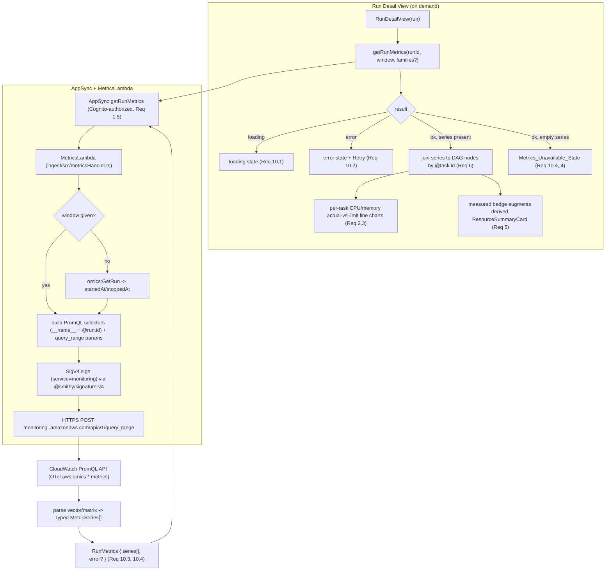

# Design Document

## Overview

This feature adds **measured HealthOmics resource-utilization metrics** (CPU, memory, network,
filesystem, scratch, GPU, run-level filesystem) to the Run Detail page, read **on demand** from
CloudWatch's Prometheus-compatible PromQL HTTP API through a new AppSync **Lambda-backed query**. It
mirrors the existing `getRunLogs` read path (`ingest/src/logsHandler.ts` + `addLogsResolver()` in
`infra/lib/api-stack.ts` + `LogsPanel.tsx` + `getRunLogs` in `frontend/src/api/client.ts`), with one
key difference: there is **no AWS SDK operation** for this PromQL API, so the Lambda must construct and
**SigV4-sign a raw HTTPS POST** itself using `@smithy/signature-v4` (already a dependency of the ingest
package) plus the SDK default credential provider (Req 1.2, 1.6).

The single most important behavioral theme is **honesty about availability**. Measured metrics exist only
under specific preconditions (the run's service role held `cloudwatch:PutMetricData` at run start; a task
was RUNNING for ≥1 emission interval). The dashboard **never fabricates a value**: it renders three
distinct states — loading, error (retryable), and unavailable — and the measured view **augments, never
replaces**, the existing derived `ResourceSummaryCard` (Req 4, 5, 10).

### Two decoupled data planes

This feature deliberately does **not** touch the existing state plane. The dashboard already has:

- **State plane (existing, event-driven, persisted):** EventBridge run/task status-change events →
  ingest Lambda → normalize/enrich → DynamoDB → AppSync subscriptions/queries → `RunDetailView` renders
  DAG nodes and the derived `ResourceSummaryCard`. This is push-based and stored.

- **Metrics plane (new, pull-query, never persisted):** `RunDetailView` calls a new `getRunMetrics`
  AppSync query on demand → `MetricsLambda` issues a SigV4-signed PromQL query against CloudWatch →
  typed series returned → per-task charts. Metrics are **pulled when a run is opened**, never driven by
  EventBridge, and **never written to DynamoDB** (Req 1, 7.4, 8.3). CloudWatch already retains the OTel
  metrics for 15 months, so persisting dense 30-second time-series in DynamoDB would be wasteful and
  redundant.

### Grounding facts (verified against the PoC and AWS docs; treated as constraints, not assumptions)

- The read path is a **SigV4-signed HTTPS POST** (signing service name `monitoring`, region from env) to
  `https://monitoring.<region>.amazonaws.com/api/v1/query` (instant, `resultType: vector`) or
  `/api/v1/query_range` (time series, `resultType: matrix`). There is **no SDK operation**; the Lambda
  builds and signs the raw request. (AWS: CloudWatch PromQL `QueryMetrics`. Content was rephrased for
  compliance with licensing restrictions.)
- **Required IAM (open item — RESOLVED, confirm at implementation):** the CloudWatch PromQL
  `QueryMetrics` operation requires the calling identity to hold **both** `cloudwatch:GetMetricData`
  **and** `cloudwatch:ListMetrics`. Source: AWS CloudWatch PromQL `QueryMetrics` — "Required IAM
  permissions". These are the actions the `MetricsLambda` role gets, no wildcards (Req 1, 8.1). The
  run role's `cloudwatch:PutMetricData` (metric emission) is separate and already in place — out of
  scope for this stack.
- PromQL selectors reference dotted metric names via `__name__`, e.g.
  `{__name__="aws.omics.task.cpu.usage", "@resource.aws.omics.run.id"="<runId>"}`. A bare
  `aws.omics.task.cpu.usage` fails to parse (Req 1.3).
- `query_range` requires RFC3339 `start`/`end` and a **numeric-seconds** `step` (e.g. `"30"`, not
  `"30s"`) and returns `resultType: matrix` (Req 1.4).
- Response JSON is the standard Prometheus envelope: `{ status, data: { resultType,
  result: [ { metric: {<labels incl __name__, __unit__, @resource.aws.omics.run.id,
  @resource.aws.omics.task.id, …>}, value: [ts, "n"]  OR  values: [[ts,"n"],…] } ] } }`. Values are
  **strings** needing parse; timestamps are **unix seconds (float)**.
- Task metrics carry `@resource.aws.omics.task.id`, enabling the JOIN to per-task DAG nodes by task id
  (Req 6). Run-level filesystem metrics carry only the run id.
- A single response returns up to **500** unique time series (the PromQL API cap), status stays 200 when
  truncated with a `warnings` field. This bounds a single run's response comfortably.

### End-to-end flow



The state plane (EventBridge → ingest → DynamoDB) and the metrics plane (query → sign → CloudWatch) share
**no storage and no events**; the only contract is the `getRunMetrics` GraphQL shape.

---

## Architecture

### Components changed or added

| Component | File | Change |
|---|---|---|
| MetricsLambda | `ingest/src/metricsHandler.ts` (new) | AppSync resolver `{ arguments }`; build PromQL, SigV4-sign, POST, parse; typed result (Req 1, 2, 3, 8, 9, 10) |
| PromQL builder | `ingest/src/metrics/promql.ts` (new) | Pure `__name__` + `@resource.*` selector construction (Req 1.3, 8.1) |
| Signed-request builder | `ingest/src/metrics/signedQuery.ts` (new) | SigV4 request construction (service `monitoring`) + form body (Req 1.2, 1.4) |
| Prometheus parser | `ingest/src/metrics/parse.ts` (new) | Parse vector/matrix envelope → typed `MetricSeries[]`; empty→unavailable, error→typed-error (Req 2.2, 3.2, 10.3, 10.4) |
| Metric registry | `ingest/src/metrics/registry.ts` (new) | The `aws.omics.*` metric set + families + label→field mapping (Req 2, 3, 9) |
| GraphQL schema | `infra/graphql/schema.graphql` | `getRunMetrics` query + `RunMetrics`/`MetricSeries`/`MetricPoint` types + enums (Req 1.1, 1.5) |
| API stack | `infra/lib/api-stack.ts` | `addMetricsResolver()` mirroring `addLogsResolver()`; least-privilege IAM (Req 1, 8.1) |
| Frontend client | `frontend/src/api/client.ts`, `api/types.ts` | `getRunMetrics` one-shot query + typed payload (Req 1.1, 10) |
| Metrics view | `frontend/src/rundetail/RunMetricsPanel.tsx` (new) | Per-task actual-vs-limit charts; three-state handling; measured labeling (Req 2,3,4,5,9,10) |
| Task-id join | `frontend/src/metrics/joinMetricsToTasks.ts` (new) | Pure JOIN of series→tasks by `@resource.aws.omics.task.id` (Req 6) |
| Series→chart shaping | `frontend/src/metrics/chartSeries.ts` (new) | Pure shaping of `MetricSeries` into Cloudscape chart series (Req 2.3, 3.3, 9) |
| Run detail wiring | `frontend/src/rundetail/RunDetailView.tsx` | Fetch metrics on open; render `RunMetricsPanel`; augment derived summary (Req 5, 6, 7.4) |

### Design principle: isolate the AWS-shape assumptions

All CloudWatch PromQL request/response assumptions (host template, signing service name, endpoint paths,
response envelope shape, label names) live behind clearly-marked constants in `ingest/src/metrics/`,
mirroring how `logsHandler.ts` isolates its log-group/stream-name assumptions. The IAM action set is
documented as **confirm at implementation** at the single `addMetricsResolver()` site.

---

## Components and Interfaces

### 1. MetricsLambda (`ingest/src/metricsHandler.ts`) — Req 1, 2, 3, 8, 9, 10

Mirrors `logsHandler.ts`: an AppSync Lambda-resolver whose event is the resolver payload
`{ arguments: {...} }`, returning a typed result matching the `RunMetrics` GraphQL type.

```ts
/** The AppSync Lambda-resolver event shape for `getRunMetrics`. */
interface GetRunMetricsEvent {
  arguments: {
    runId: string;
    /** Optional explicit RFC3339 window; when absent the Lambda derives it via GetRun. */
    startTime?: string | null;
    endTime?: string | null;
    /** Numeric-seconds resolution; clamped to >= 30 (Req 8.2). */
    stepSeconds?: number | null;
    /** Optional metric-family filter to bound cost (Req 8); default = CORE (cpu+memory). */
    families?: MetricFamily[] | null;
  };
}

type MetricFamily = 'CPU' | 'MEMORY' | 'NETWORK' | 'FILESYSTEM' | 'SCRATCH' | 'GPU' | 'RUN_FILESYSTEM';

/** One returned series (mirrors GraphQL `MetricSeries`). */
interface MetricSeries {
  metricName: string;               // e.g. "aws.omics.task.cpu.usage"
  family: MetricFamily;
  role: 'usage' | 'limit';          // actual-vs-limit pairing
  unit: string | null;              // from __unit__ (e.g. bytes, {cpu})
  taskId: string | null;            // @resource.aws.omics.task.id; null for run-level
  direction: string | null;         // network.io.direction | filesystem.io.direction
  scratchMode: string | null;       // scratch.storage.mode = LOCAL|SHARED
  gpuId: string | null;             // gpu.id
  points: { timestamp: number; value: number }[]; // ts = ms; value parsed from string
}

/** The resolver result (mirrors GraphQL `RunMetrics`). */
interface RunMetrics {
  runId: string;
  window: { start: string; end: string; stepSeconds: number } | null;
  series: MetricSeries[];           // empty array => Metrics_Unavailable_State (Req 10.4)
  error: string | null;            // non-null => typed error (Req 10.3)
}
```

Control flow:

1. Validate `runId` (non-empty), else `throw` (matches `logsHandler` validation).
2. **Resolve the range window** (Req 8.2): if `startTime`/`endTime` are supplied, use them; otherwise
   call `omics:GetRun` (`@aws-sdk/client-omics`, already an ingest dependency) and use
   `run.startTime`..`run.stopTime ?? now`. See "Run window" below for the decision + IAM impact.
3. Clamp `stepSeconds` to `>= 30` (default 30) (Req 8.2).
4. For each requested family, build the PromQL selector(s) via `buildSelector` (§2), scoped to the single
   run id (Req 8.1). CORE (default) = `aws.omics.task.cpu.{usage,limit}` +
   `aws.omics.task.memory.{usage,limit}` (Req 2.1, 3.1).
5. Build and SigV4-sign one `query_range` POST per selector via `signAndPost` (§3). Requests for the run
   run concurrently (`Promise.all`) and each is independent.
6. Parse each Prometheus matrix response into `MetricSeries[]` via `parseMatrix` (§4), tagging `family`,
   `role`, and the resource labels.
7. On any non-success HTTP status or Prometheus `status: "error"`, return
   `{ runId, window, series: [], error: <message> }` — a **typed error**, never an empty-success masking
   a failure (Req 10.3). On success return the parsed series (possibly empty → unavailable, Req 10.4).

Env vars (no hardcoding): `METRICS_REGION` (defaults to `AWS_REGION`), `MONITORING_HOST` (defaults to
`monitoring.<region>.amazonaws.com`), `SIGNING_SERVICE` (defaults to `monitoring`). Timeout: **30s**
(matches the logs Lambda).

**Range vs instant (decision):** the Lambda issues **`query_range`** for the charts the UI needs
(actual-vs-limit over the run window), returning `matrix`. Instant `query` (`vector`) is not used in v1:
the core operator need is trend-over-time (spotting bottlenecks/pressure), and a matrix is a superset of
a single instant value (Req 2.3, 3.3, 7.1, 7.2).

### 2. PromQL builder (`ingest/src/metrics/promql.ts`) — Req 1.3, 8.1

```ts
/** Build a well-formed PromQL selector referencing a dotted metric via __name__,
 *  always scoped to a single run id (Req 1.3, 8.1). */
export function buildSelector(metricName: string, runId: string): string {
  // {__name__="aws.omics.task.cpu.usage", "@resource.aws.omics.run.id"="<runId>"}
  return `{__name__=${q(metricName)}, "@resource.aws.omics.run.id"=${q(runId)}}`;
}
function q(s: string): string { /* wrap in double-quotes, escape " and \ */ }
```

The builder is pure and total: for any metric name and run id it produces a syntactically well-formed
selector (Property 2). Values are quoted/escaped so arbitrary run ids cannot break the expression.

### 3. Signed-request builder (`ingest/src/metrics/signedQuery.ts`) — Req 1.2, 1.4

```ts
import { SignatureV4 } from '@smithy/signature-v4';
import { Sha256 } from '@aws-crypto/sha256-js';
import { defaultProvider } from '@aws-sdk/credential-provider-node';

export interface RangeParams { query: string; start: string; end: string; step: string; }

/** Construct the form-encoded body for a query_range POST (Req 1.4). */
export function buildRangeBody(p: RangeParams): string {
  // application/x-www-form-urlencoded: query, start (RFC3339), end (RFC3339), step (numeric seconds)
  const body = new URLSearchParams();
  body.set('query', p.query);
  body.set('start', p.start);   // RFC3339
  body.set('end', p.end);       // RFC3339
  body.set('step', p.step);     // numeric seconds string, e.g. "30"
  return body.toString();
}

/** SigV4-sign (service=monitoring, SHA256) and POST to /api/v1/query_range. */
export async function signAndPost(host: string, region: string, service: string,
  path: '/api/v1/query_range', body: string): Promise<PrometheusEnvelope>;
```

Signing details (Req 1.2): `SignatureV4({ service: 'monitoring', region, sha256: Sha256,
credentials: defaultProvider() })`, sign an `HttpRequest` with method `POST`, the `host` header,
`content-type: application/x-www-form-urlencoded`, and the form body; then a plain HTTPS POST (Node 20
global `fetch`). The signed request goes to `https://<host>/api/v1/query_range`.

### 4. Prometheus parser (`ingest/src/metrics/parse.ts`) — Req 2.2, 3.2, 10.3, 10.4

```ts
export interface PrometheusEnvelope {
  status: 'success' | 'error';
  errorType?: string; error?: string; warnings?: string[];
  data?: { resultType: 'matrix' | 'vector'; result: PromResult[] };
}
interface PromResult {
  metric: Record<string, string>;              // labels incl __name__, __unit__, @resource.*
  value?: [number, string];                    // vector (unix seconds, string value)
  values?: [number, string][];                 // matrix
}

/** Map a success matrix envelope to typed series; label extraction is total. */
export function parseMatrix(env: PrometheusEnvelope, family: MetricFamily, role: 'usage'|'limit'): MetricSeries[];
/** Map an instant vector envelope (kept for completeness / future instant use). */
export function parseVector(env: PrometheusEnvelope, family: MetricFamily, role: 'usage'|'limit'): MetricSeries[];
```

Rules: each `PromResult` becomes one `MetricSeries`; `timestamp` = `Math.round(tsSeconds * 1000)`;
`value` = `Number(str)` (points whose value fails to parse to a finite number are dropped, never
fabricated); labels extracted: `taskId=@resource.aws.omics.task.id`, `unit=__unit__`,
`direction=network.io.direction ?? filesystem.io.direction`, `scratchMode=scratch.storage.mode`,
`gpuId=gpu.id` (Req 2.2, 3.2, 9.1, 9.2, 9.3, 9.5). A `status:"error"` (or a caller-detected non-2xx)
never reaches `parseMatrix`; the handler returns a typed error instead (Req 10.3). A success envelope
with an empty `result` yields `[]` → unavailable (Req 10.4).

### 5. Metric registry (`ingest/src/metrics/registry.ts`) — Req 2, 3, 9

A pure table mapping each `MetricFamily` to its metric names and `role`:

| Family | usage metric | limit metric | Req |
|---|---|---|---|
| CPU | `aws.omics.task.cpu.usage` | `aws.omics.task.cpu.limit` | 2.1 |
| MEMORY | `aws.omics.task.memory.usage` | `aws.omics.task.memory.limit` | 3.1 |
| NETWORK | `aws.omics.task.network.io` (split by `network.io.direction`) | — | 9.1 |
| FILESYSTEM | `aws.omics.task.filesystem.io`, `aws.omics.task.filesystem.operations` (by `filesystem.io.direction`) | — | 9.2 |
| SCRATCH | `aws.omics.task.filesystem.scratch.storage.usage` (by `scratch.storage.mode`) | `aws.omics.task.filesystem.scratch.storage.limit` | 9.3, 9.4 |
| GPU | `aws.omics.task.gpu.utilization`, `aws.omics.task.gpu.memory.usage` (per `gpu.id`) | `aws.omics.task.gpu.memory.limit` | 9.5, 9.6 |
| RUN_FILESYSTEM | `aws.omics.run.filesystem.usage` | `aws.omics.run.filesystem.limit` (STATIC only) | 9.7, 9.8 |

### Run window (decision) — Req 8.2

The `MetricsLambda` derives the range window from the run's execution window. **Decision:** the frontend
**passes** the window when it already has it (it has loaded the `Run`, which carries `startedAt`/
`stoppedAt`), and the Lambda **falls back to `omics:GetRun`** only when the window args are absent. This
keeps the common path free of an extra AWS call (lower latency/cost, Req 8) while remaining robust if a
caller omits the window. Choosing GetRun as the fallback adds a narrow **`omics:GetRun`** permission to
the Lambda role, scoped to the run resource ARN (no wildcard action). For a `Live_Run` with no
`stoppedAt`, `end = now` (Req 7.1). Rationale for supporting both: the frontend already holds the run
window, so the fast path avoids a redundant GetRun; the fallback prevents an unusable query if a future
caller passes only `runId`.

### 6. GraphQL surface (`infra/graphql/schema.graphql`) — Req 1.1, 1.5

```graphql
enum MetricFamily { CPU MEMORY NETWORK FILESYSTEM SCRATCH GPU RUN_FILESYSTEM }
enum MetricRole { usage limit }

type MetricPoint @aws_cognito_user_pools {
  # Epoch milliseconds.
  timestamp: AWSTimestamp!
  value: Float!
}

type MetricSeries @aws_cognito_user_pools {
  metricName: String!
  family: MetricFamily!
  role: MetricRole!
  unit: String
  taskId: ID            # null for run-level series
  direction: String     # network/filesystem io direction
  scratchMode: String   # LOCAL | SHARED
  gpuId: String
  points: [MetricPoint!]!
}

type MetricWindow @aws_cognito_user_pools {
  start: String!
  end: String!
  stepSeconds: Int!
}

type RunMetrics @aws_cognito_user_pools {
  runId: ID!
  window: MetricWindow
  series: [MetricSeries!]!   # empty => Metrics_Unavailable_State (Req 10.4)
  error: String             # non-null => query failed (Req 10.3)
}

# added to type Query:
getRunMetrics(
  runId: ID!
  startTime: String
  endTime: String
  stepSeconds: Int
  families: [MetricFamily!]
): RunMetrics @aws_cognito_user_pools
```

**Strongly-typed vs AWSJSON (decision):** the core CPU/memory (and all v1) series are **strongly typed**
(`MetricSeries` with explicit `points: [MetricPoint!]!` of `{ timestamp, value }`), not `AWSJSON`.
Rationale: the shape is fixed and small, the frontend needs `timestamp`/`value` per point for charting,
and strong typing gives compile-time safety in `client.ts`/`types.ts` and lets the schema/infra tests
assert the contract — consistent with how `RunLogs`/`LogEvent` are strongly typed rather than `AWSJSON`.
Direction/scratch-mode/gpu.id are optional scalar labels on the series so secondary families reuse the
same type without a union explosion.

**One query returns all requested families (decision, Req 8):** `getRunMetrics` returns every requested
family's series in one round-trip, parameterized by an optional `families` filter that **defaults to
CORE (CPU+MEMORY)**. This bounds cost by default (the operator pays for CPU+memory unless they expand),
while a single call avoids N AppSync/Lambda invocations. Secondary families are fetched only when the
operator expands those views (Req 9, 8.3) by re-issuing `getRunMetrics` with a wider `families` list.

Authorization: `getRunMetrics` and all metric types carry only `@aws_cognito_user_pools`, consistent
with the other interactive queries (Req 1.5). The browser never signs the CloudWatch request (Req 1.6).

### 7. API stack — `addMetricsResolver()` (`infra/lib/api-stack.ts`) — Req 1, 8.1

Mirrors `addLogsResolver()` exactly:

```ts
private addMetricsResolver(): void {
  const metricsFn = new NodejsFunction(this, 'MetricsFunction', {
    runtime: Runtime.NODEJS_20_X,
    entry: METRICS_HANDLER_ENTRY,               // ingest/src/metricsHandler.ts
    handler: 'handler',
    projectRoot: INGEST_PROJECT_ROOT,
    depsLockFilePath: INGEST_DEPS_LOCK_FILE,
    timeout: Duration.seconds(30),
    environment: {
      METRICS_REGION: Stack.of(this).region,
      MONITORING_HOST: `monitoring.${Stack.of(this).region}.amazonaws.com`,
      SIGNING_SERVICE: 'monitoring',
    },
    bundling: {
      format: OutputFormat.ESM,
      // Externalize only the AWS SDK modules present in the Lambda runtime.
      // @smithy/signature-v4 and @aws-crypto/sha256-js are NOT in the runtime,
      // so they are bundled (NOT externalized). See bundling note below.
      externalModules: ['@aws-sdk/*'],
    },
  });

  // Least-privilege: the CloudWatch PromQL QueryMetrics operation requires BOTH
  // cloudwatch:GetMetricData and cloudwatch:ListMetrics (AWS docs — CONFIRM AT
  // IMPLEMENTATION). No wildcard action. CloudWatch PromQL query has no
  // resource-level scoping, so resource is '*' for these read-only actions;
  // GetRun (the window fallback) is scoped to the run ARN (Req 8.1).
  metricsFn.addToRolePolicy(new PolicyStatement({
    effect: Effect.ALLOW,
    actions: ['cloudwatch:GetMetricData', 'cloudwatch:ListMetrics'],
    resources: ['*'],
  }));
  metricsFn.addToRolePolicy(new PolicyStatement({
    effect: Effect.ALLOW,
    actions: ['omics:GetRun'],
    resources: [`arn:aws:omics:${region}:${account}:run/*`],
  }));

  const ds = this.api.addLambdaDataSource('MetricsDataSource', metricsFn);
  ds.createResolver('getRunMetricsResolver', { typeName: 'Query', fieldName: 'getRunMetrics' });
}
```

**Bundling note (`@smithy/signature-v4`):** `logsHandler.ts` externalizes `@aws-sdk/*` because those
SDK clients are present in the Node 20 Lambda runtime. `@smithy/signature-v4` and `@aws-crypto/sha256-js`
are **not** guaranteed in the runtime, so they must be **bundled** (i.e. NOT added to `externalModules`).
Keeping `externalModules: ['@aws-sdk/*']` externalizes the SDK (incl. `credential-provider-node`) while
esbuild bundles signature-v4/sha256 — the correct split. Both are already ingest dependencies
(`@smithy/signature-v4` 5.7.3 is present; `@aws-crypto/sha256-js` is added if not already transitively
available). **Note (confirm at implementation):** the exact IAM action pair and the presence of
`@aws-crypto/sha256-js` in the lockfile are the two items to verify before deploy.

**Note on `cloudwatch:GetMetricData` resource scoping:** CloudWatch metric-data actions do not support
resource-level ARNs, so `Resource: '*'` is required for the read-only query actions — this is the
narrowest possible grant for these actions and carries no `Action: '*'`, consistent with the no-wildcard-
action discipline of `addLogsResolver` (Req 8.1). This is an intentional, documented exception to
resource scoping, unlike the logs resolver whose action *does* support ARN scoping.

### 8. Frontend client (`frontend/src/api/client.ts`, `api/types.ts`) — Req 1.1, 10

Add a one-shot query mirroring `getRunLogs`:

```ts
const GET_RUN_METRICS = /* GraphQL */ `
  query GetRunMetrics($runId: ID!, $startTime: String, $endTime: String,
                      $stepSeconds: Int, $families: [MetricFamily!]) {
    getRunMetrics(runId: $runId, startTime: $startTime, endTime: $endTime,
                  stepSeconds: $stepSeconds, families: $families) {
      runId
      window { start end stepSeconds }
      series {
        metricName family role unit taskId direction scratchMode gpuId
        points { timestamp value }
      }
      error
    }
  }`;

export async function getRunMetrics(variables: {
  runId: string; startTime?: string; endTime?: string;
  stepSeconds?: number; families?: MetricFamily[];
}): Promise<RunMetrics>;   // mock mode returns { series: [], error: null } (unavailable)
```

`types.ts` gains `MetricFamily`, `MetricRole`, `MetricPoint`, `MetricSeries`, `MetricWindow`,
`RunMetrics` mirrors of the schema. In `isLocalMockMode()`, `getRunMetrics` returns an empty-series
success so the UI shows the unavailable state without a backend (matching the honesty theme).

### 9. Metrics view (`frontend/src/rundetail/RunMetricsPanel.tsx` + helpers) — Req 2,3,4,5,6,9,10

A new panel, fetched on open by `RunDetailView` (once per mount, like `getRun`), rendering three states:

- **Loading** (`phase === 'loading'`): Cloudscape `Spinner` + "Loading measured utilization…" — distinct
  from unavailable (Req 10.1).
- **Error** (`phase === 'error'` or `result.error != null`): Cloudscape `Alert type="error"` with a
  **Retry** button that re-issues the query — distinct from unavailable (Req 10.2). A non-null
  `RunMetrics.error` is treated as this error state (Req 10.3).
- **Unavailable** (`result.series.length === 0`): an explicit "Measured utilization unavailable" message
  explaining metrics exist only for runs started after the role gained `cloudwatch:PutMetricData` and for
  tasks that ran ≥30s — distinct from both loading and error, and **never a fabricated 0** (Req 4.1–4.5,
  10.4). Runs started before the permission return empty → this state (Req 4.3).
- **Ready with series:** per-task charts (below).

**Chart technology (decision):** use Cloudscape's **`LineChart`** (`@cloudscape-design/components/
line-chart`, already installed — verified in `node_modules`) and **`MixedLineBarChart`** where a
usage line vs a limit reference is clearer. No new dependency. Cloudscape charts carry built-in
loading/empty/error slots that align with the three-state model. `chartSeries.ts` shapes each
`MetricSeries` into Cloudscape chart series: for CPU and memory a task gets an **actual (usage) line**
and a **limit line/threshold** on the same axis, in the metric's unit (bytes for memory from `__unit__`,
`{cpu}` for CPU) (Req 2.3, 2.4, 3.3, 3.4). If a task has usage but no limit, only the usage line is
drawn (no fabricated limit); if a task has neither, the unavailable state is shown for that task/metric
(Req 2.5, 3.5).

**Placement / augment-not-replace (Req 5):** `RunMetricsPanel` renders **below** the existing
`ResourceSummaryCard`, which is unchanged and always present (Req 5.1, 5.2). The derived summary's values
keep their existing labeling; the measured panel labels every value **"measured"** (e.g. a Cloudscape
`Badge` "Measured" on each chart) so measured and derived are visually distinguishable (Req 5.3, 5.4,
5.5). Where a run has no measured metrics, the derived summary still renders (Req 5.2) and the measured
panel shows unavailable.

**Task-id join to DAG nodes (`joinMetricsToTasks.ts`) — Req 6:** the pure join groups `series` by
`taskId` and matches each group to the `Task` whose `taskId` equals the series' `taskId`. Per-task CPU
and memory charts are surfaced in the context of that task's DAG node (e.g. a "Metrics" tab/section keyed
to the selected node, alongside the existing logs selection) (Req 6.1, 6.2). A series whose `taskId`
matches no task in the run is **omitted** from the per-node presentation without failing the overall view
(Req 6.3). A DAG node with no matching series shows the unavailable state for that node (Req 6.4).

> **Robustness note (Req 6):** live nf-core task *names* are fully qualified (e.g.
> `NFCORE_FETCHNGS:SRA:SRA_IDS_TO_RUNINFO (SRR…)`), which complicates any name-based matching. This join
> is **by task id** (`@resource.aws.omics.task.id` ↔ `Task.taskId`), **not by name**, so it is completely
> unaffected by that naming caveat — a deliberate reason the id-join is the robust choice.

Run-level filesystem series (`taskId === null`) are rendered in a run-scoped chart, not attached to a
node; when `aws.omics.run.filesystem.limit` is absent (DYNAMIC storage) the usage is shown **without a
limit reference** rather than fabricating one (Req 9.7, 9.8). GPU views are shown only when GPU series
exist and are omitted (no error) otherwise (Req 9.5, 9.6). Scratch shows usage-vs-limit split by
`scratch.storage.mode`; delayed/absent SHARED scratch → unavailable for the scratch view (Req 9.3, 9.4).

**Live vs historical + refresh (Req 7):** for a `Live_Run` the panel offers an on-demand **Refresh**
button (like `LogsPanel`) and no high-frequency automatic poll (Req 7.4, 8.3, 8.4); the window's `end`
is `now` so newly-emitted points appear on refresh (Req 7.1). For a `Historical_Run` the window is the
completed run's `startedAt`..`stoppedAt`; if that falls outside the 15-month retention the query returns
empty → unavailable (Req 7.2, 7.3).

---

## Data Models

### `MetricSeries` (Lambda output / GraphQL) — Req 2.2, 3.2, 9

```ts
interface MetricSeries {
  metricName: string; family: MetricFamily; role: 'usage' | 'limit';
  unit: string | null; taskId: string | null;
  direction: string | null; scratchMode: string | null; gpuId: string | null;
  points: { timestamp: number; value: number }[]; // ts ms; value finite number
}
```

### `RunMetrics` (resolver result) — Req 10.3, 10.4

```ts
interface RunMetrics {
  runId: string;
  window: { start: string; end: string; stepSeconds: number } | null;
  series: MetricSeries[];  // [] => unavailable
  error: string | null;    // non-null => failed
}
```

### Prometheus envelope (parser input) — grounding fact

```ts
interface PrometheusEnvelope {
  status: 'success' | 'error'; errorType?: string; error?: string; warnings?: string[];
  data?: { resultType: 'matrix' | 'vector'; result: { metric: Record<string,string>;
    value?: [number, string]; values?: [number, string][] }[] };
}
```

---

## Correctness Properties

*A property is a characteristic or behavior that should hold true across all valid executions of a
system — essentially, a formal statement about what the system should do. Properties serve as the bridge
between human-readable specifications and machine-verifiable correctness guarantees.*

The following properties were derived from a per-acceptance-criterion analysis (prework in context).
Criteria that test AWS/SDK/HTTP wiring, SigV4 mechanics, schema/auth, IAM, or UI wording are covered by
example/integration tests in the Testing Strategy rather than as universal properties.

### Property 1: Prometheus matrix parsing yields one typed series per result with finite points

*For all* success matrix envelopes (any number of results, each with arbitrary labels and any list of
`[unixSeconds, valueString]` value pairs), `parseMatrix` returns exactly one `MetricSeries` per result,
each point's `timestamp` equals the source seconds converted to integer milliseconds and each `value`
equals the numeric parse of the source string, with any point whose string does not parse to a finite
number dropped and never replaced by a fabricated value.

**Validates: Requirements 2.2, 3.2**

### Property 2: PromQL selector construction is well-formed and run-scoped for arbitrary ids

*For all* metric names and run ids (including ids containing quotes, spaces, or backslashes),
`buildSelector` produces a selector that references the metric only through a `__name__` matcher, always
includes the `@resource.aws.omics.run.id` matcher bound to the given run id, and is balanced/parseable
(quotes escaped) — never emitting the metric name as a bare identifier.

**Validates: Requirements 1.3, 8.1**

### Property 3: Empty success maps to unavailable, error maps to typed error

*For all* Prometheus envelopes, a `status:"success"` envelope with an empty `result` produces a
`RunMetrics` with `series: []` and `error: null` (the Metrics_Unavailable_State), while a `status:"error"`
envelope (or a caller-supplied non-2xx signal) produces a `RunMetrics` with `error != null`, and the two
outcomes are never conflated.

**Validates: Requirements 10.3, 10.4**

### Property 4: Series-to-task join omits unmatched series and preserves matched grouping

*For all* sets of `MetricSeries` and task lists, `joinMetricsToTasks` associates every series whose
`taskId` equals some task's `taskId` with exactly that task, omits every series whose `taskId` matches no
task from the per-node result without discarding the other series, and places no series under a task whose
id it does not carry.

**Validates: Requirements 6.1, 6.3**

### Property 5: A task with no matching series is reported unavailable, never fabricated

*For all* task lists and series sets, every task that has no series carrying its `taskId` is reported in
the join result as unavailable (no synthesized zero/placeholder series), and this holds independently of
how many other tasks do have series.

**Validates: Requirements 6.4, 4.2**

### Property 6: Actual-vs-limit chart shaping preserves usage and only pairs a real limit

*For all* per-task series groups, `chartSeries` produces an actual (usage) series for CPU/memory whenever
a usage series exists, pairs it with a limit series **iff** a limit series exists for that task and
metric, and never emits a limit series when none was measured (no fabricated limit).

**Validates: Requirements 2.4, 3.4, 9.8**

### Property 7: Measured presentation never removes the derived summary

*For all* run metric results (including empty/unavailable and error), the presentation state computed for
`RunDetailView` preserves the derived `ResourceSummary` inputs unchanged — the measured result is only
ever added alongside, and an absent or failed measured result never blanks or degrades the derived
summary.

**Validates: Requirements 5.1, 5.2**

### Property 8: Range parameter construction is retention/step bounded

*For all* run windows and requested step values, the `query_range` parameters carry an RFC3339 `start`
and `end` with `start <= end` and a numeric-seconds `step` that is at least 30, for any requested step
below 30 or missing.

**Validates: Requirements 1.4, 8.2**

---

## Error Handling

All error handling distinguishes the three honest states and never fabricates a value or silently drops a
failure.

| Failure / condition | Where | Behavior | Requirement |
|---|---|---|---|
| `runId` empty/missing | `metricsHandler` | `throw` (surfaces as GraphQL error → frontend error state) | 10.2 |
| Non-2xx HTTP from CloudWatch | `signAndPost` → handler | Return `{ series: [], error: <status+body> }` (typed error) | 10.3 |
| Prometheus `status: "error"` | parser gate → handler | Return `{ series: [], error }`; never parsed as empty-success | 10.3 |
| Success with empty `result` | handler | Return `{ series: [], error: null }` → Unavailable | 10.4, 4.1 |
| Run started before `PutMetricData` | (upstream) | CloudWatch returns empty → Unavailable | 4.3 |
| Task ran < one interval | (upstream) | No points for that task id → per-node Unavailable | 4.4 |
| Point value not finite | `parseMatrix` | Drop the point; never fabricate | 4.2 |
| Series taskId matches no node | `joinMetricsToTasks` | Omit from per-node view; overall view unaffected | 6.3 |
| Node has no series | `joinMetricsToTasks` | Per-node Unavailable | 6.4 |
| GPU absent (non-accelerator) | `RunMetricsPanel` | Omit GPU view, no error | 9.6 |
| DYNAMIC-storage run, no filesystem limit | `chartSeries`/panel | Usage without limit reference (no fabricated limit) | 9.8 |
| SHARED scratch delayed/absent | panel | Scratch view Unavailable | 9.4 |
| Window outside 15-month retention | (upstream) | Empty result → Unavailable | 7.3 |
| GetRun fallback fails (window path) | handler | Typed error result | 10.3 |
| Query in progress | frontend | Loading state (distinct from Unavailable) | 10.1 |
| Any query failure | frontend | Error state + Retry (distinct from Unavailable) | 10.2 |

Each PromQL query is scoped to a single run id and bounded to the run window with `step >= 30s`; the
Lambda uses a 30s timeout. No query is issued except in response to an operator opening/refreshing a run
(Req 8.1–8.4). CloudWatch charges per million samples scanned by API queries, so defaulting to the CORE
families and bounding the window keeps cost proportional to what is viewed (Req 8).

---

## Testing Strategy

Property-based testing applies to the pure/input-varying logic (Prometheus parsing, PromQL selector
construction, empty-vs-error mapping, task-id join, chart shaping, range-parameter bounding). SigV4
mechanics, the raw HTTP call, schema/auth, IAM, and UI wording are covered by example/integration tests.
`fast-check` is already a devDependency of both `ingest` and `frontend`; `vitest` is the runner and
Testing Library covers component behavior.

**Property-test configuration:** each property test runs **≥100 iterations** and is tagged
`// Feature: run-utilization-metrics, Property {n}: {property text}`. Each correctness property is
implemented by a single property test.

### Unit / example tests (ingest — Lambda)

- **PromQL builder** (`promql.test.ts`): known metric+run id → exact `__name__` selector string (1.3);
  quote/backslash escaping examples (backing Property 2).
- **Signed-request builder** (`signedQuery.test.ts`): `buildRangeBody` form-encodes `query`/`start`/`end`/
  `step` with RFC3339 start/end and numeric-seconds step (1.4); the signed `HttpRequest` targets
  `monitoring.<region>.amazonaws.com`, method POST, path `/api/v1/query_range`, service `monitoring`, and
  carries an `Authorization` header (1.2) — assert request *shape* with an injected fixed-credential
  signer, not a live call.
- **Prometheus parser** (`parse.test.ts`): fixtures based on the real PoC responses — a `cpu.usage`
  **vector** carrying `@resource.aws.omics.task.id`; a `memory.usage` ~757760 bytes vs `memory.limit`
  6442450944 bytes; a **matrix** from `query_range` — parsed to typed series with correct taskId/unit/
  points (2.2, 3.2); empty `result` → `[]`; `status:"error"` → typed error (10.3, 10.4).
- **Handler orchestration** (`metricsHandler.test.ts`): CORE default families → CPU+memory selectors
  (2.1, 3.1); window passed in args skips GetRun, absent window calls GetRun (8.2); non-2xx → typed error
  (10.3); success empty → unavailable (10.4); step clamped to ≥30 (8.2).

### Property tests (ingest)

- **Property 1** — matrix parsing (`parse.property.test.ts`).
- **Property 2** — selector well-formedness/run-scoping (`promql.property.test.ts`).
- **Property 3** — empty→unavailable vs error→typed-error (`resultMapping.property.test.ts`).
- **Property 8** — range-parameter bounding (`rangeParams.property.test.ts`).

### Frontend tests

- **Property 4 / 5** — `joinMetricsToTasks` (`joinMetricsToTasks.property.test.ts`): matched grouping +
  unmatched-series omission (4/6.1/6.3); unmatched-node unavailable (5/6.4).
- **Property 6** — `chartSeries` actual-vs-limit shaping, no fabricated limit (`chartSeries.property.test.ts`).
- **Property 7** — measured presentation preserves derived summary (`runMetricsPresentation.property.test.ts`).
- **RunMetricsPanel** (component/example): three distinct states — loading, error+Retry, unavailable —
  each visually distinct (10.1, 10.2, 4.5); a non-null `error` renders the error state (10.3); empty
  series renders unavailable (10.4); measured values labeled "Measured" and shown alongside the derived
  card (5.3–5.5); run started pre-permission (empty) → unavailable (4.3); GPU omitted without error when
  absent (9.6); DYNAMIC run filesystem usage shown without a limit (9.8).
- **Client** (`client.test.ts`): `getRunMetrics` sends the documented query/vars; mock mode returns
  empty-series success (unavailable).

### Infra tests (`infra` — jest via `test/app.test.ts`, mirroring the logs assertions)

- Schema contains `getRunMetrics(runId, startTime, endTime, stepSeconds, families): RunMetrics` and the
  `RunMetrics`/`MetricSeries`/`MetricPoint`/`MetricWindow` types + `MetricFamily`/`MetricRole` enums, all
  carrying `@aws_cognito_user_pools` (1.1, 1.5).
- CDK synth registers a Lambda data source + `getRunMetrics` resolver on the API (mirror the
  `LogsDataSource`/`getRunLogsResolver` assertions).
- Least-privilege IAM: a policy statement with `Action: ['cloudwatch:GetMetricData',
  'cloudwatch:ListMetrics']` and one with `omics:GetRun` scoped to a run ARN, and **no** `Action: '*'`
  (reuse the `allPolicyActions` helper to assert no wildcard action) (8.1).

### Verification commands

- ingest: `cd ingest && npm run build && npm test`
- frontend: `cd frontend && npm run build && npm run lint && npx vitest run`
- infra: `cd infra && npm test`

---

## Design Decisions and Tradeoffs

- **Pull-query, never event-driven or persisted (chosen).** Metrics are read on demand from CloudWatch,
  not ingested via EventBridge and not written to DynamoDB. Rejected: an event-driven/persisted approach —
  utilization figures are not EventBridge events, and storing dense 30-second time-series per task would
  bloat the table for data CloudWatch already retains 15 months. (Req 1, 7.4, 8.3.)
- **SigV4-signed raw HTTP, not an SDK client (chosen).** There is no AWS SDK operation for the CloudWatch
  PromQL API, so the Lambda signs a raw HTTPS POST with `@smithy/signature-v4` (service `monitoring`).
  Rejected: an SDK client call — no such operation exists. This is the key structural difference from
  `logsHandler.ts`. (Req 1.2.)
- **`query_range` (matrix) over instant `query` (vector) (chosen).** The operator need is trend-over-time
  (spot bottlenecks/pressure/exhaustion), and a matrix subsumes a single instant value. Instant queries
  are kept parseable (`parseVector`) for possible future use but unused in v1. (Req 2.3, 3.3, 7.)
- **Strongly-typed series, not `AWSJSON` (chosen).** The shape is fixed and small; strong typing gives
  compile-time safety and lets schema/infra tests assert the contract, consistent with `RunLogs`.
  Rejected: `AWSJSON` — opaque, untestable at the schema level. (Req 2, 3, 9.)
- **One query returns all requested families, default CORE (chosen).** Bounds cost by default (CPU+memory
  only unless the operator expands) while avoiding N round-trips; secondary families are opt-in via the
  `families` arg. Rejected: one query per family always — more invocations and AppSync calls. (Req 8, 9.)
- **Run window: frontend passes it, GetRun fallback (chosen).** The frontend already loaded the `Run`, so
  the fast path needs no extra AWS call; the `omics:GetRun` fallback (narrow, run-ARN-scoped) keeps the
  Lambda usable if only `runId` is passed. Rejected: always GetRun — a redundant call and extra latency on
  the common path. (Req 8.2.)
- **Bundle `@smithy/signature-v4`, externalize `@aws-sdk/*` (chosen).** The SDK is in the Lambda runtime
  (externalized like the logs Lambda), but signature-v4/sha256 are not, so they are bundled by esbuild.
  Rejected: externalizing signature-v4 — it would be missing at runtime. (Req 1.2.)
- **Augment, never replace the derived summary (chosen).** The measured panel is added below the
  unchanged `ResourceSummaryCard`; measured values are badged "Measured" and derived keep their labels, so
  older/finished runs never go blank. Rejected: replacing the derived summary — would blank runs with no
  measured metrics. (Req 5.)
- **Cloudscape `LineChart`/`MixedLineBarChart`, no new dependency (chosen).** Verified present in
  `frontend/node_modules/@cloudscape-design/components`; their loading/empty slots align with the
  three-state model. Rejected: adding a charting dependency — unnecessary. (Req 2.3, 3.3, 9.)
- **Join by task id, not task name (chosen).** `@resource.aws.omics.task.id` ↔ `Task.taskId` is immune to
  the fully-qualified nf-core task-name caveat. Rejected: name-based matching — brittle against qualified
  live task names. (Req 6.)

---

## Requirements Traceability Summary

| Requirement | Addressed in |
|---|---|
| 1.1–1.6 | §1 MetricsLambda, §2 PromQL builder, §3 signed request, §6 GraphQL surface, §7 API stack; Properties 2, 8 |
| 2.1–2.5 | §1, §5 registry, §9 charts/join; Properties 1, 4, 5, 6 |
| 3.1–3.5 | §1, §4 parser, §5 registry, §9; Properties 1, 4, 5, 6 |
| 4.1–4.5 | §1 typed result, §9 three-state panel; Properties 3, 5 |
| 5.1–5.5 | §9 augment-not-replace + measured labeling; Property 7 |
| 6.1–6.4 | §9 `joinMetricsToTasks` (id-join); Properties 4, 5 |
| 7.1–7.4 | Run window (§Run window), §9 live/historical + on-demand refresh |
| 8.1–8.4 | §2 run-scoped selector, §Run window, §7 IAM, §9 refresh; Property 8 |
| 9.1–9.8 | §5 registry, §9 secondary views + graceful degradation; Property 6 |
| 10.1–10.4 | §1 typed error/empty, §9 three states + Retry; Property 3 |
