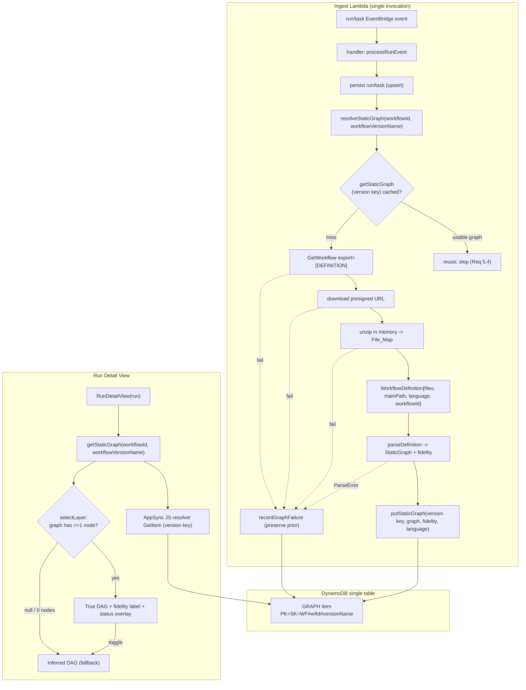

# Design Document

## Overview

This feature builds a **static DAG** — a source-derived dependency graph — for an AWS HealthOmics
workflow by downloading and parsing the workflow's **definition bundle** (`definition.zip`), caching
the parsed graph under a **version-qualified key**, exposing it through a new GraphQL query, and
rendering it in the run detail view as a "True DAG" layer that falls back to the existing Inferred
DAG when no usable graph is available.

The design deliberately extends existing machinery rather than recreating it. The pieces already in
place are:

- `getWorkflowDefinition()` and the `resolveDefinitionSource` / `resolveLanguage` / `mapEngineToLanguage`
  helpers behind "CONFIRM AGAINST AWS DOCS" markers in `ingest/src/enrichment/workflow.ts`, wrapped by
  `callWithRetry` (`ingest/src/enrichment/retry.ts`).
- The parser module in `ingest/src/parser/` — `WorkflowDefinition`, `DefinitionParser`, `parseDefinition`,
  `StaticGraph`/`GraphNode`/`GraphEdge`, `ParseError`, `assertValidGraph`, `hasCycle`, `registerParser`/`getParser`
  (`types.ts`) plus the three language parsers `wdl.ts`, `nextflow.ts`, `cwl.ts`.
- The `GRAPH` entity type in `ingest/src/repository.ts` — `buildGraphItem`, `putStaticGraph`,
  `getStaticGraph`, `recordGraphFailure`, `graphPk`/`graphSk`, `GraphItem`.
- The ingest orchestration in `ingest/src/handler.ts` (`resolveStaticGraph`).
- The AppSync GraphQL surface (`infra/graphql/schema.graphql`, `infra/resolvers/getRun.js`) and the
  CDK stacks (`infra/lib/api-stack.ts`, `infra/lib/ingest-stack.ts`).
- The frontend run detail view (`frontend/src/rundetail/RunDetailView.tsx`, `graphLayout.ts`) and the
  layer machinery (`frontend/src/taskview/selectLayer.ts`, `trueDag.ts`, `types.ts`, `api/client.ts`).

### Grounding facts (verified) that shape the design

- `GetWorkflow(export=[DEFINITION])` returns the definition as a **presigned S3 URL** on the `definition`
  field (not inline text), plus `engine`, `main` (entry filename), and `parameterTemplate`. The current
  `resolveDefinitionSource` assumption ("`definition` is inline text") is therefore wrong for real
  workflows and is replaced (Req 1.1).
- The presigned URL has a short (~600s) TTL, so download must happen inside the same invocation
  (Req 1.2, 1.3).
- `GetRun` returns `workflowVersionName` (String, `[A-Za-z0-9][A-Za-z0-9\-\._]*`, may be absent). This
  is the source of the `Workflow_Version_Name` used in the cache key. Verified against the HealthOmics
  API reference for `GetRun`. (Content was rephrased for compliance with licensing restrictions.)
- The ingest Lambda bundles the AWS SDK via esbuild with `externalModules: []`, so a new pure-JS zip
  dependency bundles cleanly with no native/runtime concern.
- `fast-check` is already an ingest devDependency; property-based tests are the established pattern.

### End-to-end flow



The ingest path (fetch → unzip → parse → cache) and the frontend path (query → resolve → render) are
fully decoupled through the `GRAPH` DynamoDB item; the only contract between them is the version-qualified
key and the item shape.

---

## Architecture

### Components changed or added

| Component | File | Change |
|---|---|---|
| Definition_Fetcher | `ingest/src/enrichment/workflow.ts` | Read presigned URL, download + unzip in-invocation, emit File_Map + Main_Path (Req 1, 2.3) |
| Zip decoder | `ingest/src/enrichment/unzip.ts` (new) | In-memory unzip of the bundle into `Record<string,string>` (Req 1.4) |
| Parser types | `ingest/src/parser/types.ts` | `WorkflowDefinition.source` → `files`+`mainPath`; add `fidelity` to `StaticGraph` (Req 2.1, 2.2, 4.6, 4.7) |
| WDL parser | `ingest/src/parser/wdl.ts` | Read `files[mainPath]`; set fidelity (Req 2.4, 4.6/4.7) |
| CWL parser | `ingest/src/parser/cwl.ts` | Read `files[mainPath]`; set fidelity (Req 2.5, 4.6/4.7) |
| Nextflow parser | `ingest/src/parser/nextflow.ts` | Cross-file `include` resolution across File_Map; fidelity=`approximate` (Req 2.6, 3, 4.2, 4.7) |
| Repository | `ingest/src/repository.ts` | Version-qualified keys; store fidelity/language/updatedAt (Req 5) |
| Handler | `ingest/src/handler.ts` | Pass `workflowVersionName` through resolve/cache/failure (Req 1.9, 5.3–5.5) |
| GraphQL schema | `infra/graphql/schema.graphql` | `StaticGraph` type + `getStaticGraph` query (Req 6) |
| Resolver | `infra/resolvers/getStaticGraph.js` (new) | GetItem on version key; null on miss (Req 6.3–6.5) |
| API stack | `infra/lib/api-stack.ts` | Register the `getStaticGraph` JS resolver on the read-only Dynamo data source (Req 6.6) |
| Frontend client | `frontend/src/api/client.ts`, `api/types.ts` | `getStaticGraph` query; `Run.workflowVersionName`; `StaticGraph.fidelity` (Req 7.1, 8.1) |
| Run detail view | `frontend/src/rundetail/RunDetailView.tsx` | Fetch graph, select layer, fidelity label, toggle (Req 7, 8) |

### Design principle: keep AWS-shape assumptions isolated

`ingest/src/enrichment/workflow.ts` remains the single "CONFIRM AGAINST AWS DOCS" location for the
`GetWorkflow` response shape. All new assumptions — that `definition` is a presigned URL, that `main`
is the entry filename, that `engine` carries the language — live behind clearly-marked constants and
resolver helpers in that file, exactly as the existing `DEFINITION_SOURCE_FIELD` / `WORKFLOW_LANGUAGE_FIELD`
constants do (Req 1.1, 1.5).

---

## Components and Interfaces

### 1. Definition_Fetcher (`ingest/src/enrichment/workflow.ts`) — Req 1, 2.3

`getWorkflowDefinition` changes from "resolve inline text" to "resolve a File_Map by downloading and
unzipping the bundle within the invocation". The retry/timeout wrapper (`callWithRetry`) is kept for
the `GetWorkflow` call; the download and unzip are new steps performed after a successful `GetWorkflow`.

New/changed constants behind the CONFIRM markers:

```ts
// CONFIRM AGAINST AWS DOCS: definition field now carries a presigned S3 URL to definition.zip.
const DEFINITION_URL_FIELD = 'definition' as const;
// CONFIRM AGAINST AWS DOCS: the entry-file name within the bundle.
const WORKFLOW_MAIN_FIELD = 'main' as const;
// CONFIRM AGAINST AWS DOCS: the workflow language.
const WORKFLOW_LANGUAGE_FIELD = 'engine' as const;
```

New resolver helpers (kept beside the existing ones):

```ts
function resolveDefinitionUrl(res: GetWorkflowCommandOutput): string | undefined;
function resolveMainPath(res: GetWorkflowCommandOutput): string | undefined; // e.g. "main.nf"
// resolveLanguage / mapEngineToLanguage: unchanged (WDL_LENIENT folds to WDL).
```

New signature (adds a downloader seam so tests inject bytes without network):

```ts
export interface DefinitionFetchOptions extends RetryOptions {
  /** Injectable fetcher for the bundle bytes; defaults to global fetch. */
  download?: (url: string) => Promise<Uint8Array>;
}

export async function getWorkflowDefinition(
  client: OmicsClient,
  workflowId: string,
  options?: DefinitionFetchOptions,
): Promise<WorkflowDefinition | null>;
```

Control flow (each failure logs operation + workflowId and returns `null` — Req 1.6, 1.7, 1.8):

1. `callWithRetry('GetWorkflow', workflowId, () => client.send(new GetWorkflowCommand({ id, export: [DEFINITION] })))`.
   On `!ok` → log + return `null` (Req 1.6).
2. `url = resolveDefinitionUrl(res)`; if absent → log + return `null` (treated like a fetch failure).
3. `bytes = await download(url)` **within the same invocation** (Req 1.2). The presigned URL is used
   immediately and never stored (Req 1.3). On throw → log reason + workflowId + return `null` (Req 1.7).
4. `files = unzipToFileMap(bytes)` (see §2). On throw → log reason + workflowId + return `null` (Req 1.8).
5. `mainPath = resolveMainPath(res)`; `language = resolveLanguage(res)` (Req 1.5, 2.3).
6. Return `{ workflowId, language, files, mainPath }` (Req 2.3).

The download uses the runtime's global `fetch` (Node 20). No new S3 SDK client or IAM is required —
the presigned URL is self-authorizing. Existing `omics:GetWorkflow` IAM already covers step 1.

A defensive size guard (e.g. reject bundles whose uncompressed total exceeds a fixed cap such as 64 MiB)
protects the Lambda from a pathological archive; exceeding it is treated as an unzip failure (Req 1.8).

### 2. Zip decoder (`ingest/src/enrichment/unzip.ts`, new) — Req 1.4

```ts
/** Unzip a definition bundle into an archive-relative File_Map. */
export function unzipToFileMap(bytes: Uint8Array): Record<string, string>;
```

Dependency choice: **`fflate`** (pure-TypeScript, zero native deps, ESM-friendly, small). It bundles
cleanly under the ingest Lambda's esbuild config (`externalModules: []`) with no `require` shim concerns.
Rejected alternatives: `adm-zip` (CommonJS, heavier, filesystem-oriented), `jszip` (async/Promise-heavy,
larger). `fflate.unzipSync` decodes the whole archive synchronously in memory, which suits a bounded
definition bundle.

Behavior:
- Decode every archive entry; keep only regular files (skip directory entries).
- Decode file bytes as UTF-8 into strings; keys are archive-relative POSIX paths exactly as stored
  (e.g. `main.nf`, `workflows/rnaseq/main.nf`, `modules/nf-core/fastqc/main.nf`).
- Corrupt/undecodable archive → throw (caught in the fetcher as an unzip failure, Req 1.8).

### 3. `WorkflowDefinition` type change (`ingest/src/parser/types.ts`) — Req 2.1, 2.2

```ts
export interface WorkflowDefinition {
  workflowId: string;
  language: Language | string;
  /** Archive-relative path -> file contents (Req 2.1). */
  files: Record<string, string>;
  /** Entry file path within `files` (Req 2.2). */
  mainPath: string;
}
```

**Blast radius** (every construction site of `WorkflowDefinition`):
- `getWorkflowDefinition()` (the producer) — §1.
- `wdl.ts` `parseWdl` — replace `def.source` with `readMain(def)` (§4a).
- `cwl.ts` `parseCwl` / `loadDocument` — replace `def.source` with `readMain(def)` (§4a).
- `nextflow.ts` — replace single-source scan with File_Map traversal (§5).
- All parser unit tests + fixtures that build a `WorkflowDefinition` (currently pass `source`) must be
  migrated to `{ files: { [mainPath]: '<text>' }, mainPath }`.

A tiny shared helper keeps single-file parsers unchanged in spirit:

```ts
// In wdl.ts / cwl.ts, or a shared parser util:
function readMain(def: WorkflowDefinition): string {
  const content = def.files[def.mainPath];
  if (content === undefined) {
    throw new ParseError(def.workflowId, `main definition file "${def.mainPath}" not found in bundle`);
  }
  return content;
}
```

### 4a. WDL and CWL parsers — Req 2.4, 2.5

WDL and CWL definitions on HealthOmics are effectively single-file for graph purposes: the entry file
(`main.wdl` / `main.cwl`, whatever `mainPath` names) contains the `workflow { calls }` / `steps`. Both
parsers change in exactly one place — read `readMain(def)` instead of `def.source` — and otherwise keep
their current call/step extraction and edge logic unchanged.

**Fidelity for WDL/CWL** (Req 4.6, 4.7): WDL `call` inputs and CWL `in.source` references express real,
authoritative producer→consumer dataflow within the entry document, so a successfully parsed WDL/CWL graph
is marked `exact`. (WDL cross-file `import` chaining is out of scope for this feature; if a WDL entry
`import`s task definitions from other files, the calls still appear because a `call` names its invocation
locally — the node inventory is complete from the entry file. If future evidence shows call sites live in
imported sub-workflows, that would downgrade to `approximate`, but for the workflows in scope WDL/CWL are
`exact`.)

### 4b. Fidelity model (`StaticGraph`) — Req 4.6, 4.7, 4.8, 8

Add a `fidelity` field to `StaticGraph`:

```ts
export type Fidelity = 'exact' | 'approximate';

export interface StaticGraph {
  workflowId: string;
  nodes: GraphNode[];
  edges: GraphEdge[];
  fidelity: Fidelity; // Req 4.6, 4.7
}
```

`assertValidGraph` is unchanged in its guarantees (unique/non-empty node ids, valid edge endpoints,
acyclic — Req 4.4, 4.5) and simply carries `fidelity` through. `parseDefinition` returns the validated
graph including `fidelity`. Each parser sets `fidelity` itself (WDL/CWL → `exact`; Nextflow → see §5).

Fidelity flows: parser → `StaticGraph.fidelity` → `GraphItem.fidelity` (§6) → GraphQL `StaticGraph.fidelity`
(§7) → frontend label (§9, Req 8.1, 8.2).

### 5. Nextflow cross-file include resolution (`ingest/src/parser/nextflow.ts`) — Req 3, 4.2, 4.7

The Nextflow parser is rewritten from "scan one source string" to "traverse the File_Map starting at
`mainPath`, following `include` statements transitively, visiting each file at most once".

**Include-resolution algorithm** (Req 3.1–3.5):

```
resolveFiles(files, mainPath):
  visited = {}                     # set of resolved paths
  queue   = [ normalize(mainPath) ]
  contents = []                    # (path, strippedSource) in discovery order
  while queue not empty:
    path = queue.pop()
    if path in visited: continue   # cycle-safe: each file at most once (Req 3.5)
    visited.add(path)
    src = files[path]; if src is undefined: continue    # unresolved include (Req 3.4)
    stripped = stripComments(src)
    contents.push((path, stripped))
    for target in extractIncludeTargets(stripped):      # `include { NAME [as ALIAS] } from './x'`
      resolved = resolvePath(path, target, files)
      if resolved is not null: queue.push(resolved)
  return contents
```

`extractIncludeTargets(src)` matches Nextflow DSL2 includes:

```
include { NAME }                    from './modules/foo'
include { NAME as ALIAS }           from './modules/foo.nf'
include { A; B as C }               from '../subworkflows/bar'
```

Regex (heuristic, not a full grammar): `/\binclude\s*\{([^}]*)\}\s*from\s*['"]([^'"]+)['"]/g`. Only the
`from` path is needed for file resolution; the brace list is used for the node inventory of imported
names (the imported declarations are discovered by parsing the target file, so the brace list is not
strictly required for the inventory, but is retained to associate aliases).

`resolvePath(fromPath, target, files)` (Req 3.1, 3.4, and the nf-core directory convention):
1. Resolve `target` relative to `dirname(fromPath)` using POSIX path join + normalization (handle `./`,
   `../`).
2. Try, in order, and return the first key present in `files`:
   - the resolved path as-is,
   - resolved path + `.nf`,
   - resolved path + `/main.nf` (the nf-core convention where an include target is a **module directory**
     whose `main.nf` is the file).
3. If none present → return `null`; the include is skipped and traversal continues (Req 3.4).

**Node inventory** (Req 3.2, 3.3, 4.1): after collecting `contents`, parse **every** discovered file for
`process <Name> { ... }` and `workflow <Name> { ... }` (named subworkflows) declarations. The node
inventory is the union of processes and named subworkflows across all resolved files. The entry
`workflow {` (unnamed) is the composition root and is not itself a node. Node ids are the declared
names; a name collision across files is de-duplicated (first-seen wins) so `assertValidGraph`'s
uniqueness holds.

**Best-effort edges** (Req 4.2, 4.3): edges are inferred only within `workflow { ... }` blocks using the
existing producer→consumer heuristic, generalized to the discovered call names (processes **and**
subworkflows). For each `workflow` body:
- Seed alias map with every known process/subworkflow name.
- Walk statements in order. On `ch = CALL.out[.x]` (or `(a,b) = CALL.out`), alias the LHS to the producer.
- On a call `CALL(args...)` where `CALL` is a known node, for every argument token that resolves (via
  the alias map) to a producer `P`, emit edge `P -> CALL`.

The parser explicitly does **not** model `.branch{}` / `.map{}` / `.set{}` / `if` conditional channel
semantics (Req 4.3); dependencies expressed only through those operators may be missed. That is the
reason Nextflow multi-file graphs are labeled `approximate`.

**Fidelity decision** (Req 4.6, 4.7):
- `approximate` whenever the workflow spans more than one resolved file **or** any include was followed
  **or** any edge was inferred through the channel heuristic — i.e. the normal nf-core case.
- `exact` only for a trivial single-file workflow with a single `process` and no cross-file includes and
  no channel wiring to interpret (e.g. GreetingsNF): the node inventory is complete and there are no
  dataflow edges to get wrong.

Parsing technique remains **regex/brace-matching heuristics** (reusing the existing `readBlock`,
`collectWorkflowBodies`, `readParenArgs`, `referencedProducers` helpers), not a Nextflow grammar. Known
limits: string/heredoc contents that look like includes, dynamically-constructed include paths, and
channel operators are not interpreted. These limits are acceptable under the fidelity contract and are
documented in the module header.

### 6. Repository — version-qualified key (`ingest/src/repository.ts`) — Req 5

Keys become version-qualified (Req 5.1). New key derivation:

```ts
export function graphPk(workflowId: string, workflowVersionName: string): string {
  return `WF#${workflowId}#${workflowVersionName}`;
}
export function graphSk(workflowId: string, workflowVersionName: string): string {
  return `WF#${workflowId}#${workflowVersionName}`;
}
```

`GraphItem` gains `fidelity`, `language`, `workflowVersionName` (already has `updatedAt`, Req 5.6, 4.8):

```ts
export interface GraphItem {
  PK: string; SK: string;
  workflowId: string;
  workflowVersionName: string;
  nodes: { id: string; name: string }[];
  edges: { from: string; to: string }[];
  fidelity?: Fidelity;   // Req 4.8
  language?: string;     // Req 5.6
  updatedAt: string;     // Req 5.6
  entityType: 'GRAPH';
  failureReason?: string;
}
```

Updated method signatures (all take `workflowVersionName`):

```ts
buildGraphItem(workflowId, workflowVersionName, graph, updatedAt, language?): GraphItem
putStaticGraph(workflowId, workflowVersionName, graph, language?): Promise<void>
getStaticGraph(workflowId, workflowVersionName): Promise<StaticGraph | null>
recordGraphFailure(workflowId, workflowVersionName, reason): Promise<void>
```

- `putStaticGraph` writes `nodes`, `edges`, `fidelity` (from `graph.fidelity`), `language`, `updatedAt`
  under the version key (Req 5.6, 5.8). Kept as an unconditional `PutItem` (success-path overwrite).
- `getStaticGraph` GetItems the version key; returns `null` when the item is absent or has no
  `nodes`/`edges` arrays (failure-only marker treated as cache miss, Req 5.4/5.5). Reconstructs
  `{ workflowId, nodes, edges, fidelity }` (defaulting `fidelity` to `approximate` if a legacy item
  lacks it).
- `recordGraphFailure` `UpdateItem`s only `failureReason` + `updatedAt` + `workflowId` +
  `workflowVersionName` + `entityType`, leaving any prior `nodes`/`edges`/`fidelity` intact (Req 5.7).

**Migration / back-compat** (Req 5.2, 5.8): the table is unchanged (still the single `GRAPH` entity type,
no new table). Existing items keyed `WF#<workflowId>` (there are none in the live TEST account in
practice, since the feature has not shipped) are simply **never read** under the new version key — they
are treated as a cache miss and superseded by a fresh version-keyed item on next sighting. **No migration
job is written.** Two versions of one workflow occupy two distinct keys, so one never clobbers the other
(Req 5.8).

### 7. Ingest orchestration (`ingest/src/handler.ts`) — Req 1.9, 5.3–5.5

`resolveStaticGraph` gains `workflowVersionName`:

```ts
async function resolveStaticGraph(deps, workflowId: string, workflowVersionName: string): Promise<void>
```

- Cache lookup gates the work: `getStaticGraph(workflowId, workflowVersionName)`; on a usable hit,
  return without fetch/parse (Req 5.3, 5.4).
- On miss, `getWorkflowDefinition(workflowId)` (now downloads+unzips), then `parseDefinition`, then
  `putStaticGraph(workflowId, workflowVersionName, graph, definition.language)` (Req 5.5, 5.6).
- Every failure path calls `recordGraphFailure(workflowId, workflowVersionName, reason)` without
  clobbering prior graph data (Req 1.9, 5.7). Definition `null` (GetWorkflow/download/unzip failure)
  and `ParseError` are handled exactly as today, just with the version key.

**Source of `workflowVersionName`** (the flagged open item — resolved): `GetRun` returns
`workflowVersionName` (verified against the API reference). It is added to `RunRecord`
(`workflowVersionName?: string`) and mapped in `mapRunResponse` alongside `workflowId`
(CONFIRM-AGAINST-DOCS block in `enrichment/tasks.ts`). The handler reads `run.workflowVersionName`.

**Fallback when a run has no version name** (Req 5.1 requires a version-qualified key; some runs — e.g.
READY2RUN or older private workflows — may omit it): use the sentinel literal `DEFAULT` as the version
segment, producing `WF#<workflowId>#DEFAULT`. This keeps the key well-formed and still isolates true
versions from each other; the frontend applies the same fallback so lookups line up. The enrichment
`enrichRun` call already runs on first sighting of a run needing enrichment, so the value is available
before `resolveStaticGraph` executes (graph resolution runs after `upsertRun`, which is after enrichment).

### 8. GraphQL surface — Req 6

Schema additions (`infra/graphql/schema.graphql`):

```graphql
type StaticGraphNode @aws_cognito_user_pools {
  id: ID!
  name: String!
}
type StaticGraphEdge @aws_cognito_user_pools {
  from: ID!
  to: ID!
}
enum GraphFidelity { exact approximate }

type StaticGraph @aws_cognito_user_pools {
  workflowId: ID!
  nodes: [StaticGraphNode!]!
  edges: [StaticGraphEdge!]!
  fidelity: GraphFidelity!
}

# added to type Query:
getStaticGraph(workflowId: ID!, workflowVersionName: String!): StaticGraph
  @aws_cognito_user_pools
```

The `StaticGraph` types carry only `@aws_cognito_user_pools` (consistent with the other interactive
queries; no IAM read needed since the ingest Lambda writes via the repository, not GraphQL — Req 6.6).

Resolver `infra/resolvers/getStaticGraph.js` (APPSYNC_JS, matching `getRun.js` style — Req 6.3):

```js
import { util } from '@aws-appsync/utils';
export function request(ctx) {
  const key = `WF#${ctx.args.workflowId}#${ctx.args.workflowVersionName}`;
  return { operation: 'GetItem', key: util.dynamodb.toMapValues({ PK: key, SK: key }) };
}
export function response(ctx) {
  if (ctx.error) util.error(ctx.error.message, ctx.error.type);
  const item = ctx.result;
  // No item, or a failure-only marker (no nodes) -> null (Req 6.5).
  if (!item || !item.nodes) return null;
  return {
    workflowId: item.workflowId,
    nodes: item.nodes,
    edges: item.edges,
    fidelity: item.fidelity || 'approximate',
  };
}
```

Registration (`infra/lib/api-stack.ts`): add `{ field: 'getStaticGraph', file: 'getStaticGraph.js' }`
to the `addReadResolvers` list on the existing **read-only** DynamoDB data source. The resolver only
`GetItem`s, which is within the existing read-only grant — no new IAM (Req 6.6). No new data source.

### 9. Frontend rendering — Req 7, 8

**Types** (`frontend/src/api/types.ts`, `frontend/src/taskview/types.ts`):
- `Run` gains `workflowVersionName?: string | null`.
- `StaticGraph` gains `fidelity: 'exact' | 'approximate'` (both backend-mirror and frontend view types).

**Client** (`frontend/src/api/client.ts`): add a one-shot query mirroring `getRun`:

```ts
const GET_STATIC_GRAPH = /* GraphQL */ `
  query GetStaticGraph($workflowId: ID!, $workflowVersionName: String!) {
    getStaticGraph(workflowId: $workflowId, workflowVersionName: $workflowVersionName) {
      workflowId
      nodes { id name }
      edges { from to }
      fidelity
    }
  }`;
export async function getStaticGraph(
  workflowId: string, workflowVersionName: string,
): Promise<StaticGraph | null>;
```

In local mock mode it returns `MOCK_GRAPHS_BY_RUN` mapped by workflow (mock graphs gain a `fidelity`).
`GET_RUN` / `LIST_RUNS` selection sets add `workflowVersionName`.

**RunDetailView** (`frontend/src/rundetail/RunDetailView.tsx`) — Req 7.1–7.5, 8:
- Replace the `staticGraph` prop's "passed out of band" limitation: on mount (alongside `getRun` /
  `listTasksForRun`), fetch `getStaticGraph(run.workflowId, run.workflowVersionName ?? 'DEFAULT')` once
  (Req 7.1). Keep the fetched graph in state; a fetch failure degrades to `null` (fallback), not an error
  banner.
- `selectLayer(graph, tasks)` is unchanged: `True_DAG` when the graph has ≥1 node, else `Inferred_DAG`
  (Req 7.2–7.4). A `null` graph or a 0-node graph both fall back (Req 7.3, 7.4, 8.4).
- The True DAG uses the existing `buildTrueDagOverlay` (exact, case-sensitive name→task-status overlay,
  Req 7.5) and `buildTrueDagFlow` — unchanged.
- **Fidelity label** (Req 8.1, 8.2): the existing layer indicator `Badge` is extended. When `True_DAG`
  and `fidelity === 'approximate'` show "Static DAG (approximate)"; when `exact` show "True dependency
  graph". This label replaces the current generic green "True DAG" badge text so an approximate graph is
  never presented as authoritative (Req 8.5).
- **Toggle to Inferred DAG** (Req 8.3): add a `Toggle` (Cloudscape) "Show inferred (timing) DAG" shown
  only while a True DAG is available; when on, the view renders the Inferred DAG for the same tasks. This
  is a view-only override of the selected layer and does not refetch.
- Unsupported/unparseable workflows produce no stored graph → query returns `null` → Inferred DAG
  (Req 8.4). No frontend change needed beyond the fallback already in `selectLayer`.

The `App.tsx` `staticGraphForRun` shim and the "KNOWN LIMITATION" comment are removed; the view now owns
its graph fetch.

---

## Data Models

### `WorkflowDefinition` (parser input) — Req 2.1, 2.2

```ts
interface WorkflowDefinition {
  workflowId: string;
  language: Language | string;
  files: Record<string, string>; // archive-relative path -> contents
  mainPath: string;              // entry file key within files
}
```

### `StaticGraph` (parser output) — Req 4.6, 4.7

```ts
interface StaticGraph {
  workflowId: string;
  nodes: { id: string; name: string }[];
  edges: { from: string; to: string }[];
  fidelity: 'exact' | 'approximate';
}
```

### `GraphItem` (DynamoDB) — Req 5.1, 5.6, 4.8

```
PK = SK = "WF#<workflowId>#<workflowVersionName>"
{ workflowId, workflowVersionName, nodes[], edges[], fidelity, language?, updatedAt, entityType:"GRAPH", failureReason? }
```

### GraphQL `StaticGraph` — Req 6.2

`{ workflowId: ID!, nodes: [StaticGraphNode!]!, edges: [StaticGraphEdge!]!, fidelity: GraphFidelity! }`

---

## Correctness Properties

*A property is a characteristic or behavior that should hold true across all valid executions of a
system — essentially, a formal statement about what the system should do. Properties serve as the bridge
between human-readable specifications and machine-verifiable correctness guarantees.*

The following properties were derived from a per-acceptance-criterion analysis (see the prework analysis
in context). Criteria that test AWS/SDK behavior, one-shot wiring, UI wording, or type shapes are covered
by example/integration tests in the Testing Strategy rather than as universal properties.

### Property 1: Zip round-trip preserves the File_Map

*For all* file maps (a finite `Record<string, string>` of archive-relative paths to UTF-8 contents),
zipping the map into a bundle and then `unzipToFileMap` on the resulting bytes yields a File_Map
equivalent to the original.

**Validates: Requirements 1.4**

### Property 2: Nextflow node inventory is the deduped union of declared processes and subworkflows across all reachable files

*For all* Nextflow File_Maps in which a set of uniquely-named processes/subworkflows is declared and wired
by `include` statements forming an arbitrary (possibly deep, possibly cyclic) reference graph reachable
from `mainPath`, the parsed graph's node set equals the set of distinct declared process/subworkflow
names reachable from the entry through resolvable includes, with each name appearing exactly once.

**Validates: Requirements 3.1, 3.2, 3.3, 4.1**

### Property 3: Include resolution always terminates and never fails on missing or cyclic includes

*For all* Nextflow File_Maps — including those with `include` statements pointing at paths absent from the
map and those forming cyclic include chains — resolution terminates (each file is visited at most once)
and produces a graph without throwing; every process declared in a resolvable file is still present.

**Validates: Requirements 3.4, 3.5**

### Property 4: The dispatcher rejects malformed graphs

*For all* graphs containing an empty node id, a duplicate node id, or an edge whose endpoint is not a
declared node, `assertValidGraph` throws a `ParseError` identifying the `workflowId`; and *for all*
well-formed acyclic graphs it returns the graph unchanged (preserving `fidelity`).

**Validates: Requirements 4.4**

### Property 5: The dispatcher rejects cyclic graphs

*For all* node sets combined with an edge set that introduces at least one cycle (including a self-loop),
`assertValidGraph` throws a `ParseError` identifying the `workflowId`.

**Validates: Requirements 4.5**

### Property 6: Repository put/get round-trip preserves the graph and its fidelity

*For all* workflow ids, workflow version names, static graphs, and languages, persisting the graph with
`putStaticGraph` and then reading it back with `getStaticGraph` under the same version-qualified key
yields a graph equivalent in nodes, edges, and fidelity, and the stored item carries the language and an
ISO-8601 `updatedAt`.

**Validates: Requirements 5.6, 4.8**

### Property 7: Version-qualified keys isolate graphs across versions

*For all* pairs of distinct workflow version names of the same workflow and any two static graphs,
persisting one graph under the first version and another under the second leaves each version's stored
graph readable and unchanged by the other write.

**Validates: Requirements 5.1, 5.8**

### Property 8: Recording a failure preserves existing graph data

*For all* previously-persisted graph items and any failure reason, `recordGraphFailure` under that item's
version-qualified key leaves the stored nodes, edges, and fidelity unchanged and sets only the failure
reason and updated timestamp.

**Validates: Requirements 5.7, 1.9**

### Property 9: A non-empty static graph selects the True DAG layer

*For all* static graphs with at least one node and any task list, `selectLayer` returns `True_DAG`.

**Validates: Requirements 7.2**

### Property 10: An unusable static graph falls back to the Inferred DAG layer

*For all* task lists with at least one task, `selectLayer` returns `Inferred_DAG` when the static graph is
`null` or has zero nodes.

**Validates: Requirements 7.3, 7.4, 8.4**

### Property 11: True DAG overlay matches node to task by exact, case-sensitive name

*For all* static graphs and task lists, `buildTrueDagOverlay` marks a node `matched` with a task's status
if and only if a task exists whose `name` equals the node `name` by exact, case-sensitive equality; a node
whose name differs from every task name (including differing only by letter case) is unmatched and carries
no status overlay.

**Validates: Requirements 7.5**

---

## Error Handling

All error handling preserves prior state and degrades to the Inferred DAG rather than surfacing failures
to the user.

| Failure | Where | Behavior | Requirement |
|---|---|---|---|
| `GetWorkflow` fails after retries | `getWorkflowDefinition` | Log op + workflowId; return `null` | 1.6 |
| `definition` field missing / not a URL | `getWorkflowDefinition` | Log + return `null` (treated as fetch failure) | 1.7 |
| Bundle download throws / non-2xx | `getWorkflowDefinition` (download seam) | Log reason + workflowId; return `null` | 1.7 |
| Bundle not a valid zip / exceeds size cap | `unzipToFileMap` → fetcher | Log reason + workflowId; return `null` | 1.8 |
| Definition `null` returned | `resolveStaticGraph` | `recordGraphFailure` (version key); no `putStaticGraph`; prior item preserved | 1.9, 5.7 |
| Missing `mainPath` file in bundle | parser (`readMain`) | `ParseError` → `recordGraphFailure`; prior preserved | 2.4/2.5/2.6, 5.7 |
| Unsupported language | `parseDefinition` | `ParseError` naming workflowId + language | 2.7 |
| Unresolvable / cyclic includes | Nextflow parser | Skip missing, visit-once; continue (no throw) | 3.4, 3.5 |
| Produced graph cyclic / malformed | `assertValidGraph` | `ParseError` naming workflowId → `recordGraphFailure` | 4.4, 4.5, 5.7 |
| Graph query returns `null` (miss, marker, or query error) | frontend | Fall back to Inferred DAG; no error banner | 7.3, 7.4, 8.4 |
| Run has no `workflowVersionName` | handler + frontend | Use `DEFAULT` sentinel segment on both sides | 5.1 |

The `callWithRetry` wrapper (10s timeout, 3 attempts, jittered backoff) is unchanged and still guards the
`GetWorkflow` call. The graph-resolution budget (`withBudget`, 30s) in the handler still bounds the whole
fetch+download+unzip+parse step; a timeout resolves to `null` and is recorded as a failure. Graph
resolution runs after `upsertRun`, so no graph failure can discard persisted run/task state (unchanged
failure-isolation guarantee).

---

## Testing Strategy

Property-based testing applies here because the core logic (zip decode, include resolution, node
inventory, graph validation, repository round-trip, layer selection, name overlay) consists of pure
functions with universal input-varying behavior. Fetch wiring, resolver mappings, schema/auth, and UI
wording are covered by example and integration tests. `fast-check` (already an ingest devDependency) is
the property library on the ingest side; the frontend uses `fast-check` with `vitest` where it is already
used, and Testing Library for component behavior.

**Property-test configuration**: each property test runs ≥100 iterations and is tagged
`// Feature: static-dag-from-definition, Property {n}: {property text}`. Each correctness property is
implemented by a single property test.

### Unit / example tests (ingest)

- **Definition_Fetcher** (`workflow.test.ts`): mocked `GetWorkflow` output; assert `export=[DEFINITION]`
  params and URL read from `definition` (1.1); download seam invoked within the call (1.2); URL never
  persisted (1.3); `mainPath`/`language` populated incl `WDL_LENIENT`→`WDL` (1.5); the four normalized
  fields present (2.3); `null` + log on GetWorkflow failure (1.6), download throw (1.7), corrupt bytes
  (1.8, also an edge case fed into Property 1's generators).
- **Parsers**: WDL/CWL read from `files[mainPath]` and reproduce prior graphs (2.4, 2.5); Nextflow reads
  from File_Map (2.6); unsupported language → `ParseError` (2.7); fidelity `exact` for trivial single
  process / WDL / CWL (4.6); fidelity `approximate` for a multi-file nf-core-style def (4.7).
- **Nextflow edge fixtures** (best-effort edges, 4.2, 4.3): a realistic nf-core-style fixture — entry
  `main.nf` → `workflows/<name>/main.nf` → `subworkflows/**/main.nf` → `modules/**/main.nf` — with known
  `X.out → Z(...)` wiring; assert the expected producer→consumer edges appear and that branch/map/set
  dependencies may be absent (documented, not asserted present).
- **Handler orchestration**: cache hit → no fetch/parse (5.4); cache miss → fetch+parse+`putStaticGraph`
  under version key (5.3, 5.5); definition `null` → `recordGraphFailure` under version key, no put (1.9);
  `workflowVersionName` sourced from the run, `DEFAULT` fallback when absent.
- **Repository**: `buildGraphItem` sets `entityType='GRAPH'` and version key (5.1, 5.2); key template
  exactness across arbitrary ids (part of Property 6/7 setup).

### Property tests (ingest)

- **Property 1** — zip round-trip (`unzip.property.test.ts`).
- **Property 2** — Nextflow node inventory across reachable files incl transitive + cyclic
  (`nextflow.inventory.property.test.ts`).
- **Property 3** — include resolution termination / missing-and-cyclic safety.
- **Property 4** — `assertValidGraph` well-formedness rejection + acceptance.
- **Property 5** — `assertValidGraph` cycle rejection (complements existing `hasCycle` tests).
- **Property 6** — repository put/get round-trip preserving fidelity (in-memory doc client stub).
- **Property 7** — version isolation.
- **Property 8** — failure preservation.

### Frontend tests

- **Property 9 / 10** — `selectLayer` (`selectLayer.property.test.ts`): True_DAG for any ≥1-node graph;
  Inferred_DAG for null/0-node with ≥1 task.
- **Property 11** — `buildTrueDagOverlay` exact case-sensitive name match (`trueDag.property.test.ts`).
- **RunDetailView** (component/example): `getStaticGraph` invoked with `workflowId` + version (`DEFAULT`
  fallback) on open (7.1); approximate fidelity → "approximate" label (8.1, 8.5); exact fidelity →
  authoritative label without "approximate" (8.2); toggle present and switches to Inferred DAG (8.3);
  `null` query → Inferred DAG (8.4).
- **Client**: `getStaticGraph` sends the documented query/vars; mock-mode returns a graph with `fidelity`.

### Infra tests (`infra` vitest)

- Schema contains `getStaticGraph(workflowId, workflowVersionName): StaticGraph` and the `StaticGraph`
  type with `workflowId`/`nodes`/`edges`/`fidelity`, both carrying `@aws_cognito_user_pools` (6.1, 6.2,
  6.6).
- Resolver `getStaticGraph.js`: `request()` builds `PK=SK=WF#<id>#<ver>` GetItem (6.3); `response()`
  returns the graph incl fidelity for a usable item (6.4) and `null` for a missing / failure-only marker
  (6.5).
- Snapshot/assertion that the CDK synth registers the resolver on the read-only Dynamo data source and
  adds no new table and no new IAM (5.2, 6.6).

### Verification commands

- ingest: `cd ingest && npm run build && npm test`
- frontend: `cd frontend && npm run build && npm run lint && npx vitest run`
- infra: `cd infra && npm test`

---

## Design Decisions and Tradeoffs

- **File_Map over concatenation (chosen).** Parsers receive `files: Record<string,string>` + `mainPath`
  rather than a single concatenated blob. Concatenation would destroy path context needed for `include`
  resolution and risk identifier collisions across files. Cost: every `WorkflowDefinition` construction
  site and fixture changes (enumerated blast radius in §3). (Req 2.1, 2.2, 3.)
- **Approximate-edge ceiling (chosen, per Req 4).** Node inventory is treated as reliable; edges are
  best-effort via a channel heuristic and multi-file Nextflow graphs are labeled `approximate`. Full
  Nextflow channel semantics (`.branch/.map/.set`, conditionals) are explicitly out of scope. Rejected: a
  full Nextflow grammar/interpreter — disproportionate effort and fragility for a dashboard visualization.
- **Reuse the `GRAPH` item, no new table (chosen).** Version qualification is achieved by changing the
  key template to `WF#<workflowId>#<workflowVersionName>`, staying in the single table. Rejected: a
  dedicated graph table — unnecessary given the item is small and access is a single GetItem. (Req 5.2.)
- **No back-compat migration for the old key (chosen).** Pre-feature items keyed `WF#<workflowId>`
  (none in practice) are treated as a cache miss and superseded; no migration job. Rejected: a one-off
  migration — cost without benefit since no such items exist. (Req 5.)
- **Zip library: `fflate` (chosen).** Pure-TS, ESM-friendly, tiny, bundles cleanly under esbuild
  `externalModules: []`. Rejected: `adm-zip` (CJS, filesystem-oriented), `jszip` (heavier, async-first).
  (Req 1.4.)
- **Download within the invocation via global `fetch` (chosen).** The ~600s presigned-URL TTL forces the
  download into the same invocation; the self-authorizing URL needs no S3 SDK client or extra IAM.
  Rejected: persisting the URL for a follow-up invocation — would risk TTL expiry and violates Req 1.3.
- **`workflowVersionName` from `GetRun`, `DEFAULT` fallback (chosen).** Resolves the flagged open item:
  `GetRun` returns `workflowVersionName`; runs lacking it use the `DEFAULT` sentinel segment on both
  ingest and frontend so keys stay well-formed and aligned. Rejected: deriving a version from the ARN or
  hashing the definition — more complex and unnecessary given the API field exists. (Req 5.1, 7.1.)
- **View-only Inferred-DAG toggle (chosen).** The toggle overrides the selected layer client-side without
  refetching, keeping the True DAG the default while honoring Req 8.3.

---

## Requirements Traceability Summary

| Requirement | Addressed in |
|---|---|
| 1.1–1.9 | §1 Definition_Fetcher, §2 Zip decoder, §7 orchestration; Error Handling; Property 1 |
| 2.1–2.7 | §3 type change, §4a WDL/CWL, §5 Nextflow, `parseDefinition`; Testing Strategy |
| 3.1–3.5 | §5 include-resolution algorithm; Properties 2, 3 |
| 4.1–4.8 | §4b fidelity model, §5 edges/fidelity, §6 store fidelity; Properties 2, 4, 5, 6 |
| 5.1–5.8 | §6 repository, §7 orchestration; Properties 6, 7, 8 |
| 6.1–6.6 | §8 GraphQL surface; infra tests |
| 7.1–7.5 | §9 frontend; Properties 9, 10, 11 |
| 8.1–8.5 | §9 fidelity label + toggle + fallback; frontend tests |
