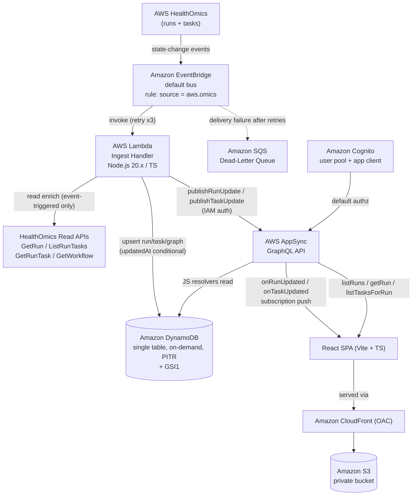

# HealthOmics Workflow Dashboard

A serverless, event-driven dashboard for monitoring AWS HealthOmics workflow runs in near real time. HealthOmics emits state-change events to Amazon EventBridge; an ingest Lambda normalizes and enriches them, upserts state into a single DynamoDB table, and publishes the change through an AWS AppSync GraphQL mutation. AppSync serves queries for the initial load and pushes live updates through subscriptions to a React single-page app hosted on Amazon S3 behind CloudFront.

This is a TypeScript monorepo with independently buildable and testable packages:

| Package     | Purpose                                                                 |
|-------------|-------------------------------------------------------------------------|
| `infra/`    | AWS CDK v2 (TypeScript) app: `DataStack`, `ApiStack`, `IngestStack`, `FrontendStack`. |
| `ingest/`   | Ingest Lambda (Node.js 20.x, TypeScript) — event normalization, enrichment, persistence, publish, and the workflow-definition parser. |
| `frontend/` | React + Vite (TypeScript) single-page app styled with the [Cloudscape Design System](https://cloudscape.design/) — fleet view and run detail view. |
| `fixtures/` | Sample HealthOmics events and workflow definitions used by tests and local verification. |
| `scripts/`  | Local verification and operational scripts (`deploy.sh`, `dev-local.sh`, `send-event.mjs`, `inject-config.mjs`, `ensure-run-metrics-permission.mjs`, `backfill-run-summaries.mjs`). |

Each package pins its dependencies to exact versions and exposes `build` and `test` scripts.

## Contents

- [1. Architecture](#1-architecture)
- [Dashboard features](#dashboard-features)
- [2. Prerequisites](#2-prerequisites)
- [3. Deploy](#3-deploy)
- [4. Teardown](#4-teardown)
- [5. Pointing the dashboard at a HealthOmics account](#5-pointing-the-dashboard-at-a-healthomics-account)
- [6. Verifying end-to-end event flow](#6-verifying-end-to-end-event-flow)
- [7. Cost documentation](#7-cost-documentation)
- [Run locally with one command](#run-locally-with-one-command)
- [Known limitations of task dependency inference and DAG inference](#known-limitations-of-task-dependency-inference-and-dag-inference)
- [Confirm against AWS docs](#confirm-against-aws-docs)

---

## 1. Architecture

The system is fully managed and event-driven end to end. HealthOmics publishes run and task status-change events to the default EventBridge bus; a rule matching `source = aws.omics` invokes the ingest Lambda. The Lambda defensively maps the event, enriches missing fields through HealthOmics read APIs (event-triggered only), upserts run/task/graph items into a single on-demand DynamoDB table with a monotonic `updatedAt` guard, then calls the AppSync `publishRunUpdate` / `publishTaskUpdate` mutations. AppSync fans those mutations out to subscribed browsers and also serves the initial `listRuns` / `getRun` / `listTasksForRun` queries. The React SPA is served privately from S3 through CloudFront (Origin Access Control) and authenticates to AppSync through a Cognito user pool.



Infrastructure is one AWS CDK v2 app split into four stacks by lifecycle and blast radius:

| Stack | Responsibilities |
|-------|------------------|
| `DataStack` | DynamoDB single table (on-demand, point-in-time recovery, `GSI1`). |
| `ApiStack` | AppSync GraphQL API, schema, JS resolvers, Cognito user pool + app client, default Cognito authz plus IAM authz for the ingest publish mutations. |
| `IngestStack` | Ingest Lambda, EventBridge rule, SQS dead-letter queue, retry policy, least-privilege IAM. The Lambda **bundles** the pinned AWS SDK v3 clients (rather than using the older SDK baked into the Node 20 runtime) so newer `GetRun` response fields — e.g. `networkingMode`, `configuration`, `vpcConfig` — are not silently dropped during deserialization. |
| `FrontendStack` | Private S3 bucket, CloudFront distribution with OAC, SPA 403/404 → `index.html` routing, build-config injection. |

Stack ordering ensures the Cognito user pool exists before API authorization is configured, and a failure in any stack fails the whole deployment (CloudFormation rolls back rather than leaving a partially-provisioned stack in service).

---

## Run locally with one command

To browse the dashboard UI on your machine without deploying any AWS resources:

```bash
scripts/dev-local.sh
```

This installs the frontend dependencies on first run, writes a local config to
`frontend/.env.local` if you don't already have one, and starts the Vite dev
server (opening `http://localhost:5173`).

The generated local config sets `VITE_LOCAL_MOCK=true`, which puts the GraphQL
client in **local mock mode**: it serves a small set of in-memory sample runs
and tasks and uses no-op subscriptions instead of calling AppSync. This means
the UI runs with **no deployed backend and no Cognito sign-in** — you get a
populated fleet view to click through, and Amplify is never configured, so
 there is no `No federated jwt` auth error.

Click a run's workflow name in the fleet list to open its **run detail view**,
which renders the task dependency graph (React Flow) with a visible layer
indicator (True DAG / Inferred DAG / Timeline), per-task status colors, and a
completed/total + elapsed-time progress indicator. Use **← Back to fleet** to
return to the list.

Options:

```bash
scripts/dev-local.sh --port 3000   # use a specific port
scripts/dev-local.sh --no-install  # skip the dependency install check
scripts/dev-local.sh --help
```

To point the local dev server at a **real deployed backend**, generate the
config from your stack outputs and restart:

```bash
cd infra && cdk deploy --all --outputs-file ../cdk-outputs.json && cd ..
node scripts/inject-config.mjs --outputs cdk-outputs.json --stack HealthOmicsApi --out frontend/.env.local
# The injected config does not set VITE_LOCAL_MOCK, so the client uses the real
# AppSync backend. If you previously ran in mock mode, ensure the generated file
# does not still contain `VITE_LOCAL_MOCK=true` (delete frontend/.env.local first).
scripts/dev-local.sh --no-install
```

Connecting to a real backend requires a signed-in Cognito user (the API's
default authorization is the Cognito user pool). Alternatively, export
`VITE_APPSYNC_ENDPOINT`, `VITE_USER_POOL_ID`, `VITE_USER_POOL_CLIENT_ID`, and
`VITE_AWS_REGION` (and leave `VITE_LOCAL_MOCK` unset) before running the script.

> The full event pipeline (Lambda, DynamoDB, AppSync) requires a deployed stack.
> Tests run entirely locally with no AWS: `cd ingest && npm test`,
> `cd infra && npm test`, `cd frontend && npm test`. See
> [section 6](#6-verifying-end-to-end-event-flow) to exercise the pipeline with
> synthetic events.

---

## Dashboard features

The dashboard has two views: a **fleet view** (the run list) and a **run detail
view** (per-run analytics and the task graph). Every derived value follows a
strict no-fabrication rule: when the underlying data is absent, the UI shows an
explicit "unavailable"/"unknown" affordance or a dash rather than a guessed
value.

### Fleet view (run list)

- **Columns:** status (with a stale-run warning badge), workflow (clickable, opens the run detail view), run name, run ID, workflow ID, engine version, batch ID, start time, and wall-clock duration.
- **Free-form search:** a text box that filters the list by case-insensitive substring across run name, run ID, workflow name/ID, status, engine version, and batch ID.
- **Filtering & sorting:** multi-select status filter, workflow filter, and sort by recency or duration (ascending/descending). The default (recency, no filters) preserves the original ordering.
- **Grouping:** mutually-exclusive toggles to group the list by engine version or by batch ID (runs started together via a batch share a `batchId`); each group renders as its own sub-table.
- **Pagination:** client-side paging of the flat list (25 runs per page). Grouped views are not paged. Search resets to page 1.
- **Stale-run detection:** a non-terminal run whose `updatedAt` is older than a threshold is flagged with a warning badge.
- **Live updates:** runs update in place and new runs insert in order via the `onRunUpdated` subscription, with a per-run pending indicator — no page reload.
- **Compare parameters:** select two runs to open a side-by-side parameters diff (added/removed/changed/unchanged), with per-side parse-error and cross-workflow notices.

### Run detail view

- **Task DAG visualizer:** the primary element, rendered via React Flow with dagre layout. Nodes are colored by task status, truncate long names with a hover tooltip showing the full name, and support a node search that highlights matches and dims the rest. The currently selected node (whose logs are open) gets an amber ring; the slowest task gets a distinct magenta ring shown in the legend.
- **Resource summary:** a compact strip of peak concurrent tasks / vCPUs, CPU-hours, and peak memory. Metrics whose inputs are absent render "unavailable"; the memory metric always carries an "unconfirmed units" note (see the confirm-against-docs list).
- **Longest-running tasks:** the top tasks by wall-clock duration (an approximation explicitly labeled as such, not a dependency-graph critical path); the slowest is highlighted on the DAG.
- **Task timeline:** a collapsible per-task queue-wait vs run-time breakdown. Queue-wait is shown under an "unconfirmed `createdAt`" caveat; run-time is not.
- **Failed-task filter:** a toggle plus count badge to show only `FAILED`/`CANCELLED` tasks.
- **Inputs & outputs:** the run's parameters as a Parameter/Value table (S3 values link to the console; folder locations complete the prefix with a trailing slash), plus a **Run configuration** table surfacing the IAM role, storage, run cache, networking (VPC + configuration name), and log level captured from `GetRun`. An engine-version badge appears on the header.
- **Logs:** read-only CloudWatch logs for a selected task (opened by clicking its node) or the run/engine streams, rendered below the DAG.

### Reports view (aggregate performance)

A top-level **Reports** area (reachable from the "Reports" button in the top
navigation) presents **aggregate performance across many runs of the same
workflow and version over a time window**, complementing the per-run fleet and
detail views.

- **Grouping:** runs are grouped by the friendly **workflow name + version**; a run with no version name is bucketed as **"(unversioned)"**. The underlying `workflowId` is tracked (hidden) so that when one friendly name+version maps to more than one workflow, the report flags a **collision** rather than silently blending unrelated workflows.
- **Time window:** a calendar date-range picker, defaulting to the **last 30 days**.
- **Statistics:** for each tracked metric — wall-clock duration, mean/peak CPU, mean/peak memory (GiB), CPU-hours, peak concurrent tasks, tasks per run, failed tasks per run — the report shows **mean, median, and p90**. Cost is intentionally out of scope for this view.
- **Availability honesty:** each metric's statistics are computed only over the runs where that metric was actually available, shown with an explicit **"N of M runs"** denominator; an unavailable metric is never counted as zero. Utilization (CPU/memory) exists only for runs whose IAM run role held `cloudwatch:PutMetricData` at run start (see [section 6](#6-enable-run-metrics-emission), the `ensure-run-metrics-permission.mjs` prerequisite); the view surfaces a note explaining why some runs lack utilization.
- **Data source:** the pipeline persists a compact **per-run performance rollup** (a `Run_Summary` item) once when a run reaches a terminal state, so reports are fast indexed reads rather than live CloudWatch fan-outs. Existing finished runs can be populated with the one-time [`backfill-run-summaries.mjs`](scripts/README.md#backfill-run-summariesmjs--one-time-run_summary-backfill-workflow-performance-reports-req-9) script.
- **Downloads:** **CSV** (per-run + aggregate data, for analytics) and **print-to-PDF** (a print-friendly layout of the cards + charts, for executive reporting). Unavailable metrics remain blank (never zero) in both exports, and memory stays in GiB.

---

## 2. Prerequisites

- **An AWS account** with permission to deploy the resources above (DynamoDB, Lambda, EventBridge, SQS, AppSync, Cognito, S3, CloudFront, IAM). This account is also where HealthOmics runs (or is the account whose default event bus receives HealthOmics events — see [section 5](#5-pointing-the-dashboard-at-a-healthomics-account)).
- **Node.js 20.x.** Node 20 is the Lambda runtime target and the minimum for the local toolchain. Verify with `node --version`.
- **npm** (bundled with Node) as the package manager.
- **AWS CDK v2 CLI.** Install globally with `npm install -g aws-cdk`, or invoke via `npx cdk`. Verify with `cdk --version` (must report a v2 version).
- **AWS credentials** configured for the target account and region (for example via `aws configure`, `AWS_PROFILE`, or `AWS_ACCESS_KEY_ID` / `AWS_SECRET_ACCESS_KEY` / `AWS_SESSION_TOKEN` environment variables). Prefer least-privilege credentials scoped to what the deploy needs.
- **A target AWS region** chosen for deployment. HealthOmics, the dashboard, and the EventBridge rule must all be in the same region so events reach the ingest Lambda.
- **CDK bootstrap** completed once per account/region (see [section 3](#3-deploy)).
- **Per-package install/build.** Install and build each package from its own directory before deploying:

  ```bash
  cd ingest && npm install && npm run build && npm test
  cd ../infra && npm install && npm run build && npm test
  cd ../frontend && npm install && npm run build && npm test
  ```

---

## 3. Deploy

Deploying is two commands: **build the SPA**, then **`cdk deploy --all`**. The
`FrontendStack` publishes the built assets to S3, injects the backend config at
deploy time, and invalidates CloudFront — so there is no separate `s3 sync` or
config-injection step. Stack names below (`HealthOmicsData`, `HealthOmicsApi`,
`HealthOmicsIngest`, `HealthOmicsFrontend`) are illustrative; run `cdk list` to
confirm the names your CDK app defines.

> **One-command deploy:** [`scripts/deploy.sh`](scripts/README.md#deploysh--build-and-deploy-in-one-command)
> runs the correct sequence for you — build ingest, build the SPA, then
> `cdk deploy` — so you never publish a stale/missing `frontend/dist`. Use
> `scripts/deploy.sh` (all stacks), `scripts/deploy.sh --frontend-only`, or
> `scripts/deploy.sh --stack <Name>`. The manual steps below are equivalent.

**1. Bootstrap the account/region (once per account+region):**

```bash
cd infra
cdk bootstrap
```

**2. Build the SPA** (from the repo root). No environment values are needed at
build time — the backend config is injected at deploy time (see step 4):

```bash
npm --prefix frontend install   # first time only
npm --prefix frontend run build # produces frontend/dist
```

**3. Deploy everything:**

```bash
cd infra
cdk deploy --all
```

CDK resolves cross-stack dependency order automatically (Data → Api → Ingest,
Api → Frontend). When the `FrontendStack` deploys it:

- uploads the built `frontend/dist` to the private S3 bucket,
- writes a `config.js` generated from the live `ApiStack` outputs (AppSync
  endpoint, Cognito user pool ID, app client ID, region), and
- invalidates the CloudFront cache.

**4. How runtime config works.** The SPA carries no hardcoded environment
values. At deploy time the `FrontendStack` writes `config.js` that sets
`window.__APP_CONFIG__` from the `ApiStack` outputs; the app reads it at runtime
(`frontend/src/api/config.ts`). This means the **same pre-built bundle** can be
deployed against any backend without rebuilding. The mapping is:

| ApiStack output      | `window.__APP_CONFIG__` field | Purpose                    |
|----------------------|-------------------------------|----------------------------|
| `GraphqlApiUrl`      | `appsyncEndpoint`             | AppSync GraphQL endpoint   |
| `UserPoolId`         | `userPoolId`                  | Cognito user pool          |
| `UserPoolClientId`   | `userPoolClientId`            | Cognito app client         |
| `Region`             | `region`                      | AWS region                 |

> If `frontend/dist` does not exist when you deploy, the `FrontendStack` skips
> the asset upload (with a warning) so the rest of the deploy still succeeds —
> just run the build (step 2) and redeploy `HealthOmicsFrontend` to publish the
> site.

**5. Create a sign-in user.** The API's default authorization is the Cognito
user pool and self-signup is disabled, so create at least one user (this is an
operational step, not part of the stacks):

```bash
aws cognito-idp admin-create-user \
  --user-pool-id <UserPoolId> --username you@example.com \
  --user-attributes Name=email,Value=you@example.com Name=email_verified,Value=true \
  --message-action SUPPRESS
aws cognito-idp admin-set-user-password \
  --user-pool-id <UserPoolId> --username you@example.com \
  --password '<StrongPassw0rd!>' --permanent
```

The dashboard is then reachable at the CloudFront distribution domain emitted by
the `FrontendStack`; sign in with that user.

> **Local development** uses a different path: `scripts/dev-local.sh` runs the
> SPA in mock mode (or against a real backend via env vars) — see
> [Run locally with one command](#run-locally-with-one-command). The legacy
> `scripts/inject-config.mjs` (writing `.env.production`) is still available for
> build-time injection if you prefer baking config into the bundle, but the
> deploy-time `config.js` path above is the default and needs no rebuild.

**6. Enable run-metrics emission (one-time, out-of-band, per run role).**
HealthOmics only emits `aws.omics` run/task utilization metrics (used by the
dashboard's resource summary) for runs whose IAM **run role** already holds
`cloudwatch:PutMetricData` at the time the run starts. This run role is a
HealthOmics service role, not created by this repo's CDK, so it is **not**
provisioned by `cdk deploy --all` — grant it once, out-of-band, per run role,
before starting any runs you want metrics for:

```bash
# Check what would change, without touching AWS:
node scripts/ensure-run-metrics-permission.mjs --dry-run --role-name <your-run-role-name>

# Apply it for real:
node scripts/ensure-run-metrics-permission.mjs --role-name <your-run-role-name>
```

The script is idempotent (safe to re-run). Granting `cloudwatch:PutMetricData`
enables CloudWatch metric ingestion, which CloudWatch bills for. Runs started
**before** the policy is applied never emit metrics retroactively — this only
affects runs started after the grant. See
[`scripts/README.md`](scripts/README.md#ensure-run-metrics-permissionmjs--grant-run-role-metric-emission-req-43)
for full flag documentation.

---

## 4. Teardown

Destroy all stacks with the CDK CLI from `infra/`:

```bash
cd infra
cdk destroy --all
```

Notes:

- The stacks apply `DESTROY` removal policies (and S3 auto-delete) so `cdk destroy` removes the DynamoDB table, S3 bucket contents, and other resources rather than orphaning them. `cdk destroy` reports any resource that cannot be removed.
- Because the `DataStack` table uses a `DESTROY` removal policy, teardown **deletes all stored run/task/graph data**. If you need to keep the data, change the table's removal policy to `RETAIN` and take a backup (point-in-time recovery is enabled) before destroying.
- The EventBridge rule created on the **default** bus is owned by the `IngestStack` and is removed when that stack is destroyed; the default bus itself is an account resource and is not deleted.
- The Cognito users you created are account resources, not part of the stacks; delete them separately (`aws cognito-idp admin-delete-user`) if desired. The user pool itself is removed with the `ApiStack`.
- Delete any locally generated `cdk-outputs.json` / `frontend/.env.*` files if you no longer need them (all gitignored).

---

## 5. Pointing the dashboard at a HealthOmics account

The dashboard is driven entirely by HealthOmics events landing on the **default** EventBridge bus in the account and region where the stacks are deployed. To point the dashboard at a HealthOmics account:

1. **Deploy into the same account and region as HealthOmics.** HealthOmics delivers its run/task status-change events to the default event bus of the account and region in which the runs execute. The `IngestStack` creates an EventBridge rule on that **default** bus with the pattern `{"source": ["aws.omics"]}`, so no cross-account or custom-bus wiring is required when the dashboard is co-located with HealthOmics. Confirm the deploy region matches the region where your HealthOmics runs execute.
2. **No producer-side configuration is needed for same-account events.** HealthOmics automatically emits `aws.omics` events to the default bus; the rule matches them and invokes the ingest Lambda. There is nothing to enable on the HealthOmics side.
3. **IAM.** The ingest Lambda's execution role is granted, by the `IngestStack`, least-privilege access only:
   - HealthOmics **read-only** on `GetRun`, `ListRunTasks`, `GetRunTask`, `GetWorkflow` (no create/update/delete).
   - `appsync:GraphQL` scoped to the `publishRunUpdate` and `publishTaskUpdate` mutation fields only.
   - DynamoDB write access scoped to the table and `GSI1`.
   For the events to enrich correctly, the deploying principal and the Lambda role must be able to call those HealthOmics read APIs in the target region.
4. **Cross-account (optional).** If HealthOmics runs in a different account than the dashboard, forward `aws.omics` events from the source account's default bus to the dashboard account (an EventBridge rule targeting the dashboard account's event bus, plus the corresponding cross-account bus resource policy). The ingest rule and enrichment IAM still apply in the dashboard account. This path is beyond the default single-account setup above.

---

## 6. Verifying end-to-end event flow

Use `scripts/send-event.mjs` to push a synthetic `aws.omics` event through the real pipeline. It validates the fixture against the same schema the ingest pipeline assumes and, on validation failure, rejects the event and sends nothing (leaving run/task data unchanged). Fixtures live under `fixtures/events/` (`run-status-change.json`, `task-status-change.json`; shorthands `run` and `task`).

**1. Dry-run (no AWS calls).** Confirms the fixture is well-formed and shows what would be sent — never imports the AWS SDK or contacts AWS:

```bash
scripts/send-event.mjs --dry-run --fixture run
```

**2. EventBridge mode.** Publishes the fixture as a synthetic event to the default bus via `PutEvents`, exercising the full path (rule → Lambda → DynamoDB → AppSync → subscription):

```bash
scripts/send-event.mjs --mode eventbridge --fixture task --region <region>
```

**3. Lambda mode.** Invokes the ingest Lambda directly with the fixture payload (useful when you want to bypass the bus/rule and test the handler itself):

```bash
scripts/send-event.mjs --mode lambda --fixture run \
    --function <ingest-function-name> --region <region>
```

`--function` may also come from `$INGEST_FUNCTION_NAME`; `--event-bus` defaults to `default` (or `$EVENT_BUS_NAME`); `--region` defaults to `$AWS_REGION`. The sending modes lazily import `@aws-sdk/client-eventbridge` / `@aws-sdk/client-lambda`, so run the script from a Node context that provides them (e.g. the `ingest/` package or a workspace that installs them).

**Expected result.** With the SPA open (signed in through Cognito and subscribed), publishing a synthetic run or task event should update the corresponding run in the fleet view — or the task node in the run detail view — **within 5 seconds, with no browser polling.** If nothing updates, check: the deploy region matches `--region`; the ingest Lambda's CloudWatch logs for enrichment or publish errors; the SQS dead-letter queue for events that failed after 3 EventBridge retries; and that you are signed in with a valid Cognito user.

---

## 7. Cost documentation

The design goal is **zero cost at idle**: every component is fully managed and scales to zero when no events or requests are being processed. No EC2, ECS, or Fargate is provisioned, and no NAT gateways are created, so there are no recurring hourly compute or networking charges. DynamoDB uses on-demand (PAY_PER_REQUEST) capacity only — no provisioned/reserved throughput.

> **Looking for a dollar figure?** See [Estimated cost at scale (100,000 runs / month)](#estimated-cost-at-scale-100000-runs--month) below for a measured, itemized estimate of the **dashboard's** monthly cost (this does not include AWS HealthOmics workflow-execution cost).

### Cost drivers

Each expected cost driver, its billing unit, and the AWS service that meters it:

| Cost driver | Billing unit | Metering service | Idle behavior |
|-------------|--------------|------------------|---------------|
| AppSync GraphQL requests | Per query/mutation request (per million requests) | AWS AppSync | Scales to zero — billed only per request. |
| AppSync real-time subscriptions | Per subscription connection-minute plus per message delivered | AWS AppSync | Scales to zero — billed only while clients are connected/receiving. |
| Lambda invocations | Per request plus GB-seconds of compute duration | AWS Lambda | Scales to zero — billed only per invocation. |
| DynamoDB reads (on-demand) | Per read request unit (RRU) | Amazon DynamoDB | Scales to zero — billed only per request. |
| DynamoDB writes (on-demand) | Per write request unit (WRU) | Amazon DynamoDB | Scales to zero — billed only per request. |
| DynamoDB storage | Per GB-month of stored data | Amazon DynamoDB | Usage-based, proportional to stored items (see fixed/recurring note below). |
| CloudFront | Per GB of data transfer out plus per 10,000 HTTP/HTTPS requests | Amazon CloudFront | Scales to zero — billed only per request/transfer. |
| S3 (SPA assets) | Per GB-month storage plus per-request GET/PUT | Amazon S3 | Usage-based; SPA asset storage is a few MB. |
| SQS dead-letter queue | Per request (per million requests) | Amazon SQS | Scales to zero — billed only when messages are enqueued. |
| EventBridge (default bus, `aws.omics`) | AWS service events on the default bus are not charged for ingestion | Amazon EventBridge | No charge for AWS-source events on the default bus. |

### Fixed / recurring charges (idle-cost flags)

Per the idle-cost constraint, any resource that bills a **fixed recurring charge independent of usage** is flagged here as violating "zero cost at idle":

- **DynamoDB point-in-time recovery (PITR) — potential recurring charge.** PITR is enabled on the table (required by the design). PITR bills per GB-month of continuous-backup storage. When the table holds no data this rounds to zero, but any stored data incurs a small storage-based charge that is **not** driven by request traffic. Flagged as a usage-proportional storage charge that persists while data is retained, though it is not a flat per-hour fee.
- **CloudFront / S3 storage — usage-proportional, not flat.** Stored SPA assets and CloudFront usage bill by storage and transfer, not by a fixed hourly rate; there is no minimum monthly fee, so these do not constitute a fixed recurring charge.
- **Cognito user pool — no fixed charge at this scale.** The user pool bills per monthly active user (with a free tier) and has no flat provisioning fee, so it does not incur a fixed recurring charge when idle (no active users ⇒ no charge).

**Result:** no component in this stack incurs a *flat, usage-independent hourly or monthly* charge. The only always-on cost is data-proportional storage (DynamoDB items + PITR continuous backups, and a few MB of SPA assets in S3), which trends to zero as stored data trends to zero. This satisfies the zero-idle-cost intent; the PITR/storage line items are flagged above so an operator who requires literally-zero standing cost can disable PITR and empty the table.

### Estimated cost at scale (100,000 runs / month)

> **Scope:** these figures estimate the cost of **this dashboard** (its DynamoDB,
> Lambda, AppSync, S3/CloudFront, Cognito, SQS) to *ingest and serve* 100,000
> runs in a month. They **do not** include the cost of executing the workflows
> themselves in AWS HealthOmics (compute, run storage), which is a separate and
> typically much larger spend that depends entirely on each workflow's
> CPU/memory/duration and cannot be derived from this repository.

The estimate is anchored on **measured** values from live data in this account,
not guesses:

- Run item in DynamoDB: **~3.6 KB** (of which `rawGetRun`, the raw `GetRun` capture, is ~2.7 KB).
- Task item in DynamoDB: **~0.29 KB**.
- Tasks per run: **~40** (measured on an `nf-core-fetchngs` sample run).
- SPA payload per fresh page load: **~3.3 MB** (JS + CSS, uncompressed).

**Modeling assumptions (the dashboard's usage pattern):** each run emits ~4
run-status events, and each task ~3 task-status events; every event triggers one
ingest Lambda invocation, a HealthOmics read (`GetRun`/`ListRunTasks`), DynamoDB
upserts, and one AppSync publish that fans out to connected subscribers. At ~40
tasks/run that is roughly **~124 writes and ~124 publishes per run** (~12.4M each
across 100k runs). Prices are us-east-1 on-demand, no free tier or reserved
capacity applied (except Cognito).

| Service | Basis | Est. monthly |
|---------|-------|--------------|
| DynamoDB — writes | ~13.6M write units (run + task upserts) | ~$17 |
| DynamoDB — reads | ingest reads + dashboard queries | ~$1–3 |
| DynamoDB — storage | ~1.5 GB (100k runs + ~4M tasks) | ~$0.40 |
| DynamoDB — PITR | continuous backup of ~1.5 GB | ~$0.30 |
| Lambda — ingest | ~12.4M invocations, ~200 ms @ 256 MB | ~$12 |
| AppSync — requests | ~12.4M publish/query operations | ~$50 |
| AppSync — real-time | subscription connection-minutes + ~12.4M messages delivered | ~$25–40 |
| CloudFront | SPA loads (~3.3 MB each); assumes light viewer traffic | ~$15 |
| S3 (SPA assets) | a few MB stored + GETs | ~$0.10 |
| Cognito | small number of users, within free tier | ~$0 |
| EventBridge (`aws.omics`) | AWS-source events on the default bus | $0 (not billed) |
| SQS dead-letter queue | only on delivery failure | ~$0 |
| **Total (dashboard only)** | | **≈ $120–150 / month** |

**Sensitivities — read before relying on these numbers:**

- **Tasks per run is the dominant lever.** The estimate uses the measured ~40 tasks/run. Real nf-core pipelines often run **100–200+ tasks/run**, which scales AppSync, Lambda, and DynamoDB writes proportionally — at ~150 tasks/run the dashboard total is roughly **$300–450/month**.
- **AppSync is the largest line item** (~$75–90 combined) because the pipeline publishes an update for every run/task status event and fans it out to subscribers.
- **`rawGetRun` roughly quadruples the run-item write cost** (a ~3.6 KB item consumes 4 write units vs. 1 for a sub-1 KB item). It is inexpensive in absolute terms here, but trimming or dropping the raw capture would cut run-write cost ~4×.
- **CloudFront scales with viewers and refreshes, not run count**, and the SPA bundle is large (~3.3 MB); code-splitting would reduce transfer.
- Figures are estimates for planning only; actual bills vary with AWS pricing, region, free-tier eligibility, and real traffic.

---

## Known limitations of task dependency inference and DAG inference

The HealthOmics run APIs do not expose task dependency edges, so the true dependency DAG is derived from the workflow definition and, when that is unavailable, inferred from timing. Each known limitation is listed as a discrete entry:

- **No frontend query fetches the stored static graph.** The GraphQL schema (`infra/graphql/schema.graphql`) exposes only `listRuns`, `getRun`, and `listTasksForRun` — there is no query to retrieve the cached `StaticGraph` (persisted by ingest keyed by `workflowId`). The frontend layer selector (`frontend/src/taskview/selectLayer.ts`) therefore receives the static graph as an *input parameter*; unless a caller supplies it, `selectLayer` never sees a graph and falls back to the Inferred_DAG or Timeline_View even when a True_DAG was computed and stored. Wiring a `getStaticGraph(workflowId)` query is required to surface the True_DAG in the SPA.
- **Inferred DAG ordering is timing-based, not dependency-based.** When no static graph is supplied, `frontend/src/taskview/inferredDag.ts` orders tasks purely by `startedAt` and groups tasks with overlapping `[startedAt, stoppedAt]` intervals as "concurrent." Overlap in time does not imply independence, and non-overlap does not imply a dependency, so the inferred layout can show false concurrency or a misleading sequence. It carries a visible "inferred" label for this reason.
- **Tasks without timing data cannot be ordered.** Tasks with a missing or unparseable `startedAt` are grouped into a single trailing level in the inferred ordering; their true position relative to timed tasks is unknown. When no task has usable timing at all, the view degrades to the Timeline_View with an "ordering data unavailable" indication.
- **True_DAG node-to-task matching is exact and case-sensitive.** The overlay (`frontend/src/taskview/trueDag.ts`) matches a static-graph node to a run task by exact, case-sensitive `name` equality. If HealthOmics reports a task name that differs from the definition's call/process/step name (aliasing, prefixing, scatter suffixes, casing), the node is rendered with an unmatched-status indication and shows no live status.
- **WDL parser is heuristic, not a full grammar.** `ingest/src/parser/wdl.ts` recognizes `call` statements and `name.output` reference forms to derive edges. It does not fully evaluate expressions, scatter bodies, conditionals, imports, or aliased sub-workflow outputs beyond collecting the calls they contain, so dependencies expressed through unsupported constructs may be missed.
- **Nextflow parser resolves DSL2 channel wiring heuristically.** `ingest/src/parser/nextflow.ts` collects `process` declarations and scans the `workflow { ... }` block for channel assignments and process calls, resolving `PROCESS.out`-style references and locally-bound variables. Channel wiring expressed through operators, complex closures, `include` from modules, or dynamic constructs it does not recognize is ignored rather than erroring, so some edges may be missing.
- **CWL parser derives edges from `in`/`out`/`source` references only.** `ingest/src/parser/cwl.ts` builds one node per workflow `step` and edges from consuming-step `in`/`source` references back to producing-step `out` outputs. Connections expressed through other mechanisms (e.g. subworkflow packing, scatter/valueFrom expressions) may not be captured.
- **Unparseable, unsupported, or cyclic definitions produce no graph.** If a definition cannot be parsed, uses an unsupported language/engine, or would yield a cycle, the parser rejects it and no static graph is stored; those runs fall back to the inferred/timeline views.
- **`GetWorkflow` returns a bundle URL, not inline text (confirmed).** Static-graph creation assumes `GetWorkflow` returns the definition text inline on the `definition` field, but for the workflows tested the API actually returns `definition` as a **presigned S3 URL to a `definition.zip`** (with `main` naming the entry file, e.g. `main.nf`, and `definitionRepositoryDetails` for Git-sourced workflows). Because `resolveDefinitionSource()` expects inline text, those runs currently build no static graph and fall back to the Inferred_DAG / Timeline_View. Surfacing the True_DAG for such workflows requires extending the resolver to download and unzip the bundle (and, for real nf-core pipelines, resolve `include` across the module tree). See the confirm-against-docs list below.

---

## Confirm against AWS docs

The real HealthOmics event JSON and read-API response shapes are **not** hardcoded from memory — every assumption is isolated behind clearly commented "CONFIRM AGAINST AWS DOCS" markers so it can be corrected in one place once verified against the AWS HealthOmics documentation. Each location below lists the exact source file and the code element to update:

| # | What to confirm | Source file | Code element to update |
|---|-----------------|-------------|------------------------|
| 1 | Run status / task status enum member spellings emitted by HealthOmics (casing, extra states, DELETED only on runs) | `ingest/src/domain/status.ts` | `RunStatus` and `TaskStatus` enums (`isRunStatus` / `isTaskStatus` guards depend on them) |
| 2 | Event `detail-type` strings used to classify run vs task events | `ingest/src/eventMapper.ts` | `detectKind()` — the `RUN_DETAIL_TYPE` / `TASK_DETAIL_TYPE` constants |
| 3 | Run event `detail` field names (run id, status, run name, workflow id/name) | `ingest/src/eventMapper.ts` | `mapRunEvent()` — the `RUN_FIELDS` constant |
| 4 | Task event `detail` field names, including that the task id is carried only by the task `arn` (`.../task/<id>`) | `ingest/src/eventMapper.ts` | `mapTaskEvent()` — the `TASK_FIELDS`, `TASK_ARN_FIELD`, and `TASK_ARN_RESOURCE_PREFIX` constants (and `parseTaskIdFromArn`) |
| 5 | `GetRun` response → RunRecord mapping. Beyond the core fields (timestamps, status, workflowId, outputUri, parameters, engineVersion) this now also maps the run configuration — `roleArn`, `storageType`/`storageCapacity`, `cacheId`/`cacheBehavior`, `networkingMode`, `configuration.name`, `logLevel`, and `batchId` — and captures the **entire raw `GetRun` response** as a JSON string (`rawGetRun`, `$metadata` stripped) so no returned field is lost. `rawGetRun` is persisted in DynamoDB for audit/completeness and is **not** exposed through the GraphQL API (it can contain sensitive values such as role ARN and VPC subnet/SG ids). | `ingest/src/enrichment/tasks.ts` | `mapRunResponse()` field mapping |
| 6 | `ListRunTasks` item / `GetRunTask` response → TaskRecord mapping (status, cpus, memory units, timestamps) | `ingest/src/enrichment/tasks.ts` | `mapTaskFields()` field mapping (used by `enrichRun` / `enrichTasks`) |
| 7 | `GetWorkflow` export mode + the response field holding the definition. **Confirmed against AWS:** for the workflows tested, `GetWorkflow` with `export=[DEFINITION]` returns the `definition` field as a **presigned S3 URL to a `definition.zip` bundle** (plus `main` = the entry file, e.g. `main.nf`, and `definitionRepositoryDetails` for Git-sourced workflows) — **not** inline definition text. `resolveDefinitionSource()` currently expects inline text, so imported/bundled workflows yield no static graph and fall back to the Inferred/Timeline layers until the resolver is extended to download and unzip the bundle. | `ingest/src/enrichment/workflow.ts` | `resolveDefinitionSource()` — the `WORKFLOW_EXPORT_DEFINITION` and `DEFINITION_SOURCE_FIELD` constants |
| 8 | `GetWorkflow` engine/language spellings mapped to the parser `Language` union | `ingest/src/enrichment/workflow.ts` | `mapEngineToLanguage()` / `resolveDefinitionSource`'s companion `resolveLanguage()` — the `WORKFLOW_LANGUAGE_FIELD` constant |

Alongside these code elements, the artifacts to update when the real shapes are confirmed are the ingest event fixtures under `fixtures/events/` and the workflow-definition fixtures used by the parser tests.

---

## Toolchain

- Node.js 20.x is the Lambda runtime target; Node 20+ is required for the local toolchain.
- Package manager: npm.
